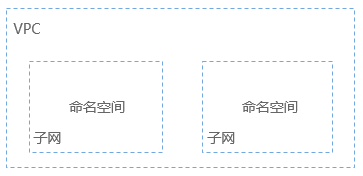
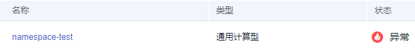
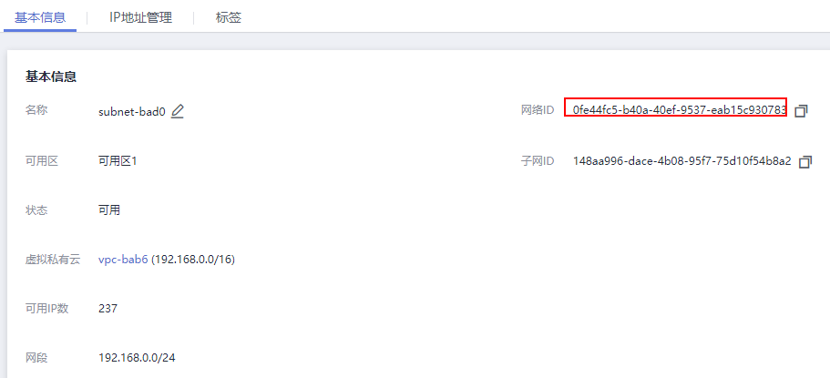
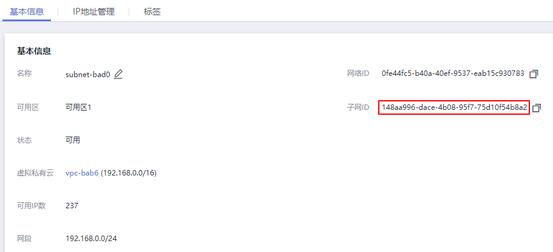
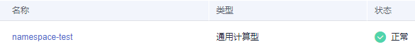

# Namespace和Network<a name="devg_na"></a>

Namespace（命名空间）是一种在多个用户之间划分资源的方法。适用于用户中存在多个团队或项目的情况。当前云容器实例提供“通用计算型“和“GPU型“两种类型的资源，创建命名空间时需要选择资源类型，后续创建的负载中容器就运行在此类型的集群上。

-   **通用计算型**：支持创建含CPU资源的容器实例及工作负载，适用于通用计算场景。
-   **GPU型**：支持创建含GPU资源的容器实例及工作负载，适用于深度学习、科学计算、视频处理等场景。

Network是云容器实例扩展的一种Kubernetes资源对象，用于关联VPC及子网，从而使得容器实例能够使用公有云的网络资源。

## Namespace与网络的关系<a name="zh-cn_topic_0127684722_section17189123157"></a>

从网络角度看，命名空间对应一个虚拟私有云（VPC）中一个子网，如[图1](#zh-cn_topic_0127684722_fig714315366295)所示，在创建命名空间时会关联已有VPC或创建一个新的VPC，并在VPC下创建一个子网。后续在该命名空间下创建Pod、Service等资源时都会在对应的VPC及子网之内，且占用子网中的IP地址。

通常情况下，如果您在同一个VPC下还会使用其他服务的资源，您需要考虑您的网络规划，如子网网段划分、IP数量规划等，确保有可用的网络资源。

**图 1**  命名空间与VPC子网的关系<a name="zh-cn_topic_0127684722_fig714315366295"></a>  


## 哪些情况下适合使用多个命名空间<a name="zh-cn_topic_0127684722_section5571151617513"></a>

因为Namespace可以实现部分的环境隔离，当您的项目和人员众多的时候可以考虑根据项目属性，例如生产、测试、开发划分不同的Namespace。

## 创建Namespace<a name="zh-cn_topic_0127684722_section6548246286"></a>

Namespace下需要有一个Network关联VPC及子网，创建完Namespace后需要创建一个Network。

> **说明：** 
>通常情况下，没有频繁创建Namespace的需求，建议通过云容器实例的控制台界面创建Namespace，具体方法请参见[创建命名空间](https://support.huaweicloud.com/usermanual-cci/cci_01_0001.html)。

以下示例创建一个名为namespace-test的Namespace，指定云容器实例的资源类型为general-computing。

```
apiVersion: v1
kind: Namespace
metadata:
  name: namespace-test
  labels:
    sys_enterprise_project_id: "0" 
  annotations:
    namespace.kubernetes.io/flavor: general-computing
spec:
  finalizers:
  - kubernetes
```

这里的定义文件采用YAML格式描述（如果您对YAML格式不了解，可以参考[YAML语法](https://support.huaweicloud.com/devg-cci/cci_05_1001.html)），也是使用JSON格式。

-   sys\_enterprise\_project\_id：表示企业项目ID，可进入[企业管理](https://console.huaweicloud.com/eps/#/eps/manager/projects)的企业项目详情页面获取。未开通企业管理的用户无需配置此参数。不配置时默认为0，表示default企业项目。
-   namespace.kubernetes.io/flavor: general-computing：指定命名空间类型。

    命令空间的类型有如下两种：

    -   **general-computing**：通用计算型，支持创建含CPU资源的容器实例及工作负载，适用于通用计算场景。
    -   **gpu-accelerated**：GPU型，支持创建含GPU资源的容器实例及工作负载，适用于深度学习、科学计算、视频处理等场景。


假如上面Namespace定义的文件名称为ns.yaml，则执行kubectl create -f ns.yaml即可创建命名空间，-f 表示从文件创建。

```
# kubectl create -f ns.yaml 
namespace/namespace-test created
```

执行kubectl get ns查询namespace是否创建成功，ns为namespace的缩写。

```
# kubectl get ns
NAME             STATUS    AGE
namespace-test   Active    23s
```

如上，可以看到namespace-test这个命名空间创建成功，且存在的时长为23秒。

登录云容器实例控制台，单击左侧导航栏“命名空间“，您可以看到命令空间创建成功，但状态为“异常“。这是因为在云容器实例中，您需要为Namespace定义网络策略，具体操作方法请参见[创建Network](#zh-cn_topic_0127684722_section1794612365010)。

**图 2**  Namespace-异常<a name="zh-cn_topic_0127684722_fig366481419810"></a>  


## 创建Network<a name="zh-cn_topic_0127684722_section1794612365010"></a>

Namespace创建好后，需要为Namespace创建网络策略，关联VPC及子网。

以下示例创建一个名为test-network的Network。

```
apiVersion: networking.cci.io/v1beta1
kind: Network
metadata:
  annotations:
    network.alpha.kubernetes.io/default-security-group: security-group-id
    network.alpha.kubernetes.io/domain-id: domain-id
    network.alpha.kubernetes.io/project-id: project-id
  name: test-network
spec:
  cidr: 192.168.0.0/24
  attachedVPC: vpc-id
  networkID: network-id
  networkType: underlay_neutron
  subnetID: subnet-id
```

> **说明：** 
>此处VPC和子网的网段不能为10.247.0.0/16，10.247.0.0/16是云容器实例预留给Service的网段。如果您使用此网段，后续可能会造成IP冲突，导致负载无法创建或服务不可用；如果您不需要通过Service访问，而是直接访问Pod，则可以使用此网段。

上面参数获取方法如下：

-   network.alpha.kubernetes.io/domain-id：账号ID，可以在[我的凭证](https://console.huaweicloud.com/iam/?locale=zh-cn#/mine/apiCredential )获取。
-   network.alpha.kubernetes.io/project-id：项目ID，可以在[我的凭证](https://console.huaweicloud.com/iam/?locale=zh-cn#/mine/apiCredential)获取。
-   network.alpha.kubernetes.io/default-security-group：安全组ID，可以在[安全组控制台](https://console.huaweicloud.com/vpc/#/vpc/vpcmanager/securitygroups)获取，如下图。

    **图 3**  获取安全组ID<a name="zh-cn_topic_0127684722_fig676063417262"></a>  
    

-   cidr：子网网段。
-   attachedVPC：虚拟私有云的ID，可在VPC控制台获取。

    **图 4**  获取VPC ID<a name="zh-cn_topic_0127684722_fig69573455348"></a>  
    

-   networkID：子网的网络ID，可在VPC控制台 \> 子网中获取。

    **图 5**  获取子网的网络ID<a name="zh-cn_topic_0127684722_fig1273117811396"></a>  
    

-   networkType：网络类型，当前仅支持**underlay\_neutron**网络模式。
-   subnetID：子网ID，可在VPC控制台 \> 子网获取。

    **图 6**  获取子网ID<a name="zh-cn_topic_0127684722_fig36417103119"></a>  
    


假如上面Network定义的文件名称为network.yaml，则执行kubectl create -f network.yaml即可创建命名空间，-f 表示从文件创建。这里--namespace namespace-test是指定在namespace-test这个命名空间下创建。

```
# kubectl create -f network.yaml --namespace namespace-test
network.networking.cci.io/test-network created
```

登录云容器实例控制台，单击左侧导航栏“命名空间“，您可以看到命令空间创建成功，且状态为“正常“。

**图 7**  Namespace-正常<a name="zh-cn_topic_0127684722_fig187513312598"></a>  


## 为kubectl上下文指定Namespace<a name="zh-cn_topic_0127684722_section16376341994"></a>

上面创建Network是在指定的Namespace下创建的，本文档后续的资源创建都是在某个命名空间下操作，每次都指定命名空间比较麻烦，您可以为kubectl上下文指定命名空间，这样在某个上下文中，创建的资源就都是在某个命名空间下，方便操作。

指定Namespace只需要在设置上下文命令中添加一个“--namespace“选项，如下所示。

**kubectl config set-context **_$context _**--namespace**=_$ns_

其中，_$ns为Namespace的名称；$context_  为上下文的名称，可以自定义，也可执行如下命令获取：

```
# kubectl config get-contexts
CURRENT   NAME                                         CLUSTER                  AUTHINFO                                  NAMESPACE
          cci-context-cn-east-3-1C8PNI0POPPCSFGXPM6S   cci-cluster-cn-east-3    cci-user-cn-east-3-1C8PNI0POPPCSFGXPM6S   
*         cci-context-cn-east-3-hwuser_xxx             cci-cluster-cn-east-3    cci-user-cn-east-3-hwuser_xxx       
          kubernetes-admin@kubernetes                  kubernetes               kubernetes-admin 
```

假设，上面创建的Namespace名称为namespace-test，则示例如下。

```
# kubectl config set-context cci-context --namespace=namespace-test
```

指定Namespace后，就可以使用 kubectl 命令直接操作云容器实例的相关资源。如下所示，执行**kubectl get pod**，查看Pod资源，一切正常。

```
# kubectl get pod
No resources found.
```

