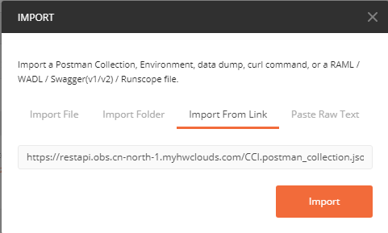
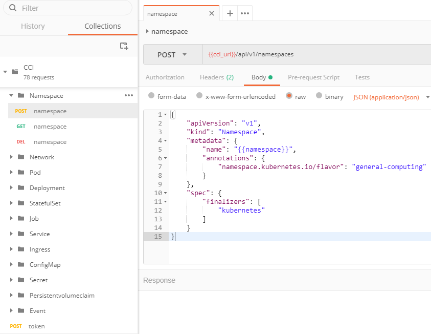
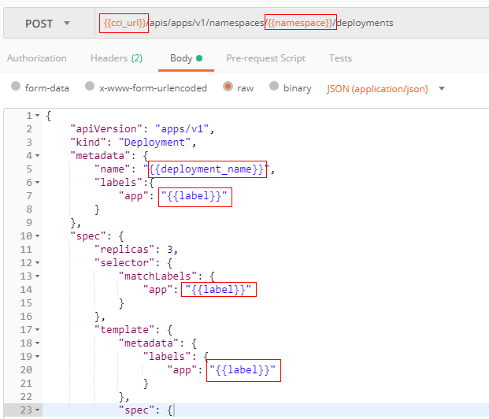
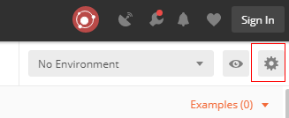
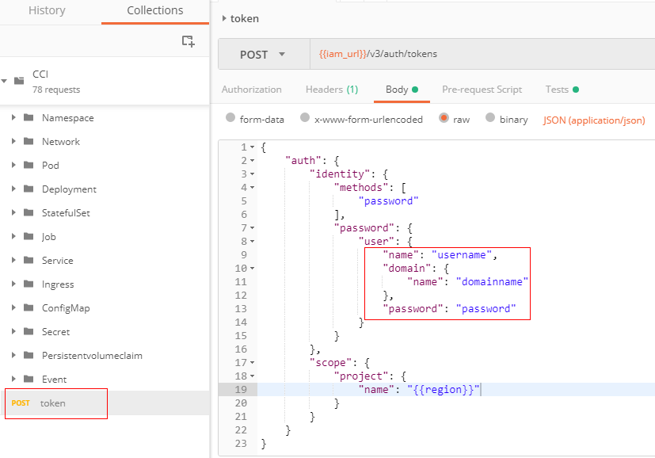
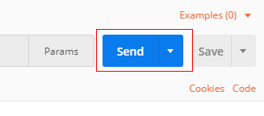
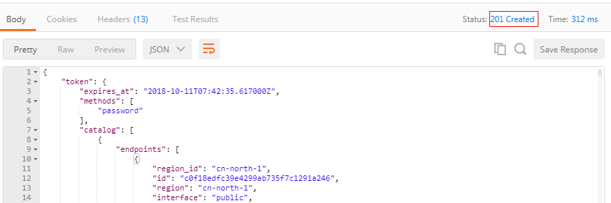
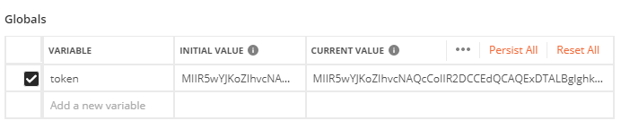
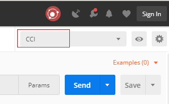

# 使用Postman调用接口

为方便您调试，云容器实例提供了包含接口请求示例的Postman Collection文件，基于此文件，您可以方便的使用Postman调试所有云容器实例接口。

## 前提条件

已下载并安装[Postman](https://www.getpostman.com/)（也可以使用[Chrome浏览器插件](https://chrome.google.com/webstore/detail/postman/fhbjgbiflinjbdggehcddcbncdddomop)）。

## 导入Collection文件

打开Postman，在左上角单击“File \> Import“，在弹出的窗口中选择“Import From Link“，输入文件地址[https://restapi.obs.cn-north-1.myhwclouds.com/CCI.postman\_collection.json](https://restapi.obs.cn-north-1.myhwclouds.com/CCI.postman_collection.json)，然后单击“Import“。

**图 1**  Import From Link  

导入后，您可以看到云容器实例接口的请求示例，其中包含所有Kubernetes 1.9 API和Network API，以及一个获取Token的API。

**图 2**  Collections  

## 导入Environment文件

Postman中可以使用环境变量，这为调试API带来了很大的便利，Postman环境变量详细的请参见[Intro to environments and globals](https://learning.getpostman.com/docs/postman/environments_and_globals/intro_to_environments_and_globals/)。

云容器实例提供的Collection文件中使用了环境变量，在调用时需要使用“\{\{\}\}“将环境变量括起来，如下图所示，cci\_url、namespace、deployment\_name和label均为环境变量。

**图 3**  环境变量示例  

云容器实例同时提供了与上面Collection文件配套的Environment文件，方便您使用。使用浏览器访问链接[https://restapi.obs.cn-north-1.myhwclouds.com/CCI.postman\_environment.json](https://restapi.obs.cn-north-1.myhwclouds.com/CCI.postman_environment.json)，将“CCI.postman\_environment.json“保持到本地。打开Postman，单击右上角配置按钮，如下图所示。

**图 4**  导入环境变量  

在弹出的对话框中，单击“Import“，单击“选择文件“，选择上面保存的“CCI.postman\_environment.json“，将环境变量导入Postman，导入后如下图所示，您可以在此处修改变量的值。

> **注意：**   
>此处请修改namespace的值，因为namespace名称在区域内全局唯一，不同用户需要使用不同的namespace，否则会导致调用失败。  

**图 5**  环境变量  

## 获取Token

导入Collection文件和Environment文件后，您就可以使用Postman调用云容器实例的API。

首先，您需要获取Token，然后才能调用云容器实例的API。获取Token接口需要在请求消息Body体中填写下面三个参数，即用户名、账号名和密码。

**图 6**  获取Token  

填写完成后，单击右侧“Send“发送请求。

**图 7**  发送请求  

在下面的响应栏中您会看到返回了“201 Created“，表示Token创建成功。

**图 8**  请求成功  

在获取Token这里，您可以看到两行脚本，这两行脚本的意思是在调用成功后获取响应消息的Header中的“x-subject-token“字段，并将“x-subject-token“的值设置为全局变量“token“的值。有了这两行脚本，您就无需手动去设置token的值。

**图 9**  自动获取Token  

您可以在全局变量中看到这个token的值，如下图所示。

**图 10**  全局变量token  

## 调试云容器实例API

Token获取成功后，您就可以使用Postman调用云容器实例的API。由于使用了环境变量，发送请求前，您需要选择环境变量为“CCI“（即[导入Environment文件](#section8303153155014)导入的Environment），如下图所示。

**图 11**  选择环境变量  

