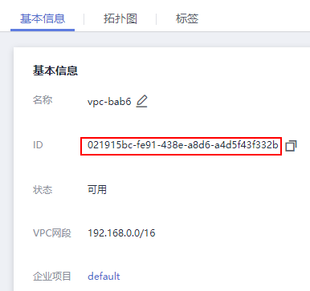

# 创建Network<a name="cci_02_2012"></a>

## 功能介绍<a name="section1686113493165"></a>

创建一个Network对象。

Network对象是华为云CCI新增对象，用于定义kubernetes中一个namespace内的网络。目前CCI支持VPC网络，一个VPC网络类型的network对象对应于华为云虚拟私有云服务中的一个子网。

CCI的容器网络依赖于华为云底层VPC网络，因此在创建network对象前，需要先调用虚拟私有云的接口创建或者查询已有子网信息。

> **须知：**   
>此处VPC和子网的网段不能为10.247.0.0/16，10.247.0.0/16是云容器实例预留给Service的网段。如果您使用此网段，后续可能会造成IP冲突，导致负载无法创建或服务不可用；如果您不需要通过Service访问，而是直接访问Pod，则可以使用此网段。  

安全组ID可以在[安全组控制台](https://console.huaweicloud.com/vpc/#/vpc/vpcmanager/securitygroups)获取，如下图。

**图 1**  获取安全组ID<a name="fig676063417262"></a>  


VPC ID、子网ID和网络ID可以VPC控制台获取。

**图 2**  获取VPC ID<a name="fig69573455348"></a>  


**图 3**  获取子网ID和网络ID<a name="fig1273117811396"></a>  


## URI<a name="section8403243161416"></a>

POST /apis/networking.cci.io/v1beta1/namespaces/\{namespace\}/networks

**表 1**  Path参数

<a name="table1696332124519"></a>
<table><thead align="left"><tr id="row11961332194516"><th class="cellrowborder" valign="top" width="24.01%" id="mcps1.2.3.1.1"><p id="p396032144518"><a name="p396032144518"></a><a name="p396032144518"></a>参数</p>
</th>
<th class="cellrowborder" valign="top" width="75.99000000000001%" id="mcps1.2.3.1.2"><p id="p18962325454"><a name="p18962325454"></a><a name="p18962325454"></a>描述</p>
</th>
</tr>
</thead>
<tbody><tr id="row9960327457"><td class="cellrowborder" valign="top" width="24.01%" headers="mcps1.2.3.1.1 "><p id="p1496113214456"><a name="p1496113214456"></a><a name="p1496113214456"></a>namespace</p>
</td>
<td class="cellrowborder" valign="top" width="75.99000000000001%" headers="mcps1.2.3.1.2 "><p id="p141902036155717"><a name="p141902036155717"></a><a name="p141902036155717"></a>Object name and auth scope, such as for teams and projects.</p>
</td>
</tr>
</tbody>
</table>

**表 2**  Query参数

<a name="table34813241101"></a>
<table><thead align="left"><tr id="row1048111243020"><th class="cellrowborder" valign="top" width="24.38%" id="mcps1.2.4.1.1"><p id="p13339172817018"><a name="p13339172817018"></a><a name="p13339172817018"></a>参数</p>
</th>
<th class="cellrowborder" valign="top" width="24.62%" id="mcps1.2.4.1.2"><p id="p663610391010"><a name="p663610391010"></a><a name="p663610391010"></a>是否必选</p>
</th>
<th class="cellrowborder" valign="top" width="51%" id="mcps1.2.4.1.3"><p id="p9636103913011"><a name="p9636103913011"></a><a name="p9636103913011"></a>描述</p>
</th>
</tr>
</thead>
<tbody><tr id="row34814241405"><td class="cellrowborder" valign="top" width="24.38%" headers="mcps1.2.4.1.1 "><p id="p5964532607"><a name="p5964532607"></a><a name="p5964532607"></a>pretty</p>
</td>
<td class="cellrowborder" valign="top" width="24.62%" headers="mcps1.2.4.1.2 "><p id="p49641432503"><a name="p49641432503"></a><a name="p49641432503"></a>No</p>
</td>
<td class="cellrowborder" valign="top" width="51%" headers="mcps1.2.4.1.3 "><p id="p496433211018"><a name="p496433211018"></a><a name="p496433211018"></a>If 'true', then the output is pretty printed.</p>
</td>
</tr>
</tbody>
</table>

## 请求消息<a name="section947084713911"></a>

**请求参数**

**表 3**  请求参数

<a name="table34052983203655"></a>
<table><thead align="left"><tr id="row30254333203655"><th class="cellrowborder" valign="top" width="20.202020202020204%" id="mcps1.2.5.1.1"><p id="p34681881203655"><a name="p34681881203655"></a><a name="p34681881203655"></a>参数</p>
</th>
<th class="cellrowborder" valign="top" width="13.131313131313133%" id="mcps1.2.5.1.2"><p id="p333122111014"><a name="p333122111014"></a><a name="p333122111014"></a>是否必选</p>
</th>
<th class="cellrowborder" valign="top" width="18.181818181818183%" id="mcps1.2.5.1.3"><p id="p57769002203655"><a name="p57769002203655"></a><a name="p57769002203655"></a>参数类型</p>
</th>
<th class="cellrowborder" valign="top" width="48.484848484848484%" id="mcps1.2.5.1.4"><p id="p58673482203655"><a name="p58673482203655"></a><a name="p58673482203655"></a>描述</p>
</th>
</tr>
</thead>
<tbody><tr id="row54931625203655"><td class="cellrowborder" valign="top" width="20.202020202020204%" headers="mcps1.2.5.1.1 "><p id="p17240419192016"><a name="p17240419192016"></a><a name="p17240419192016"></a>kind</p>
</td>
<td class="cellrowborder" valign="top" width="13.131313131313133%" headers="mcps1.2.5.1.2 "><p id="p224018192205"><a name="p224018192205"></a><a name="p224018192205"></a>Yes</p>
</td>
<td class="cellrowborder" valign="top" width="18.181818181818183%" headers="mcps1.2.5.1.3 "><p id="p724019190202"><a name="p724019190202"></a><a name="p724019190202"></a>String</p>
</td>
<td class="cellrowborder" valign="top" width="48.484848484848484%" headers="mcps1.2.5.1.4 "><p id="p324091920203"><a name="p324091920203"></a><a name="p324091920203"></a>Kind is a string value representing the REST resource this object represents. Servers may infer this from the endpoint the client submits requests to. Cannot be updated. The value of this parameter is <strong id="b72405191204"><a name="b72405191204"></a><a name="b72405191204"></a>Network</strong>.</p>
</td>
</tr>
<tr id="row195372326207"><td class="cellrowborder" valign="top" width="20.202020202020204%" headers="mcps1.2.5.1.1 "><p id="p2303143411208"><a name="p2303143411208"></a><a name="p2303143411208"></a>apiVersion</p>
</td>
<td class="cellrowborder" valign="top" width="13.131313131313133%" headers="mcps1.2.5.1.2 "><p id="p1130373452010"><a name="p1130373452010"></a><a name="p1130373452010"></a>Yes</p>
</td>
<td class="cellrowborder" valign="top" width="18.181818181818183%" headers="mcps1.2.5.1.3 "><p id="p193031434172011"><a name="p193031434172011"></a><a name="p193031434172011"></a>String</p>
</td>
<td class="cellrowborder" valign="top" width="48.484848484848484%" headers="mcps1.2.5.1.4 "><p id="p193031634142019"><a name="p193031634142019"></a><a name="p193031634142019"></a>APIVersion defines the versioned schema of this representation of an object. Servers should convert recognized schemas to the latest internal value, and may reject unrecognized values.The value of this parameter is <strong id="b1130363452010"><a name="b1130363452010"></a><a name="b1130363452010"></a>networking.cci.io</strong>.</p>
</td>
</tr>
<tr id="row93783310208"><td class="cellrowborder" valign="top" width="20.202020202020204%" headers="mcps1.2.5.1.1 "><p id="p1865841122014"><a name="p1865841122014"></a><a name="p1865841122014"></a>metadata</p>
</td>
<td class="cellrowborder" valign="top" width="13.131313131313133%" headers="mcps1.2.5.1.2 "><p id="p986512418201"><a name="p986512418201"></a><a name="p986512418201"></a>Yes</p>
</td>
<td class="cellrowborder" valign="top" width="18.181818181818183%" headers="mcps1.2.5.1.3 "><p id="a3467669217d84b4c81c113d5e2da8569"><a name="a3467669217d84b4c81c113d5e2da8569"></a><a name="a3467669217d84b4c81c113d5e2da8569"></a><a href="数据结构.md#zh-cn_topic_0079614925_table47756489">表10</a></p>
</td>
<td class="cellrowborder" valign="top" width="48.484848484848484%" headers="mcps1.2.5.1.4 "><p id="p338173482316"><a name="p338173482316"></a><a name="p338173482316"></a>Standard object metadata.</p>
<p id="p107941024294"><a name="p107941024294"></a><a name="p107941024294"></a>其中annotations字段请参见<a href="#table15841359192020">表4</a>。</p>
<p id="p1852313501213"><a name="p1852313501213"></a><a name="p1852313501213"></a>另外必须设置metadata.Namespace=当前操作的namespace</p>
</td>
</tr>
<tr id="row168816301233"><td class="cellrowborder" valign="top" width="20.202020202020204%" headers="mcps1.2.5.1.1 "><p id="p9864152411266"><a name="p9864152411266"></a><a name="p9864152411266"></a>spec</p>
</td>
<td class="cellrowborder" valign="top" width="13.131313131313133%" headers="mcps1.2.5.1.2 "><p id="p4986110104112"><a name="p4986110104112"></a><a name="p4986110104112"></a>Yes</p>
</td>
<td class="cellrowborder" valign="top" width="18.181818181818183%" headers="mcps1.2.5.1.3 "><p id="p83351644132313"><a name="p83351644132313"></a><a name="p83351644132313"></a><a href="#table15570752102811">表5</a></p>
</td>
<td class="cellrowborder" valign="top" width="48.484848484848484%" headers="mcps1.2.5.1.4 "><p id="p086472482619"><a name="p086472482619"></a><a name="p086472482619"></a>Specification of the desired behavior of the Network.</p>
</td>
</tr>
<tr id="row286653082316"><td class="cellrowborder" valign="top" width="20.202020202020204%" headers="mcps1.2.5.1.1 "><p id="p786418243264"><a name="p786418243264"></a><a name="p786418243264"></a>status</p>
</td>
<td class="cellrowborder" valign="top" width="13.131313131313133%" headers="mcps1.2.5.1.2 "><p id="p3864112482611"><a name="p3864112482611"></a><a name="p3864112482611"></a>No</p>
</td>
<td class="cellrowborder" valign="top" width="18.181818181818183%" headers="mcps1.2.5.1.3 "><p id="p1430310471239"><a name="p1430310471239"></a><a name="p1430310471239"></a><a href="#table3226535203116">表6</a></p>
</td>
<td class="cellrowborder" valign="top" width="48.484848484848484%" headers="mcps1.2.5.1.4 "><p id="p9864162417264"><a name="p9864162417264"></a><a name="p9864162417264"></a>Most recently observed status of the Network.</p>
</td>
</tr>
</tbody>
</table>

**表 4**  metadata.annotations必选字段数据结构说明

<a name="table15841359192020"></a>
<table><thead align="left"><tr id="row86001559122015"><th class="cellrowborder" valign="top" width="35%" id="mcps1.2.5.1.1"><p id="p15600359142019"><a name="p15600359142019"></a><a name="p15600359142019"></a>参数</p>
</th>
<th class="cellrowborder" valign="top" width="11%" id="mcps1.2.5.1.2"><p id="p37761541122611"><a name="p37761541122611"></a><a name="p37761541122611"></a>是否必选</p>
</th>
<th class="cellrowborder" valign="top" width="10%" id="mcps1.2.5.1.3"><p id="p18600759152013"><a name="p18600759152013"></a><a name="p18600759152013"></a>参数类型</p>
</th>
<th class="cellrowborder" valign="top" width="44%" id="mcps1.2.5.1.4"><p id="p36001759112013"><a name="p36001759112013"></a><a name="p36001759112013"></a>描述</p>
</th>
</tr>
</thead>
<tbody><tr id="row1760010591201"><td class="cellrowborder" valign="top" width="35%" headers="mcps1.2.5.1.1 "><p id="p13600195917201"><a name="p13600195917201"></a><a name="p13600195917201"></a>network.alpha.kubernetes.io/default-security-group</p>
</td>
<td class="cellrowborder" valign="top" width="11%" headers="mcps1.2.5.1.2 "><p id="p7917635152617"><a name="p7917635152617"></a><a name="p7917635152617"></a>Yes</p>
</td>
<td class="cellrowborder" valign="top" width="10%" headers="mcps1.2.5.1.3 "><p id="p060015952017"><a name="p060015952017"></a><a name="p060015952017"></a>String</p>
</td>
<td class="cellrowborder" valign="top" width="44%" headers="mcps1.2.5.1.4 "><p id="p0600659172010"><a name="p0600659172010"></a><a name="p0600659172010"></a>Network对应子网所属安全组ID。</p>
</td>
</tr>
<tr id="row613885715287"><td class="cellrowborder" valign="top" width="35%" headers="mcps1.2.5.1.1 "><p id="p8138105722810"><a name="p8138105722810"></a><a name="p8138105722810"></a>network.alpha.kubernetes.io/project-id</p>
</td>
<td class="cellrowborder" valign="top" width="11%" headers="mcps1.2.5.1.2 "><p id="p101381357142820"><a name="p101381357142820"></a><a name="p101381357142820"></a>Yes</p>
</td>
<td class="cellrowborder" valign="top" width="10%" headers="mcps1.2.5.1.3 "><p id="p6138057172815"><a name="p6138057172815"></a><a name="p6138057172815"></a>String</p>
</td>
<td class="cellrowborder" valign="top" width="44%" headers="mcps1.2.5.1.4 "><p id="p1437351152918"><a name="p1437351152918"></a><a name="p1437351152918"></a>Network所属用户的project-id，获取方法请参见<a href="获取项目ID.md">获取项目ID</a>。</p>
</td>
</tr>
<tr id="row182801859132818"><td class="cellrowborder" valign="top" width="35%" headers="mcps1.2.5.1.1 "><p id="p11280165916288"><a name="p11280165916288"></a><a name="p11280165916288"></a>network.alpha.kubernetes.io/domain-id</p>
</td>
<td class="cellrowborder" valign="top" width="11%" headers="mcps1.2.5.1.2 "><p id="p1928095919281"><a name="p1928095919281"></a><a name="p1928095919281"></a>Yes</p>
</td>
<td class="cellrowborder" valign="top" width="10%" headers="mcps1.2.5.1.3 "><p id="p928035972817"><a name="p928035972817"></a><a name="p928035972817"></a>String</p>
</td>
<td class="cellrowborder" valign="top" width="44%" headers="mcps1.2.5.1.4 "><p id="p1056319392297"><a name="p1056319392297"></a><a name="p1056319392297"></a>Network所属用户的domain-id，获取方法请参见<a href="获取账号ID.md">获取账号ID</a>。</p>
</td>
</tr>
</tbody>
</table>

**表 5**  VPC网络类型

<a name="table15570752102811"></a>
<table><thead align="left"><tr id="row457055292811"><th class="cellrowborder" valign="top" width="17%" id="mcps1.2.5.1.1"><p id="p1745604817818"><a name="p1745604817818"></a><a name="p1745604817818"></a>参数</p>
</th>
<th class="cellrowborder" valign="top" width="16%" id="mcps1.2.5.1.2"><p id="p046512488820"><a name="p046512488820"></a><a name="p046512488820"></a>是否必选</p>
</th>
<th class="cellrowborder" valign="top" width="19%" id="mcps1.2.5.1.3"><p id="p104741648481"><a name="p104741648481"></a><a name="p104741648481"></a>参数类型</p>
</th>
<th class="cellrowborder" valign="top" width="48%" id="mcps1.2.5.1.4"><p id="p15491184819810"><a name="p15491184819810"></a><a name="p15491184819810"></a>描述</p>
</th>
</tr>
</thead>
<tbody><tr id="row4570125212286"><td class="cellrowborder" valign="top" width="17%" headers="mcps1.2.5.1.1 "><p id="p6341320173012"><a name="p6341320173012"></a><a name="p6341320173012"></a>cidr</p>
</td>
<td class="cellrowborder" valign="top" width="16%" headers="mcps1.2.5.1.2 "><p id="p123462063018"><a name="p123462063018"></a><a name="p123462063018"></a>No</p>
</td>
<td class="cellrowborder" valign="top" width="19%" headers="mcps1.2.5.1.3 "><p id="p734152063019"><a name="p734152063019"></a><a name="p734152063019"></a>String</p>
</td>
<td class="cellrowborder" valign="top" width="48%" headers="mcps1.2.5.1.4 "><p id="p1534112014309"><a name="p1534112014309"></a><a name="p1534112014309"></a>Network对应VPC子网的网段。</p>
<div class="note" id="note3755144411414"><a name="note3755144411414"></a><a name="note3755144411414"></a><span class="notetitle"> 说明： </span><div class="notebody"><p id="p1294525011518"><a name="p1294525011518"></a><a name="p1294525011518"></a>此处VPC和子网的网段不能为10.247.0.0/16，10.247.0.0/16是云容器实例预留给Service的网段。如果您使用此网段，后续可能会造成IP冲突，导致负载无法创建或服务不可用；如果您不需要通过Service访问，而是直接访问Pod，则可以使用此网段。</p>
</div></div>
</td>
</tr>
<tr id="row367322818307"><td class="cellrowborder" valign="top" width="17%" headers="mcps1.2.5.1.1 "><p id="p15251183993015"><a name="p15251183993015"></a><a name="p15251183993015"></a>attachedVPC</p>
</td>
<td class="cellrowborder" valign="top" width="16%" headers="mcps1.2.5.1.2 "><p id="p18251039173015"><a name="p18251039173015"></a><a name="p18251039173015"></a>Yes</p>
</td>
<td class="cellrowborder" valign="top" width="19%" headers="mcps1.2.5.1.3 "><p id="p4251123914302"><a name="p4251123914302"></a><a name="p4251123914302"></a>String</p>
</td>
<td class="cellrowborder" valign="top" width="48%" headers="mcps1.2.5.1.4 "><p id="p1125173914309"><a name="p1125173914309"></a><a name="p1125173914309"></a>Network 所在VPC的ID。</p>
</td>
</tr>
<tr id="row12251142917306"><td class="cellrowborder" valign="top" width="17%" headers="mcps1.2.5.1.1 "><p id="p13221554153020"><a name="p13221554153020"></a><a name="p13221554153020"></a>networkType</p>
</td>
<td class="cellrowborder" valign="top" width="16%" headers="mcps1.2.5.1.2 "><p id="p2022117547304"><a name="p2022117547304"></a><a name="p2022117547304"></a>Yes</p>
</td>
<td class="cellrowborder" valign="top" width="19%" headers="mcps1.2.5.1.3 "><p id="p18221754103018"><a name="p18221754103018"></a><a name="p18221754103018"></a>String</p>
</td>
<td class="cellrowborder" valign="top" width="48%" headers="mcps1.2.5.1.4 "><p id="p3221185418309"><a name="p3221185418309"></a><a name="p3221185418309"></a>Network 网络类型，VPC网络类型取值：<strong id="b197945241336"><a name="b197945241336"></a><a name="b197945241336"></a>underlay_neutron</strong>。</p>
</td>
</tr>
<tr id="row1581183217301"><td class="cellrowborder" valign="top" width="17%" headers="mcps1.2.5.1.1 "><p id="p9470170173116"><a name="p9470170173116"></a><a name="p9470170173116"></a>networkID</p>
</td>
<td class="cellrowborder" valign="top" width="16%" headers="mcps1.2.5.1.2 "><p id="p11470100173120"><a name="p11470100173120"></a><a name="p11470100173120"></a>Yes</p>
</td>
<td class="cellrowborder" valign="top" width="19%" headers="mcps1.2.5.1.3 "><p id="p34704093112"><a name="p34704093112"></a><a name="p34704093112"></a>String</p>
</td>
<td class="cellrowborder" valign="top" width="48%" headers="mcps1.2.5.1.4 "><p id="p447020173116"><a name="p447020173116"></a><a name="p447020173116"></a>Network对应VPC子网的网络ID。</p>
</td>
</tr>
<tr id="row2861143193012"><td class="cellrowborder" valign="top" width="17%" headers="mcps1.2.5.1.1 "><p id="p63148613115"><a name="p63148613115"></a><a name="p63148613115"></a>subnetID</p>
</td>
<td class="cellrowborder" valign="top" width="16%" headers="mcps1.2.5.1.2 "><p id="p17314061317"><a name="p17314061317"></a><a name="p17314061317"></a>Yes</p>
</td>
<td class="cellrowborder" valign="top" width="19%" headers="mcps1.2.5.1.3 "><p id="p17314196103116"><a name="p17314196103116"></a><a name="p17314196103116"></a>String</p>
</td>
<td class="cellrowborder" valign="top" width="48%" headers="mcps1.2.5.1.4 "><p id="p931417643110"><a name="p931417643110"></a><a name="p931417643110"></a>Network对应VPC子网的子网ID。</p>
</td>
</tr>
<tr id="row2845112943015"><td class="cellrowborder" valign="top" width="17%" headers="mcps1.2.5.1.1 "><p id="p5736171133115"><a name="p5736171133115"></a><a name="p5736171133115"></a>availableZone</p>
</td>
<td class="cellrowborder" valign="top" width="16%" headers="mcps1.2.5.1.2 "><p id="p17736311153115"><a name="p17736311153115"></a><a name="p17736311153115"></a>Yes</p>
</td>
<td class="cellrowborder" valign="top" width="19%" headers="mcps1.2.5.1.3 "><p id="p1873651111311"><a name="p1873651111311"></a><a name="p1873651111311"></a>String</p>
</td>
<td class="cellrowborder" valign="top" width="48%" headers="mcps1.2.5.1.4 "><p id="p159741931152618"><a name="p159741931152618"></a><a name="p159741931152618"></a>Network对应VPC子网所在可用区。当前支持“华北-北京一”、“华北-北京四”和“华东-上海一”区域，该值可设置为“cnnorth1a”、“cn-north-4a”或“cn-east-3a”。</p>
</td>
</tr>
</tbody>
</table>

**表 6**  status字段数据结构说明

<a name="table3226535203116"></a>
<table><thead align="left"><tr id="row162271135153117"><th class="cellrowborder" valign="top" width="17.378262173782623%" id="mcps1.2.5.1.1"><p id="p186516551182"><a name="p186516551182"></a><a name="p186516551182"></a>参数</p>
</th>
<th class="cellrowborder" valign="top" width="15.828417158284172%" id="mcps1.2.5.1.2"><p id="p107515551089"><a name="p107515551089"></a><a name="p107515551089"></a>是否必选</p>
</th>
<th class="cellrowborder" valign="top" width="18.998100189981002%" id="mcps1.2.5.1.3"><p id="p15881655682"><a name="p15881655682"></a><a name="p15881655682"></a>参数类型</p>
</th>
<th class="cellrowborder" valign="top" width="47.795220477952206%" id="mcps1.2.5.1.4"><p id="p69835516817"><a name="p69835516817"></a><a name="p69835516817"></a>描述</p>
</th>
</tr>
</thead>
<tbody><tr id="row722703513115"><td class="cellrowborder" valign="top" width="17.378262173782623%" headers="mcps1.2.5.1.1 "><p id="p7770135423110"><a name="p7770135423110"></a><a name="p7770135423110"></a>state</p>
</td>
<td class="cellrowborder" valign="top" width="15.828417158284172%" headers="mcps1.2.5.1.2 "><p id="p77701754123116"><a name="p77701754123116"></a><a name="p77701754123116"></a>No</p>
</td>
<td class="cellrowborder" valign="top" width="18.998100189981002%" headers="mcps1.2.5.1.3 "><p id="p15770754123114"><a name="p15770754123114"></a><a name="p15770754123114"></a>String</p>
</td>
<td class="cellrowborder" valign="top" width="47.795220477952206%" headers="mcps1.2.5.1.4 "><p id="p17706543314"><a name="p17706543314"></a><a name="p17706543314"></a>Network所处状态，包括Initializing、Active、Pending、Failed、Terminating。</p>
</td>
</tr>
<tr id="row193591035375"><td class="cellrowborder" valign="top" width="17.378262173782623%" headers="mcps1.2.5.1.1 "><p id="p43591735378"><a name="p43591735378"></a><a name="p43591735378"></a>Message</p>
</td>
<td class="cellrowborder" valign="top" width="15.828417158284172%" headers="mcps1.2.5.1.2 "><p id="p1635983183717"><a name="p1635983183717"></a><a name="p1635983183717"></a>No</p>
</td>
<td class="cellrowborder" valign="top" width="18.998100189981002%" headers="mcps1.2.5.1.3 "><p id="p4359153163716"><a name="p4359153163716"></a><a name="p4359153163716"></a>String</p>
</td>
<td class="cellrowborder" valign="top" width="47.795220477952206%" headers="mcps1.2.5.1.4 "><p id="p183591313376"><a name="p183591313376"></a><a name="p183591313376"></a>Network对象所处当前状态的原因</p>
</td>
</tr>
</tbody>
</table>

**请求示例**

```
{
    "apiVersion": "networking.cci.io/v1beta1",
    "kind": "Network",
    "metadata": {
        "annotations": {
            "network.alpha.kubernetes.io/default-security-group": "security-group-id",
            "network.alpha.kubernetes.io/domain-id": "domain-id",
            "network.alpha.kubernetes.io/project-id": "project-id"
        },
        "name": "test-network",
        "namespace": "test-ns"
    },
    "spec": {
        "availableZone": "cnnorth1a",
        "cidr": "192.168.0.0/24",
        "attachedVPC": "vpc-id",
        "networkID": "network-id",
        "networkType": "underlay_neutron",
        "subnetID": "subnet-id"
    }
}
```

## 响应消息<a name="section61819725020"></a>

**响应参数**

响应参数详情见[表3](#table34052983203655)

**响应示例**

```
{
    "kind": "Network",
    "apiVersion": "networking.cci.io/v1beta1",
    "metadata": {
        "name": "test-network",
        "namespace": "test-ns",
        "selfLink": "/apis/networking.cci.io/v1beta1/namespaces/test-ns/networks/test-network",
        "uid": "f03452ac-a4ea-11e8-8500-c81fbe371a17",
        "resourceVersion": "2025736",
        "creationTimestamp": "2018-08-21T02:35:59Z",
        "annotations": {
            "network.alpha.kubernetes.io/default-security-group": "security-group-id",
            "network.alpha.kubernetes.io/domain-id": "domain-id",
            "network.alpha.kubernetes.io/project-id": "project-id",
            "network.alpha.kubernetes.io/type": "underlay_neutron"
        },
        "enable": true
    },
    "spec": {
        "availableZone": "cnnorth1a",
        "cidr": "192.168.0.0/24",
        "attachedVPC": "vpc-id",
        "networkID": "network-id",
        "networkType": "underlay_neutron",
        "subnetID": "subnet-id"
    },
    "status": {
        "state": "Initializing"
    }
}
```

## 状态码<a name="s50f1049a6a4d404c895cf636eb8f3bf1"></a>

**表 7**  状态码

<a name="zh-cn_topic_0079615062_table27129916"></a>
<table><thead align="left"><tr id="zh-cn_topic_0079615062_row7162954"><th class="cellrowborder" valign="top" width="50%" id="mcps1.2.3.1.1"><p id="p3042097021059"><a name="p3042097021059"></a><a name="p3042097021059"></a>状态码</p>
</th>
<th class="cellrowborder" valign="top" width="50%" id="mcps1.2.3.1.2"><p id="p4817954021059"><a name="p4817954021059"></a><a name="p4817954021059"></a>描述</p>
</th>
</tr>
</thead>
<tbody><tr id="zh-cn_topic_0079615062_row4477025"><td class="cellrowborder" valign="top" width="50%" headers="mcps1.2.3.1.1 "><p id="zh-cn_topic_0079615062_p27094719"><a name="zh-cn_topic_0079615062_p27094719"></a><a name="zh-cn_topic_0079615062_p27094719"></a>201</p>
</td>
<td class="cellrowborder" valign="top" width="50%" headers="mcps1.2.3.1.2 "><p id="zh-cn_topic_0079615062_p47188597"><a name="zh-cn_topic_0079615062_p47188597"></a><a name="zh-cn_topic_0079615062_p47188597"></a>This operation succeeds, and a Network resource object is returned.</p>
</td>
</tr>
</tbody>
</table>

