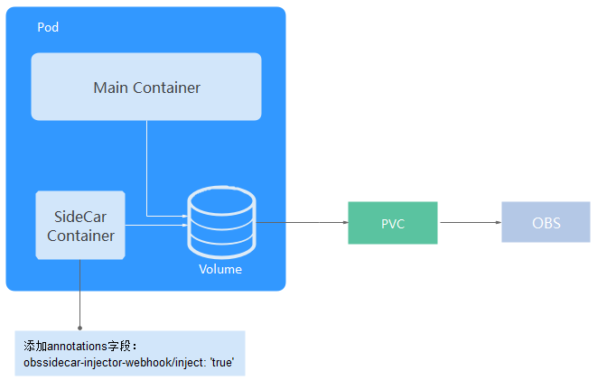

# 挂载OBS使用限制<a name="cci_02_2026"></a>

云容器实例通过辅助容器（SideCar Container）挂载OBS路径，并将路径共享给主容器，如[图1](#fig82821406355)所示。

**图 1**  SideCar Container<a name="fig82821406355"></a>  


挂载OBS时有如下限制：

-   创建Pod时需要添加如下annotations字段：**obssidecar-injector-webhook/inject: 'true'**。

    ```
    {
        "apiVersion": "batch/v1",
        "kind": "Job",
        "metadata": {
            "annotations": {
                "description": ""
            },
            "enable": true,
            "name": "obs-casoffinder",
            "namespace": "cci-namespace-tibgpu",
            "labels": {}
        },
        "spec": {
            "template": {
                "metadata": {
                    "enable": true,
                    "name": "obs-casoffinder",
                    "annotations": {
                        "obssidecar-injector-webhook/inject": "true",
                        "obssidecar-injector-webhook/cpu": "500m",
                        "obssidecar-injector-webhook/memory": "2048Mi"
                    }
                },
                "spec": {
                    "containers": [
                        {
                            "image": "swr.cn-north-1.myhuaweicloud.com/aeocdc/opencl1:v1",
                            "name": "casoffinder-obs",
                            "terminationMessagePolicy": "File",
                            "resources": {
                                "limits": {
                                    "cpu": "4",
                                    "memory": "32Gi",
                                    "nvidia.com/gpu-tesla-p4-8GB": "1"
                                },
                                "requests": {
                                    "cpu": "4",
                                    "memory": "32Gi",
                                    "nvidia.com/gpu-tesla-p4-8GB": "1"
                                }
                            },
                            "command": [
                                "/bin/sh",
                                "-c",
                                "/tmp/obs0/gBIG/cas-offinder /tmp/obs0/gBIG/off_targetInput.txt G /tmp/obs0/gBIG/off_targetOutput.txt  && echo >/obssidecar/terminate/0"
                            ],
                            "lifecycle": {},
                            "volumeMounts": [
                                {
                                    "name": "cci-obs-import-jzt9g50x-tunn",
                                    "mountPath": "/tmp/obs0"
                                }
                            ]
                        }
                    ],
                    "imagePullSecrets": [
                        {
                            "name": "imagepull-secret"
                        }
                    ],
                    "restartPolicy": "Never",
                    "volumes": [
                        {
                            "persistentVolumeClaim": {
                                "claimName": "cci-obs-import-jzt9g50x-tunn"
                            },
                            "name": "cci-obs-import-jzt9g50x-tunn"
                        }
                    ]
                }
            },
            "activeDeadlineSeconds": 200
        }
    }
    ```

-   启动命令。
    -   使用yaml配置容器启动命令时，推荐使用bash方式。

        **trap '\[ -d /obssidecar/terminate \] && echo \> /obssidecar/terminate/0' EXIT && sleep 10**

        示例：

        ```
        {
            "command": [
                "/bin/sh",
                "-c",
                "trap '[ -d /obssidecar/terminate ] && echo > /obssidecar/terminate/0' EXIT && sleep 10"
            ]
        }
        ```

    -   用户容器自带启动命令或者容器本身就不会退出时，无需配置启动命令。

        其中，用户容器自带启动命令时，需要保证命令退出时向/obssidecar/terminate/写入任意一个文件，保证sidecar容器感知用户容器的退出。


