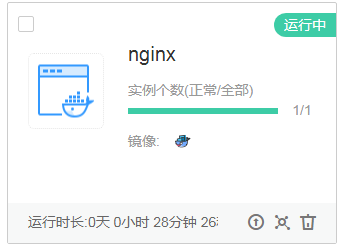

# 示例<a name="cci_02_0011"></a>

## 概述<a name="section142673304107"></a>

本文通过调用一系列云容器实例的API使用nginx镜像创建一个工作负载，介绍使用云容器实例API的基本流程。

其中，镜像直接使用Docker官方nginx镜像，容器的资源规格为0.25核CPU、512M内存，并绑定一个负载均衡实例，通过负载均衡实例从外网访问容器负载。

创建出来的nginx负载如下所示。

**图 1**  nginx示例<a name="fig11150819143813"></a>  


创建nginx的流程如下：

1.  调用[Token认证](获取请求认证.md#section2417768214391)接口获取用户Token，因为在后续的在后续的请求中需要将Token放到请求消息头中作为认证。
2.  调用[创建Namespace](创建Namespace.md)接口创建命名空间。
3.  调用[创建Network](创建Network.md)接口创建网络，与VPC和子网关联。
4.  调用[创建Deployment](创建Deployment.md)接口创建nginx容器负载。

## 前提条件<a name="section91264715102"></a>

-   已获取IAM和云容器实例CCI的Endpoint，具体请参见[地区和终端节点](http://developer.huaweicloud.com/endpoint)。
-   已获取项目ID和账号ID，具体请参见[获取项目ID](获取项目ID.md)和[获取账号ID](获取账号ID.md)。
-   已创建VPC和子网，并获取VPC ID、子网网络ID、子网ID、安全组ID、子网CIDR。

## 创建容器负载<a name="section680742610404"></a>

假设已获取前提条件中的信息为如下值（实际操作中您需要根据实际情况替换）：

-   IAM的Endpoint：iam.cn-north-1.myhuaweicloud.com
-   云容器实例的Endpoint：cci.cn-north-1.myhuaweicloud.com
-   区域的名称：“cn-north-1“

则可以通过如下步骤创建nginx容器负载。

1.  调用[Token认证](获取请求认证.md#section2417768214391)接口获取用户Token，并设置成环境变量，Token用于后续调用其他接口鉴权。

    ```
    curl POST https://iam.cn-north-1.myhuaweicloud.com/v3/auth/tokens -H 'content-type: application/json' -v -k -d '{
        "auth": {
            "identity": {
                "methods": [
                    "password"
                ],
                "password": {
                    "user": {
                        "name": "testname",
                        "domain": {
                            "name": "testname"
                        },
                        "password": "******"
                    }
                }
            },
            "scope": {
                "project": {
                    "name": "cn-north-1"
                }
            }
        }
    }'
    ```

    响应Header中“X-Subject-Token“的值即为Token：

    ```
    X-Subject-Token:MIIDkgYJKoZIhvcNAQcCoIIDgzCCA38CAQExDTALBglghkgBZQMEAgEwgXXXXX...
    ```

    使用如下命令将token设置为环境变量，方便后续事项。

    **export Token=_\{_**_**X-Subject-Token\}**_

    **X-Subject-Token**即为上一步骤获取到的token，如下所示。

    ```
    export Token=MIIDkgYJKoZIhvcNAQcCoIIDgzCCA38CAQExDTALBglghkgBZQMEAgEwgXXXXX...
    ```

2.  调用[创建Namespace](创建Namespace.md)接口创建命名空间，并指定使用GPU型资源。

    ```
    curl POST https://cci.cn-north-1.myhuaweicloud.com/api/v1/namespaces -H 'content-type: application/json' -H "x-auth-token: $Token" -v -k -d '{
        "apiVersion": "v1",
        "kind": "Namespace",
        "metadata": {
            "name": "namespace-test",
            "annotations": {
                "namespace.kubernetes.io/flavor": "gpu-accelerated"
            }
        },
        "spec": {
            "finalizers": [
                "kubernetes"
            ]
        }
    }'
    ```

3.  调用[创建Network](创建Network.md)接口创建网络，与VPC与子网关联。

    ```
    curl POST https://cci.cn-north-1.myhuaweicloud.com/apis/networking.cci.io/v1beta1/namespaces/namespace-test/networks -H 'content-type: application/json' -H "x-auth-token: $Token" -v -k -d '{
        "apiVersion": "networking.cci.io/v1beta1",
        "kind": "Network",
        "metadata": {
            "annotations": {
                "network.alpha.kubernetes.io/default-security-group": "security-group-id",
                "network.alpha.kubernetes.io/domain-id": "domain-id",
                "network.alpha.kubernetes.io/project-id": "project-id"
            },
            "name": "test-network"
        },
        "spec": {
            "availableZone": "cnnorth1a",
            "cidr": "192.168.0.0/24",
            "attachedVPC": "vpc-id",
            "networkID": "network-id",
            "networkType": "underlay_neutron",
            "subnetID": "subnet-id"
        }
    }
    ```

4.  调用[创建Deployment](创建Deployment.md)接口创建nginx容器负载，负载名称为nginx，使用Docker官方镜像nginx:latest，容器的资源规格为0.1核CPU、128M内存。调用接口后，云容器实例会创建一个运行nginx的容器。

    ```
    curl POST https://cci.cn-north-1.myhuaweicloud.com/apis/apps/v1/namespaces/namespace-test/deployments -H 'content-type: application/json' -H "x-auth-token: $Token" -v -k -d '{
        "apiVersion": "apps/v1",
        "kind": "Deployment",
        "metadata": {
            "name": "nginx"
        },
        "spec": {
            "replicas": 1,
            "selector": {
                "matchLabels": {
                    "app": "nginx"
                }
            },
            "template": {
                "metadata": {
                    "labels": {
                        "app": "nginx"
                    }
                },
                "spec": {
                    "containers": [
                        {
                            "image": "nginx:latest",
                            "name": "container-0",
                            "resources": {
                                "limits": {
                                    "cpu": "250m",
                                    "memory": "512Mi"
                                },
                                "requests": {
                                    "cpu": "250m",
                                    "memory": "512Mi"
                                }
                            }
                        }
                    ],
                    "imagePullSecrets": [
                        {
                            "name": "imagepull-secret"
                        }
                    ],
                    "volumes": [],
                    "affinity": {}
                }
            },
            "minReadySeconds": 0,
            "strategy": {
                "type": "RollingUpdate",
                "rollingUpdate": {
                    "maxSurge": 0,
                    "maxUnavailable": 1
                }
            }
        }
    }'
    ```

    Nginx负载创建完后，您可以在云容器实例的管理控制台查看到负载。

    **图 2**  nginx<a name="fig47489333115"></a>  
    


