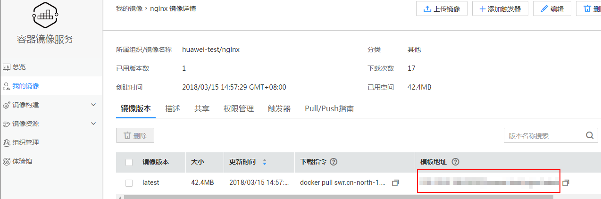

# 获取Docker镜像地址

云容器实例支持使用Dockerhub官方镜像和上传到容器镜像服务的镜像。其中

-   华为云[容器镜像服务](https://www.huaweicloud.com/product/swr.html)从Dockerhub同步了部分常用镜像，使得您可以在内部网络中直接使用“镜像名称:版本号“，如nginx:alpine，您可以在容器镜像服务控制台中查询同步了哪些镜像；对于没有同步的Dockerhub镜像，容器需要访问外部网络，从而下载Dockerhub的镜像，这种情况下，您需要做一些网络配置，具体请参见[从容器访问公网](https://support.huaweicloud.com/usermanual-cci/cci_01_0065.html)。
-   容器镜像服务中的镜像请使用镜像的“模板地址“，上传镜像后，您可以在容器镜像服务的镜像中获取，如下图所示。

    **图 1**  镜像地址  
    

