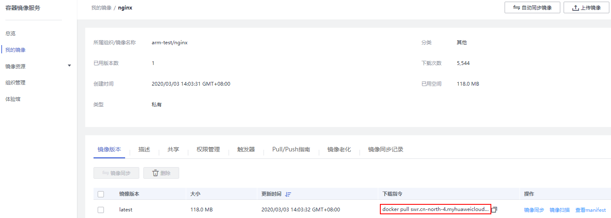

# 获取容器镜像地址

云容器实例支持使用镜像中心和上传到容器镜像服务的镜像。其中

-   华为云[容器镜像服务](https://www.huaweicloud.com/product/swr.html)从镜像中心同步了部分常用镜像，使得您可以在内部网络中直接使用“镜像名称:版本号“，如nginx:alpine，您可以在容器镜像服务控制台中查询同步了哪些镜像。
-   容器镜像服务中的镜像请使用镜像的“下载指令“，上传镜像后，您可以在容器镜像服务的镜像中获取，如下图所示。

    **图 1**  镜像地址  
    

