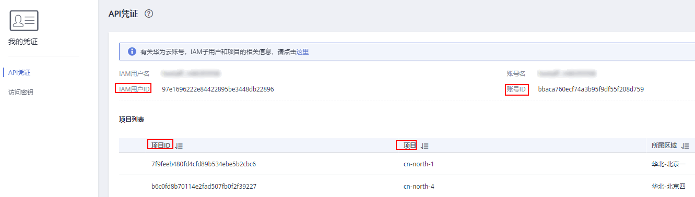

# 获取项目ID<a name="cci_02_1001"></a>

在调用接口的时候，部分URL中需要填入项目编号，所以需要获取到项目编号。项目编号获取步骤如下：

1.  注册并登录管理控制台。
2.  单击用户名，在下拉列表中单击“基本信息”。
3.  在基本信息页面单击“管理我的凭证”。

    在“我的凭证”页面的项目列表中查看项目ID。


**图 1**  查看项目ID<a name="fig48412424201120"></a>  


1.  获取Token。

    请参见[Token认证](认证鉴权.md#section2417768214391)。

2.  获取项目ID。

    获取项目ID的接口为“GET https://iam.eu-west-0.myhuaweicloud.com/v3/_projects_”。

    在请求消息头中增加“X-Auth-Token“，“X-Auth-Token“的取值为上一步获取的Token。

    响应示例如下，其中projects下的“id“即为项目ID。

    ```
    {
        "links": {},
        "projects": [
            {
                "is_domain": ,
                "description": "",
                "links": {}
                "enabled": true,
                "id": "",   // 项目ID
                "parent_id": "",
                "domain_id": "",
                "name": ""
            },
            ...
       ]
    }
    ```


