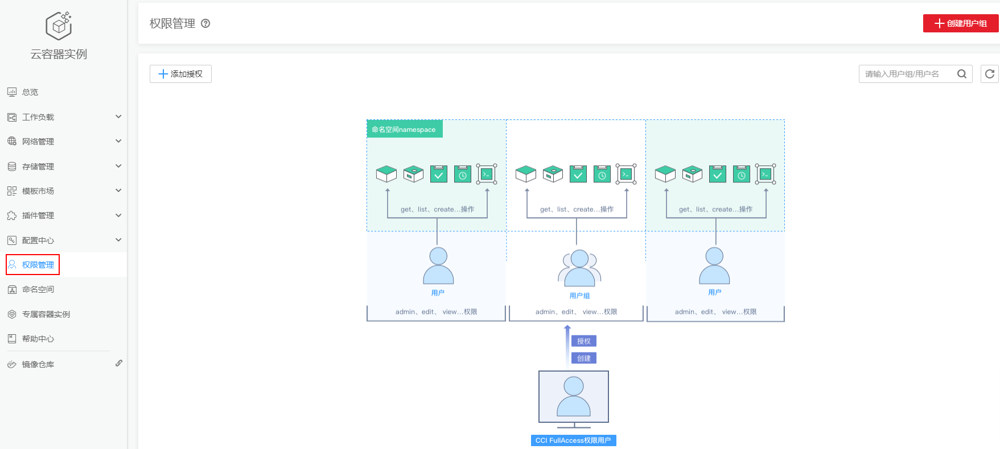

# CCI权限说明

CCI当前认证鉴权是在Kubernetes的角色访问控制（RBAC）与统一身份认证服务（IAM）的能力基础上，提供的基于IAM的细粒度权限控制和IAM Token认证，同时支持命名空间级别及命名空间以下资源的权限控制，帮助用户便捷灵活的对租户下的IAM用户、用户组设定不同的操作权限。

-   **命名空间下资源权限的授权：**是基于Kubernetes RBAC能力的授权。通过权限设置可以让不同的用户或用户组拥有操作指定Namespace下Kubernetes资源的权限。
-   **命名空间级别的授权：**是基于IAM的细粒度授权。通过命名空间级别权限设置可以控制用户操作Namespace（如创建、删除Namespace等）。更多细粒度权限说明请参见[CCI细粒度鉴权系统策略关联Actions](https://support.huaweicloud.com/productdesc-cci/cci_03_0008.html#section0)。

> **说明：** 
>-   创建Namespace时，打开RBAC鉴权开关，则此Namespace下资源访问受RBAC鉴权控制；如果未打开RBAC鉴权开关，则RBAC鉴权不生效。
>-   创建开启RBAC鉴权的Namespace后，需要先对用户授权后，用户才能使用这个Namespace。
>-   支持对当前用户下的所有命名空间进行授权，以提供更好的前端显示体验。

**图 1**  CCI权限管理  

## 命名空间权限

Kubernetes RBAC API定义了四种类型：Role、ClusterRole、RoleBinding与ClusterRoleBinding。当前CCI仅支持ClusterRole、RoleBinding，这两种类型之间的关系和简要说明如下：

-   **ClusterRole：**描述角色和权限的关系。在Kubernetes的RBAC API中，一个角色定义了一组特定权限的规则。整个Kubernetes集群范围内有效的角色则通过ClusterRole对象实现。
-   **RoleBinding：**描述 subjects （包含users, groups）和 角色的关系。角色绑定将一个角色中定义的各种权限授予一个或者一组用户，该用户或用户组则具有对应绑定ClusterRole定义的权限。

**表 1**  RBAC API所定义的两种类型

<table><thead align="left"><tr id="row1914410211164"><th class="cellrowborder" valign="top" width="30.620000000000005%" id="mcps1.2.3.1.1">
类型名称

</th>
<th class="cellrowborder" valign="top" width="69.38%" id="mcps1.2.3.1.2">
说明

</th>
</tr>
</thead>
<tbody><tr id="row2014418219161"><td class="cellrowborder" valign="top" width="30.620000000000005%" headers="mcps1.2.3.1.1 ">
ClusterRole

</td>
<td class="cellrowborder" valign="top" width="69.38%" headers="mcps1.2.3.1.2 ">
ClusterRole对象可以授予整个集群范围内资源访问权限。

</td>
</tr>
<tr id="row16145329168"><td class="cellrowborder" valign="top" width="30.620000000000005%" headers="mcps1.2.3.1.1 ">
RoleBinding

</td>
<td class="cellrowborder" valign="top" width="69.38%" headers="mcps1.2.3.1.2 ">
RoleBinding可以将同一Namespace中的subject（用户）绑定到某个具有特定权限的ClusterRole下，则此subject即具有该ClusterRole定义的权限。

</td>
</tr>
</tbody>
</table>

> **注意：** 
>当前仅支持用户使用ClusterRole在Namespace下创建RoleBinding。

CCI中的命名空间权限是基于Kubernetes RBAC能力的授权，通过权限设置可以让不同的用户或用户组拥有操作不同Kubernetes资源的不同权限。

CCI的kubernetes资源通过命名空间进行权限设置，目前包含**cluster-admin**、**admin**、**edit**、**view**四种角色，详见[表2](#table174765455252)。

**表 2**  用户/用户组角色说明

<table><thead align="left"><tr id="row19540194512257"><th class="cellrowborder" valign="top" width="34.300000000000004%" id="mcps1.2.3.1.1">
默认的ClusterRole

</th>
<th class="cellrowborder" valign="top" width="65.7%" id="mcps1.2.3.1.2">
描述

</th>
</tr>
</thead>
<tbody><tr id="row151518546195"><td class="cellrowborder" valign="top" width="34.300000000000004%" headers="mcps1.2.3.1.1 ">
cluster-admin

</td>
<td class="cellrowborder" valign="top" width="65.7%" headers="mcps1.2.3.1.2 ">
具有Kubernetes所有资源对象操作权限。

</td>
</tr>
<tr id="row195412454251"><td class="cellrowborder" valign="top" width="34.300000000000004%" headers="mcps1.2.3.1.1 ">
admin

</td>
<td class="cellrowborder" valign="top" width="65.7%" headers="mcps1.2.3.1.2 ">
允许admin访问，可以限制在一个Namespace中使用RoleBinding。如果在RoleBinding中使用，则允许对Namespace中大多数资源进行读写访问。这一角色不允许操作Namespace本身，也不能写入资源限额。

</td>
</tr>
<tr id="row12541445182514"><td class="cellrowborder" valign="top" width="34.300000000000004%" headers="mcps1.2.3.1.1 ">
edit

</td>
<td class="cellrowborder" valign="top" width="65.7%" headers="mcps1.2.3.1.2 ">
允许对命名空间内的大多数资源进行读写操作。

</td>
</tr>
<tr id="row15541154516259"><td class="cellrowborder" valign="top" width="34.300000000000004%" headers="mcps1.2.3.1.1 ">
view

</td>
<td class="cellrowborder" valign="top" width="65.7%" headers="mcps1.2.3.1.2 ">
允许对多数对象进行只读操作，但是对secret是不可访问的。

</td>
</tr>
</tbody>
</table>

更多Kubernetes RBAC授权的内容可以参考[Kubernetes RBAC官方文档](https://kubernetes.io/docs/admin/authorization/rbac/)。

