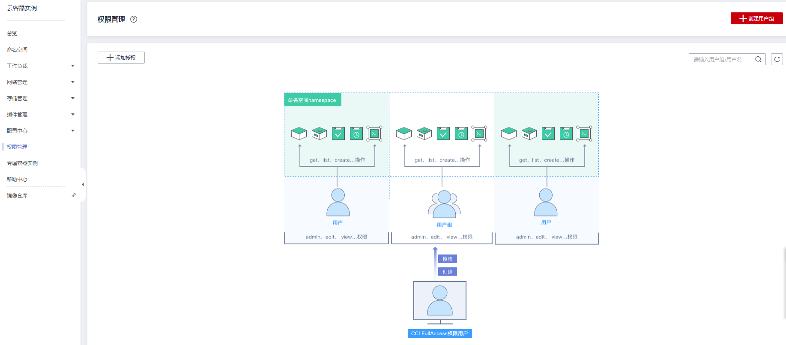

# CCI权限说明

CCI当前认证鉴权是在Kubernetes的角色访问控制（RBAC）与统一身份认证服务（IAM）的能力基础上，提供的基于IAM的细粒度权限控制和IAM Token认证，同时支持命名空间级别及命名空间以下资源的权限控制，帮助用户便捷灵活的对租户下的IAM用户、用户组设定不同的操作权限。

-   **命名空间下资源权限的授权：**是基于Kubernetes RBAC能力的授权。通过权限设置可以让不同的用户或用户组拥有操作指定Namespace下Kubernetes资源的权限。
-   **命名空间级别的授权：**是基于IAM的细粒度授权。通过命名空间级别权限设置可以控制用户操作Namespace（如创建、删除Namespace等）。更多细粒度权限说明请参见[CCI细粒度鉴权系统策略关联Actions](https://support.huaweicloud.com/productdesc-cci/cci_03_0008.html#section0)。

> **说明：** 
>-   创建Namespace时，打开RBAC鉴权开关，则此Namespace下资源访问受RBAC鉴权控制；如果未打开RBAC鉴权开关，则RBAC鉴权不生效。
>-   创建开启RBAC鉴权的Namespace后，需要先对用户授权后，用户才能使用这个Namespace。
>-   network、clusterRole和roleBinding资源不受RBAC权限影响，只受IAM细粒度鉴权控制。network受控于network相关action，clusterRole与roleBinding受控于rbac相关action。
>-   支持对当前用户下的所有命名空间进行授权，以提供更好的前端显示体验。

**图 1**  CCI权限管理  

## 命名空间权限

Kubernetes RBAC API定义了四种类型：Role、ClusterRole、RoleBinding与ClusterRoleBinding。当前CCI仅支持ClusterRole、RoleBinding，这两种类型之间的关系和简要说明如下：

-   **ClusterRole：**描述角色和权限的关系。在Kubernetes的RBAC API中，一个角色定义了一组特定权限的规则。整个Kubernetes集群范围内有效的角色则通过ClusterRole对象实现。
-   **RoleBinding：**描述subjects（包含users，groups）和角色的关系。角色绑定将一个角色中定义的各种权限授予一个或者一组用户，该用户或用户组则具有对应绑定ClusterRole定义的权限。

**表 1**  RBAC API所定义的两种类型

|类型名称|说明|
|--|--|
|ClusterRole|ClusterRole对象可以授予整个集群范围内资源访问权限。|
|RoleBinding|RoleBinding可以将同一Namespace中的subject（用户）绑定到某个具有特定权限的ClusterRole下，则此subject即具有该ClusterRole定义的权限。|

> **注意：** 
>当前仅支持用户使用ClusterRole在Namespace下创建RoleBinding。

CCI中的命名空间权限是基于Kubernetes RBAC能力的授权，通过权限设置可以让不同的用户或用户组拥有操作不同Kubernetes资源的不同权限。

CCI的kubernetes资源通过命名空间进行权限设置，目前包含**cluster-admin**、**admin**、**edit**、**view**四种角色，详见[表2](#table174765455252)。

**表 2**  用户/用户组角色说明

|默认的ClusterRole|描述|
|--|--|
|cluster-admin|具有Kubernetes所有资源对象操作权限。|
|admin|允许admin访问，可以限制在一个Namespace中使用RoleBinding。如果在RoleBinding中使用，则允许对Namespace中大多数资源进行读写访问。这一角色不允许操作Namespace本身，也不能写入资源限额。|
|edit|允许对命名空间内的大多数资源进行读写操作。|
|view|允许对多数对象进行只读操作，但是对secret是不可访问的。|

更多Kubernetes RBAC授权的内容可以参考[Kubernetes RBAC官方文档](https://kubernetes.io/docs/admin/authorization/rbac/)。

