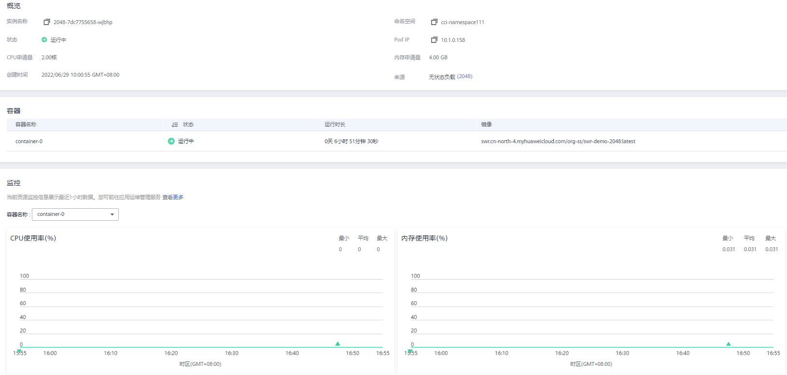

# Pod

## 什么是Pod

Pod是Kubernetes创建或部署的最小单位。一个Pod封装一个或多个容器（container）、存储资源（volume）、一个独立的网络IP以及管理控制容器运行方式的策略选项。

Pod使用主要分为两种方式：

-   Pod中运行一个容器。这是Kubernetes最常见的用法，您可以将Pod视为单个封装的容器，但是Kubernetes是直接管理Pod而不是容器。
-   Pod中运行多个需要耦合在一起工作、需要共享资源的容器。通常这种场景下是应用包含一个主容器和几个辅助容器（SideCar Container），如[图1](#zh-cn_topic_0116111750_fig347141918551)所示，例如主容器为一个web服务器，从一个固定目录下对外提供文件服务，而辅助的容器周期性的从外部下载文件存到这个固定目录下。

    **图 1**  Pod  
    

实际使用中很少直接创建Pod，而是使用Kubernetes中称为Controller的抽象层来管理Pod实例，例如Deployment和Job。Controller可以创建和管理多个Pod，提供副本管理、滚动升级和自愈能力。通常，Controller会使用Pod Template来创建相应的Pod。

## 查看Pod

有时，您也许会通过调用[创建Pod](https://support.huaweicloud.com/api-cci/cci_02_3006.html)接口或者使用kubectl直接创建Pod，这些Pod并不在某个负载或任务之下，不方便通过控制台管理。云容器实例提供了[Pod管理](https://console.huaweicloud.com/cci/#/app/workload/pod/list)功能，您可以通过“选择来源“更方便找到需要的Pod。

**图 2**  选择Pod来源  

您可以查看到所有Pod详情，包括基本信息、Pod中容器组成、Pod的监控信息、事件，以及使用远程终端访问Pod。您还可以对Pod进行删除操作，并查看Pod的日志。

**图 3**  Pod详情  

## 使用kubectl创建Pod

使用kubectl创建Pod请参见[Pod](https://support.huaweicloud.com/devg-cci/cci_05_0004.html)。

