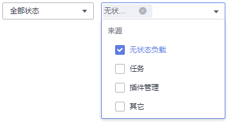

# Pod管理

## 查看Pod

有时，您也许会通过调用[创建Pod](https://support.huaweicloud.com/api-cci/cci_02_3006.html)接口或者使用kubectl直接创建Pod，这些Pod并不在某个负载或任务之下，不方便通过控制台管理。云容器实例提供了Pod管理功能，您可以通过“选择来源“更方便找到需要的Pod。

**图 1**  选择Pod来源  

您可以查看到所有Pod详情，包括基本信息、Pod中容器组成、Pod的监控信息、事件，以及使用远程终端访问Pod。您还可以对Pod进行删除操作，并查看Pod的日志。

**图 2**  Pod详情  

## 使用kubectl创建Pod

使用kubectl创建Pod请参见[Pod](https://support.huaweicloud.com/devg-cci/cci_05_0004.html)。

