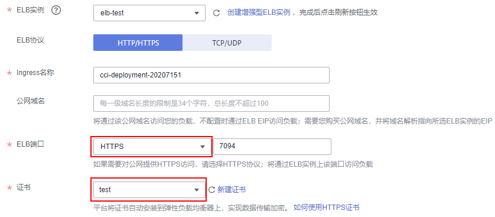

# SSL证书

SSL（安全套接层，Secure Sockets Layer）是一种安全协议，目的是为互联网通信，提供安全及数据完整性保障。

云容器实例支持上传SSL证书，在使用HTTPS访问时，云容器实例将SSL证书自动安装到七层负载均衡器上，实现数据传输加密。

> **说明：**   
>Secret与SSL证书共用同一个配额。  

## SSL证书介绍

SSL证书就是遵守SSL（Secure Socket Layer）协议，由受信任的数字证书颁发机构CA，在验证服务器身份后颁发，具有服务器身份验证和数据传输加密功能。服务器通过安装SSL证书可以实现数据信息在客户端和服务器之间的加密传输，可以防止数据信息的泄露，保证了双方传递信息的安全性，而且可以通过服务器证书验证他所访问的网站是否是真实可靠。

SSL证书分为权威证书和自签名证书。权威证书由权威的数字证书认证机构签发，您可向第三方证书代理商购买，使用权威证书的Web网站，默认客户端都是信任的。自签名证书是由用户自己颁发给自己的，一般可以使用openssl生成，默认客户端是不信任的，浏览器访问时会弹出告警，选择忽略告警可继续正常访问。

## 使用场景

服务器通过安装SSL证书可以实现数据信息在客户端和服务器之间的加密传输，可以防止数据信息的泄露，保证了双方传递信息的安全性。当在云容器实例服务上部署Web应用需要安全的公网访问时，您可以在创建负载时的访问配置页选择公网访问，ELB协议选择HTTPS协议，再选择该公网访问的证书。

## 添加证书

1.  登录云容器实例控制台，单击左侧导航栏的“配置管理 \> SSL证书“，在右侧页面中选择命名空间，单击“添加证书“。
2.  填写SSL证书名称和描述信息。

    证书名称要求：请输入以小写字母或数字开头，小写字母、数字、中划线（-）、点（.）组成（其中两点不能相连，点不能与中划线相连），小写字母或数字结尾的1到253字符的字符串。

3.  上传证书文件和私钥文件。

    -   证书文件支持“.crt“和“.cer“格式，且大小不超过2MB，文件内容须符合对应的CRT、CER协议。
    -   私钥文件支持“.key“和“.pem“格式，且大小不超过2MB，私钥不能加密。

    **图 1**  上次SSL证书文件  
    

4.  单击“添加证书“，完成上传。

## 使用SSL证书

当服务有公网访问时，可以使用SSL证书，设置ELB为HTTPS协议。

在[创建负载](创建无状态工作负载.md)的过程中，负载访问方式选择“公网访问“，ELB协议选择“HTTP/HTTPS“，证书选项选择SSL证书，负载创建过程中会将SSL证书自动安装到弹性负载均衡器上，从而实现数据传输加密。

**图 2**  使用SSL证书  

负载创建完成后，云容器实例将会在ELB中创建与负载名字相同证书。云容器实例服务创建以“beethoveen-cci-ingress“开头名称的证书，请勿删除或更新该类证书，否则引起访问异常。

## 更新与删除SSL证书

-   在证书过期前可以更新相应的证书，使用该证书的负载会同步更新。
-   请勿删除正在被负载使用的证书，否则可能导致应用无法访问。

