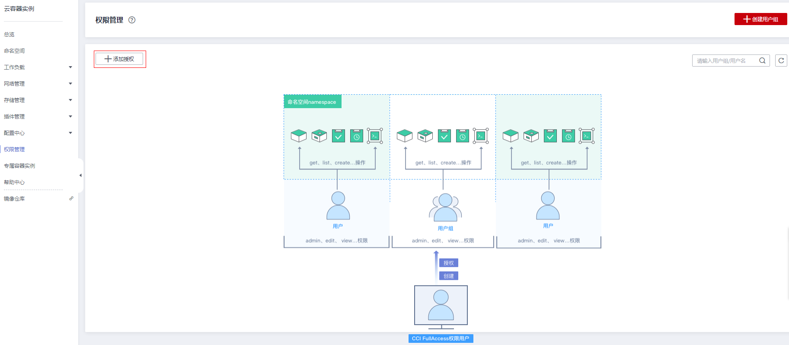
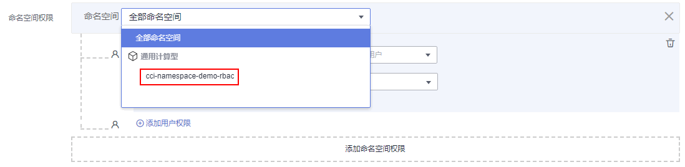
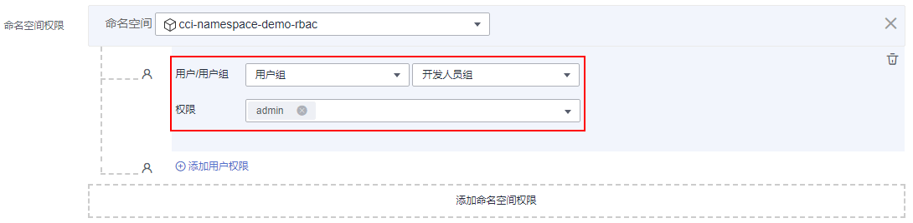
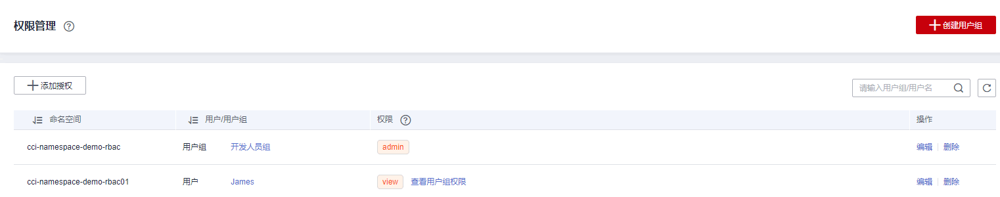

# 为用户/用户组授权命名空间权限

本章节通过简单的命名空间授权方法，将CCI服务的用户和用户组授予操作不同命名空间资源的权限，从而使用户和用户组拥有命名空间的操作权限。设置流程如[示例流程](#section41056841)所示。

## 配置说明

-   您需要拥有一个主帐号，仅主帐号、授予了CCI FullAccess权限的用户或拥有RBAC所有权限的用户，才可以对其他用户进行授权操作。
-   本例将对用户和用户组授予操作不同命名空间资源的权限，在您的实际业务中，您可根据业务需求仅对用户或用户组授予不同的权限。
-   本例仅用于给用户或用户组在未授权过的命名空间下新增权限，已授权的用户或用户组的权限可以在“权限管理“的列表“操作“栏中单击“编辑“进行修改。
-   当给用户或用户组添加多个权限时，多个权限会同时生效（取并集）；为用户组设置的权限将作用于用户组下的全部用户。
-   在开启RBAC鉴权场景下，同类权限取并集，不同类权限取交集。例如，IAM细粒度鉴权中给用户组添加了多个权限，此时权限取最高权限，同理CCI权限管理给用户或用户组添加了多个权限，此时权限也取最高权限，即为同类权限取并集。当用户拥有CCI CommonOperations权限时，本可以创建无状态负载，但如该用户以及用户所在用户组未在目标Namespace下被赋予对应RBAC权限，则创建无状态负载会鉴权失败，即为不同类权限取交集。

## 示例流程

命名空间是对一组资源和对象的抽象整合。在同一个集群内可创建不同的命名空间，不同命名空间中的数据彼此隔离，使得它们既可以共享同一个集群的服务，也能够互不干扰。命名空间的一个重要的作用是充当一个虚拟的集群，用于多种工作用途，满足多用户的使用需求。

本章节将沿用[创建用户并授权使用CCI](创建用户并授权使用CCI.md)中创建的IAM用户“James”和用户组“开发人员组”进行说明，为IAM用户“James”和用户组“开发人员组”添加命名空间权限，可以参考如下操作：

-   [步骤一：为IAM用户/用户组添加命名空间权限](#section39693318615)
-   [步骤二：用户登录并验证权限](#section191001533766)

## 步骤一：为IAM用户/用户组添加命名空间权限

本步骤以主帐号给CCI CommonOperations用户（James）赋予Namespace下view权限为例，被授权的CCI CommonOperations用户在该Namespace下只有只读权限。

1.  登录云容器实例管理控制台，在左侧导航栏中选择“权限管理“，进入权限管理页面。
2.  单击“添加授权“，进入添加授权页面。

    **图 1**  添加授权  
    

3.  在添加授权页面，选择要授权使用的命名空间，此处选择“cci-namespace-demo-rbac”。

    **图 2**  选择命名空间  
    

4.  为“开发人员组”增加“admin“权限，在展开的选项中进行如下配置：

    -   用户/用户组：选择“用户组“，并在二级选项中选择“开发人员组”。
    -   权限：选择“admin“。

    **图 3**  为用户组授予admin权限  
    

5.  单击下方的“添加命名空间权限“，为用户“James”增加在另一个命名空间“cci-namespace-demo-rbac01”的权限，在展开的选项中进行如下配置：

    -   命名空间：选择“cci-namespace-demo-rbac01”。
    -   用户/用户组：选择“用户“，并在二级选项中选择“James”。
    -   权限：选择“view“。

    **图 4**  添加命名空间权限  
    

6.  单击“创建“，完成以上用户和用户组在命名空间中的相应权限设置。

    **图 5**  命名空间权限列表  
    

    > **说明：** 
    >经过以上操作，授权结果如下：
    >-   由于“开发人员组”包含IAM用户“James”，因此IAM用户“James”也同时获得了在命名空间“cci-namespace-demo-rbac”的“admin“权限。
    >-   为IAM用户“James”增加了在命名空间“cci-namespace-demo-rbac01”的“view“权限。

## 步骤二：用户登录并验证权限

使用IAM用户“James”登录云容器实例控制台，验证授予的命名空间权限，验证步骤如下：

1.  在“IAM用户登录”页面，输入帐号名、用户名及用户密码，使用新创建的IAM用户登录。

    -   帐号名为该IAM用户所属华为云帐号的名称。
    -   用户名和密码为创建IAM用户James时输入的用户名和密码，首次登录时需要重置密码。

    如果登录失败，您可以联系您的帐号主体，确认用户名及密码是否正确，或是重置用户名及密码。

2.  登录成功后，进入控制台，登录后默认区域为“华东-上海一”，请先切换至授权区域。
3.  在“服务列表”中选择“云容器实例CCI“，进入CCI控制台，对IAM用户James的命名空间权限进行验证。

