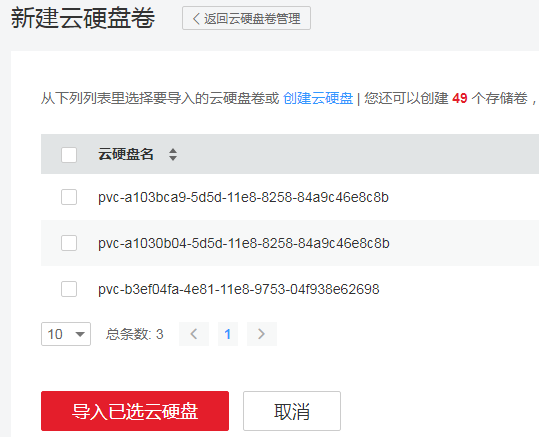
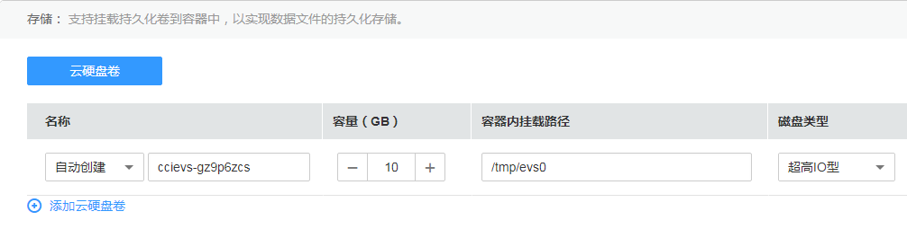
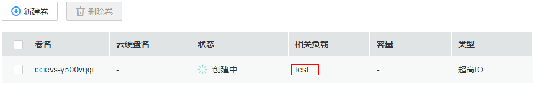

# 云硬盘卷

为满足数据的持久化需求，云容器实例支持将[云硬盘](https://www.huaweicloud.com/product/evs.html)（EVS）挂载到容器中。通过云硬盘，可以将存储系统的远端文件目录挂载到容器中，数据卷中的数据将被永久保存，即使删除了容器，只是删除了挂载数据卷，数据卷中的数据依然保存在存储系统中。

EVS目前支持普通I/O、高I/O、超高I/O 三种规格。

-   普通I/O：后端存储由SATA 存储介质提供，适用于大容量，读写速率要求不高，事务性处理较少的应用场景，如：开发测试、企业办公应用。
-   高I/O：后端存储由SAS存储介质提供，适用于性能相对较高，读写速率要求高，有实时数据存储需求应用场景，如：创建文件系统、分布式文件共享。
-   超高I/O：后端存储SSD存储介质提供，适用于高性能、高读写速率要求、数据密集型应用场景，如：NoSQL、关系型数据库、数据仓库（如Oracle RAC、SAP HANA\)。

## 使用限制

-   云容器实例仅支持导入同个可用区（当前云容器实例位于华为-北京一，可用区1）下的共享、SCSI、非加密、非包周期、非ECS捆绑销售、非专属存储云硬盘。
-   云硬盘卷只能当一个新盘来用。对于云容器实例没有挂载过的云硬盘卷，云硬盘卷中的内容对容器不可见。
-   对于已导入的云硬盘，如果在云硬盘控制台中删除该硬盘，云容器实例无法感知，建议您确定没有负载使用时再删除云硬盘。
-   一个云硬盘卷只能挂载到一个实例下。

## 添加云硬盘

1.  登录云容器实例控制台，单击左侧导航栏的[存储管理 \> 云硬盘卷](https://console.huaweicloud.com/cci/#/app/storage/evs/list)，单击“新建卷“。
2.  选择要导入的云硬盘，然后单击“导入已选云硬盘“。

    如果此处没有云硬盘可选，您可以单击“创建云硬盘“，在云硬盘界面单击“购买云硬盘“，根据界面操作，购买云硬盘，购买完成后再导入。

    > **说明：**   
    >一块云硬盘只能导入一个命名空间，不能同时导入多个命名空间。如果一块云硬盘已经被导入到一个命名空间，则在其他命名空间下不可见，不能再次导入。  

    **图 1**  添加云硬盘  
    

    导入后，您可以在看到对应的卷。

    **图 2**  导入结果  
    

## 使用云硬盘

在[创建负载](无状态工作负载.md)的过程中，选择容器镜像后，在高级设置里面选择添加云存储，将云存储挂载到容器中使用。

**图 3**  配置云硬盘卷参数  

> **说明：**   
>无状态负载只会创建一块云硬盘，负载中的Pod共享使用。  

负载创建成功后，可以在“配置管理  \>  云硬盘卷“中查看到云硬盘与负载的关系。

**图 4**  管理云硬盘卷  

## 使用kubectl创建云硬盘卷

使用kubectl创建云硬盘卷请参见[使用PersistentVolumeClaim申请持久化存储](https://support.huaweicloud.com/devg-cci/cci_05_0014.html)。

