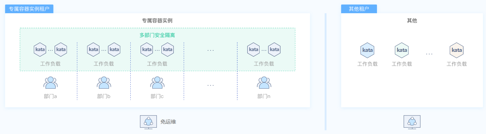
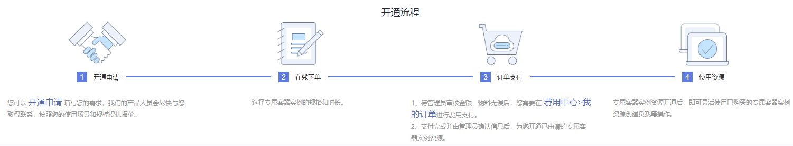

# 什么是专属容器实例

专属容器实例租户独占物理服务器，支持多部门业务隔离，其基于高性能物理服务器运行Kata容器，实现虚机级别安全隔离，同时性能无损耗。服务器的升级和维护工作由华为云承担，客户只需要关注自身业务。

使用专属容器实例前，请按照如下流程申请开通。

**图 1**  专属容器实例开通流程  

> **说明：** 
>目前专属容器实例仅“华北-北京四”和“华东-上海一”区域支持。

