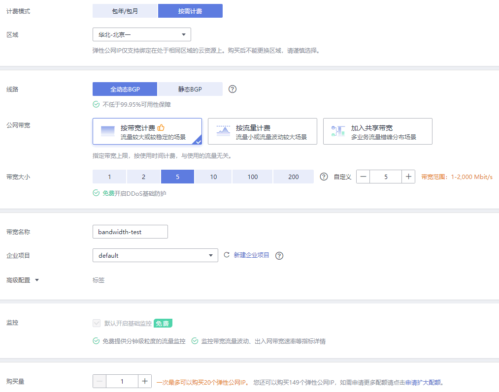
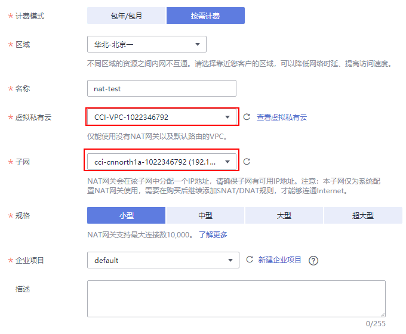
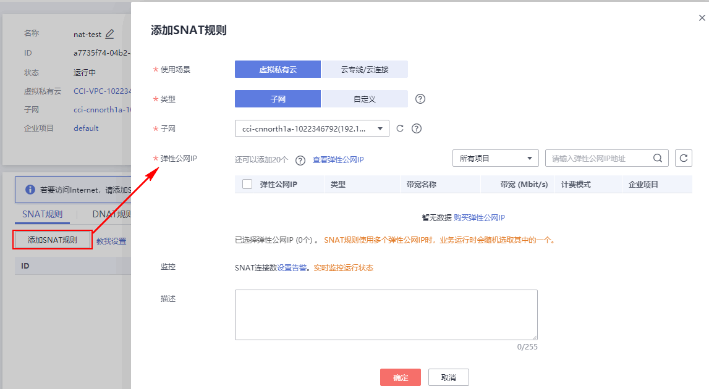
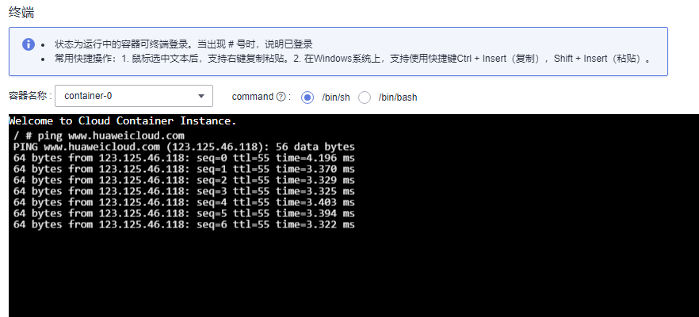

# 从容器访问公网

您可以使用[NAT网关服务](https://www.huaweicloud.com/product/nat.html)，该服务能够为VPC内的容器实例提供网络地址转换（Network Address Translation）服务，SNAT功能通过绑定弹性公网IP，实现私有IP向公有IP的转换，可实现VPC内的容器实例共享弹性公网IP访问Internet。其原理如[图1](#fig34611314153619)所示。通过NAT网关的SNAT功能，即使VPC内的容器实例不配置弹性公网IP也可以直接访问Internet，提供超大并发数的连接服务，适用于请求量大、连接数多的服务。

**图 1**  SNAT  

您可以通过如下步骤实现容器实例访问Internet。

1.  购买弹性公网IP。

    1.  登录管理控制台。
    2.  在管理控制台左上角单击图标，选择区域和项目。
    3.  在系统首页，单击“网络 \> 虚拟私有云“。
    4.  在左侧导航树，单击“弹性公网IP和带宽 \> 弹性公网IP”。
    5.  在“弹性公网IP“界面，单击“购买弹性公网IP“。
    6.  根据界面提示配置参数。

        > **说明：**   
        >此处“区域“需选择容器实例所在区域。  

    **图 2**  购买弹性公网IP  
    

2.  购买NAT网关，具体请参见[购买NAT网关](https://support.huaweicloud.com/qs-natgateway/zh-cn_topic_0127293920.html)。
    1.  登录管理控制台。
    2.  在管理控制台左上角单击图标，选择区域和项目。
    3.  在系统首页，单击“网络 \> NAT网关“。
    4.  在NAT网关页面，单击“购买NAT网关“，进入NAT网关购买页面。
    5.  根据界面提示配置参数。

        > **说明：**   
        >此处需选择容器实例所在[命名空间](命名空间.md)相同的VPC和子网。  

        **图 3**  购买NAT网关  
        

3.  配置SNAT规则，为子网绑定弹性公网IP，具体请参见[添加SNAT规则](https://support.huaweicloud.com/qs-natgateway/zh-cn_topic_0127293981.html)。

    1.  登录管理控制台。
    2.  在管理控制台左上角单击图标，选择区域和项目。
    3.  在系统首页，单击“网络 \>NAT网关“。
    4.  在NAT网关页面，单击需要添加SNAT规则的NAT网关名称。
    5.  在SNAT规则页签中，单击“添加SNAT规则”。
    6.  根据界面提示配置参数。

    > **说明：**   
    >此处需选择容器实例所在[命名空间](命名空间.md)相同的子网。  

    **图 4**  配置SNAT规则  
    

    SNAT规则配置完成后，您就可以从容器中访问公网了，如下图示例，从容器中能够ping通公网。

    **图 5**  从容器中访问公网  
    

