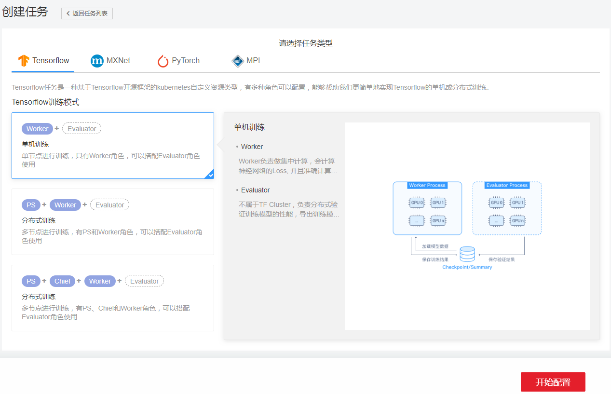
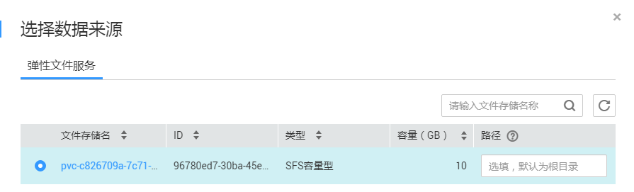
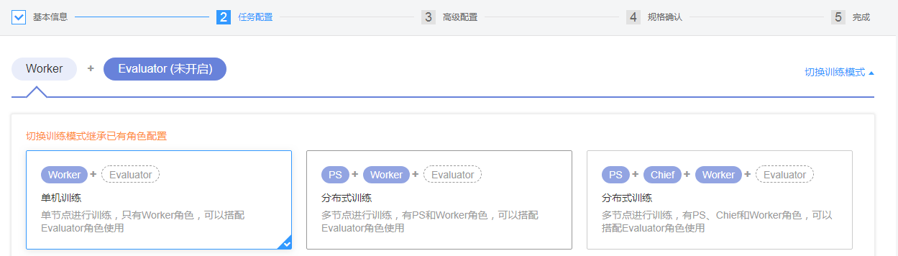
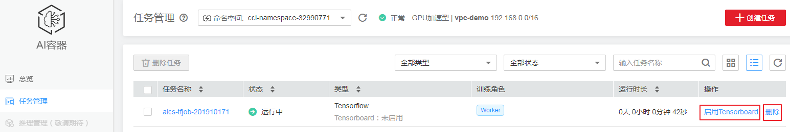
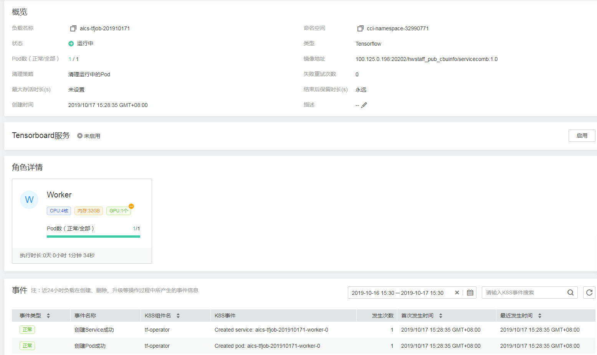
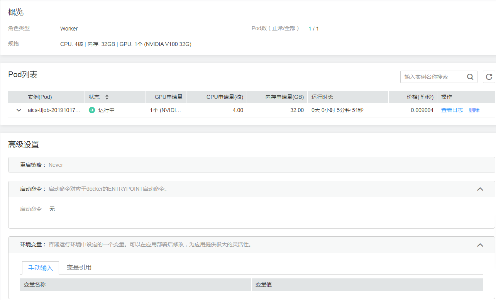
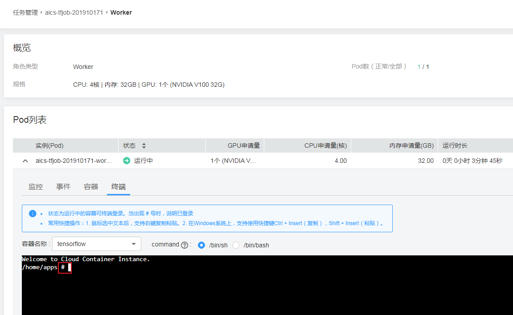
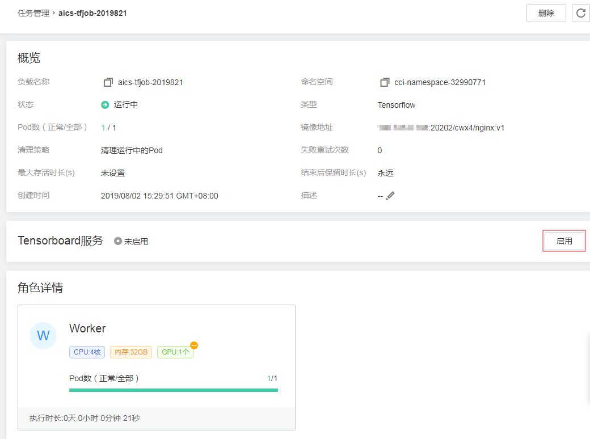
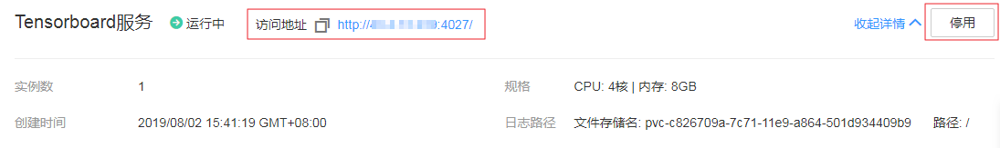
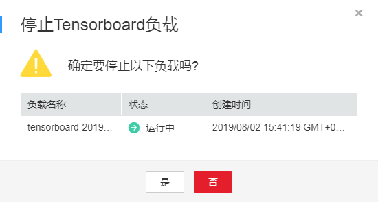

# 任务管理

您可以通过AI容器非常快速地创建AI任务。AI容器提供了Tensorflow、MXNet、PyTorch、MPI类型的AI任务部署和管理能力，支持任务部署、配置、监控、日志等特性。

## 创建任务

1.  登录[AI容器管理控制台](https://console.huaweicloud.com/aics)，左侧导航栏中选择[任务管理](https://console.huaweicloud.com/aics/?region=cn-north-1#/app/task/list)，在右侧页面单击“创建任务“。
2.  选择任务类型和训练模式（请参考[AI容器基本概念](AI容器基本概念.md)），单击“开始配置”。

    **图 1**  选择任务类型  
    

3.  添加基本信息，单击“下一步”。
    -   **任务名称**

        请输入以小写字母开头，小写字母、数字、中划线（-）组成，不能以中划线（-）结尾，24个字符之内的字符串。

    -   **命名空间**

        选择命名空间，如果还未创建命名空间，请参考[命名空间](命名空间.md)创建。

        > **须知：** 
        >当前仅支持GPU加速型命名空间。
        >切换命名空间，会导致您需要重新填写与命名空间强相关的数据，如训练数据、配置管理等，请谨慎操作！

    -   **coredns插件**

        coredns插件为您的负载提供内部域名解析服务（创建负载时发布内部访问，负载间通过内部域名互相访问）。默认为2.5.5版本。

    -   **任务描述**

        描述信息，少于等于1000个字符。

    -   **训练数据**

        AI容器中的训练数据存储在[弹性文件服务（SFS）](https://support.huaweicloud.com/sfs/index.html)中。

        -   数据来源：单击“选择路径”，在弹出的对话框中选择文件存储名、填写文件路径（当前仅支持填写已存在的路径），单击“确定”。

            **图 2**  选择数据来源  
            

            数据来源路径选择后，请填写容器内挂载路径。

        -   输出路径：选择输出路径，填写容器内挂载路径。
        -   日志路径：选择日志路径，填写容器内挂载路径。

    -   **容器配置**

        AI容器中的镜像数据来自于[容器镜像服务（SWR）](https://support.huaweicloud.com/swr/index.html)，单击“上传镜像”，您可以进入[容器镜像服务控制台](https://console.huaweicloud.com/swr)上传镜像，具体方法请参见[页面上传镜像](https://support.huaweicloud.com/usermanual-swr/swr_01_0012.html)。

        -   我的镜像：展示了您上传到容器镜像服务的镜像。
        -   Docker官方镜像：展示了Dockerhub上的公共镜像。

            **图 3**  Docker官方镜像  
            

        -   共享镜像：展示了容器镜像服务中他人共享的镜像。

        镜像选择完成后，需要选择镜像的版本。

4.  单击角色名称，配置该角色的任务信息。

    配置任务过程中，如需切换同类型任务的其他训练模式，可单击右上角“切换训练模式”，切换后的训练模式将继承已有角色配置。

    **图 4**  切换训练模式  
    

    -   **实例数量**

        设置实例（Pod）数量，默认为1。

    -   **容器镜像**

        [步骤3](#li338216121351)中选择的镜像。单击“前往修改”，可返回[步骤3](#li338216121351)重新进行容器配置。

    -   **Pod规格**

        当前提供2种类型的Pod，包括[RDMA](https://zh.wikipedia.org/wiki/%E8%BF%9C%E7%A8%8B%E7%9B%B4%E6%8E%A5%E5%86%85%E5%AD%98%E8%AE%BF%E9%97%AE)加速型和GPU加速型。

        Tensorflow的PS角色、MXNet的Scheduler和Server角色、PyTorch的Master角色、MPI的Launcher角色不参与训练，可以使用RDMA加速型Pod，其他角色只支持GPU加速型Pod。

        GPU加速型Pod提供NVIDIA Tesla V100 32G显卡、NVIDIA Tesla V100 16G显卡以及NVIDIA Tesla P4 8G显卡，具体的规格有如下所示。

        -   NVIDIA Tesla V100 32G显卡：
            -   NVIDIA Tesla V100 32G x 1，CPU 4核，内存32GB
            -   NVIDIA Tesla V100 32G x 2，CPU 8核，内存64GB
            -   NVIDIA Tesla V100 32G x 4，CPU 16核，内存128GB
            -   NVIDIA Tesla V100 32G x 8，CPU 32核，内存256GB

        -   NVIDIA Tesla V100 16G显卡：
            -   NVIDIA Tesla V100 16G x 1，CPU 4核，内存32GB
            -   NVIDIA Tesla V100 16G x 2，CPU 8核，内存64GB
            -   NVIDIA Tesla V100 16G x 4，CPU 16核，内存128GB
            -   NVIDIA Tesla V100 16G x 8，CPU 32核，内存256GB

        -   NVIDIA Tesla P4 8G显卡：
            -   NVIDIA Tesla P4 8G x 1，CPU 4核，内存32GB
            -   NVIDIA Tesla P4 8G x 2，CPU 8核，内存64GB
            -   NVIDIA Tesla P4 8G x 3，CPU 16核，内存128GB
            -   NVIDIA Tesla P4 8G x 4，CPU 32核，内存256GB

        AI容器支持使用NVIDIA GPU的驱动版本为**410.104**和**418.126**，您应用程序中使用的CUDA需满足如[表1](#table2822104310159)所示的配套关系。CUDA与驱动的配套关系来源于NVIDIA官网，详细信息请参见[CUDA Compatibility](https://docs.nvidia.com/deploy/cuda-compatibility/index.html)。

        **表 1**  NVIDIA GPU驱动与CUDA配套关系

        
        <table><thead align="left"><tr id="row17823154311517"><th class="cellrowborder" valign="top" width="30.620000000000005%" id="mcps1.2.3.1.1">
NVIDIA GPU驱动版本

        </th>
        <th class="cellrowborder" valign="top" width="69.38%" id="mcps1.2.3.1.2">
CUDA Toolkit版本

        </th>
        </tr>
        </thead>
        <tbody><tr id="row9786192115398"><td class="cellrowborder" valign="top" width="30.620000000000005%" headers="mcps1.2.3.1.1 ">
410.104

        </td>
        <td class="cellrowborder" valign="top" width="69.38%" headers="mcps1.2.3.1.2 ">
CUDA 10.0 (10.0.130)及以下

        </td>
        </tr>
        <tr id="row4823184321519"><td class="cellrowborder" valign="top" width="30.620000000000005%" headers="mcps1.2.3.1.1 ">
418.126

        </td>
        <td class="cellrowborder" valign="top" width="69.38%" headers="mcps1.2.3.1.2 ">
CUDA 10.1 (10.1.105)及以下

        </td>
        </tr>
        </tbody>
        </table>

    -   **高级设置**
        -   重启策略：实例重启策略分为4种，不同角色可以设置不同的重启策略。

            Never：容器终止退出时，永不重启容器。

            Always：容器终止退出时，总是重启容器。

            OnFailure：容器异常退出（退出码非0）时，重启容器。

            ExitCode：表示根据容器退出码决定是否重启Pod，1-127退出码代表永久性错误，不会重启Pod；128-255退出码代表可重试错误，将会重启Pod。

        -   启动命令：输入容器启动命令，容器启动后会立即执行。启动命令对应于docker的ENTRYPOINT启动命令，详细内容请参见[容器启动命令](https://support.huaweicloud.com/usermanual-cci/cci_01_0050.html)。
        -   环境变量：在容器中设置环境变量，支持手动输入和引用变量。环境变量为应用提供极大的灵活性，您可以在应用程序中使用环境变量，在创建容器时为环境变量赋值，容器运行时读取环境变量的值，从而做到灵活的配置，而不是每次都重新编写应用程序制作镜像。

            手动输入只需要直接输入变量名称和变量值。

            变量引用支持引用PodIP（Pod的IP地址）、PodName（Pod的名称），输入变量名称，选择引用类型。

        -   健康检查：健康检查是指容器运行过程中，根据您需要，定时检查容器健康状况。详细步骤请参见[健康检查](https://support.huaweicloud.com/usermanual-cci/cci_01_0013.html)。
        -   生命周期：生命周期脚本定义，在容器的生命周期的特定阶段执行调用。详细步骤请参见[容器生命周期](https://support.huaweicloud.com/usermanual-cci/cci_01_0012.html)。
        -   配置管理：容器支持挂载ConfigMap和Secret。ConfigMap和Secret的创建请参见[使用ConfigMap](https://support.huaweicloud.com/usermanual-cci/cci_01_0034.html)和[使用Secret](https://support.huaweicloud.com/usermanual-cci/cci_01_0035.html)。

5.  单击其他角色名称，配置角色的任务信息，方法参照[步骤4](#li155045351702)。所有角色都配置完成后单击“下一步”。

    > **说明：** 
    >Tensorflow训练模式中Evaluator角色为可选，如需配置该角色的任务，需要先选择“启用Evaluator”。

6.  任务高级配置。
    -   失败重试次数：任务的失败重试次数，仅适用于重启策略为OnFailure或Always的pod。默认为0。
    -   最大存活时长\(s\)：从创建任务开始，若超过此时间任务没有执行完成，则任务会视为失败。默认为“不配置”。
    -   结束后保留时长\(s\)：任务结束之后，多久时间清理任务。默认为“永久”。
    -   清理策略：任务结束之后，清理pod策略，包括“清理运行中的实例”、“清理全部实例”和“不清理”。默认为“清理运行中的实例”。
    -   Tensorboard服务：对于Tensorflow类型的任务，可选择开启**Tensorboard**。Tensorboard是为Tensorflow提供训练结果分析的工具应用。Tensorboard服务信息配置请参见[启用/停用Tensorboard](#section9839133372616)。

7.  单击“下一步“，单击“提交”，任务开始执行，单击“返回任务列表”。

    在任务列表中，待任务状态为“运行中“，任务创建成功。

## 查看任务

任务创建完成后，您可以进入任务详情界面，查看任务中各角色执行详情和任务事件等。

1.  登录[AI容器管理控制台](https://console.huaweicloud.com/aics)，左侧导航栏中选择[任务管理](https://console.huaweicloud.com/aics/?region=cn-north-1#/app/task/list)。在任务管理页面，可查看任务列表、删除任务、[启用/停用Tensorboard（仅适用Tensorflow任务）](#section9839133372616)。

    **图 5**  任务管理页面  
    

2.  在右侧页面单击任务名称，进入任务详情页面。

    **图 6**  查看任务详情  
    

3.  在任务详情页面可查看任务基本信息，查看任务中各角色CPU、内存、GPU使用情况，[启用/停用Tensorboard（仅适用Tensorflow任务）](#section9839133372616)，查看任务近24小时任务在创建、删除、升级等操作过程中所产生的事件信息等。

    单击“角色详情”中各角色卡片可进入角色详情页面，查看Pod列表和高级设置等。

    **图 7**  查看角色详情  
    

## 登录Pod

任务创建完成后，可通过Webterminal和kubectl两种方式登录Pod。使用kubectl exec命令登录Pod的操作步骤请参见[使用kubectl登录Pod](https://support.huaweicloud.com/devg-cci/cci_kubectl.html)。

1.  登录[AI容器管理控制台](https://console.huaweicloud.com/aics)，左侧导航栏中选择[任务管理](https://console.huaweicloud.com/aics/?region=cn-north-1#/app/task/list)。
2.  在右侧页面单击Tensorflow任务名称，进入任务详情页面。
3.  在角色详情中，单击角色名称，在Pod实例下面选择“终端“页签。

    当出现“\#” 号时，说明已登录。

    **图 8**  登录终端  
    

## 启用/停用Tensorboard

Tensorboard是为Tensorflow提供训练结果分析的工具应用。对于未启用Tensorboard的Tensorflow任务，您可以进入任务详情界面，启用Tensorboard服务。对于已启用Tensorboard的Tensorflow任务，您可以进入任务详情界面，停用Tensorboard服务。

1.  登录[AI容器管理控制台](https://console.huaweicloud.com/aics)，左侧导航栏中选择[任务管理](https://console.huaweicloud.com/aics/?region=cn-north-1#/app/task/list)。
2.  在右侧页面单击Tensorflow任务名称，进入任务详情页面，在Tensorboard服务栏单击“启用”。

    **图 9**  启用Tensorboard  
    

3.  配置Tensorboard服务信息，单击“提交”。
    -   Tensorboard日志路径：单击“选择路径”，选择Tensorboard日志路径，Tensorboard日志存放在弹性文件服务中。如果创建任务时配置了训练数据的日志路径，Tensorboard日志路径将继承该配置。
    -   公网ELB实例：如果还未创建增强型公网ELB实例，请参考[创建增强型工作负载](https://support.huaweicloud.com/usermanual-elb/zh-cn_topic_0015479967.html)创建。
    -   ELB端口：选择公网ELB实例后，ELB端口默认设置。

4.  等待Tensorboard服务状态为“运行中”，可查看Tensorboard服务信息及访问Tensorboard的地址。

    **图 10**  查看访问地址  
    

    > **须知：** 
    >使用完毕请及时停用Tensorboard，否则会继续计费。

    在任务详情页的Tensorboard服务栏单击“停用”，在弹出的对话框中单击“是”，可停用Tensorboard，停用后平台将删除该Tensorboard。

    **图 11**  停用Tensorboard  
    

