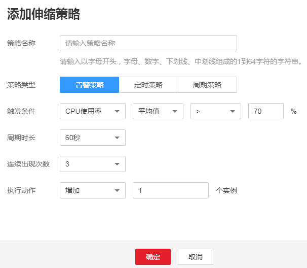
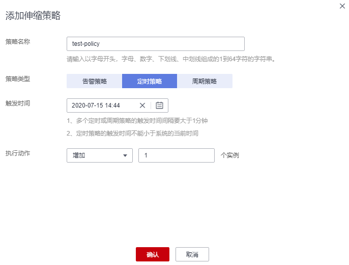
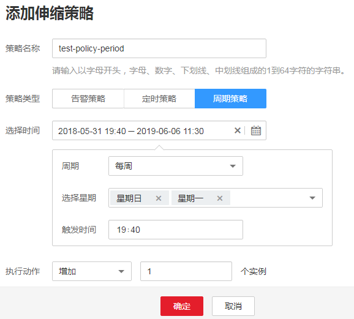
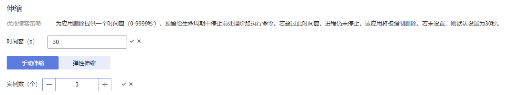
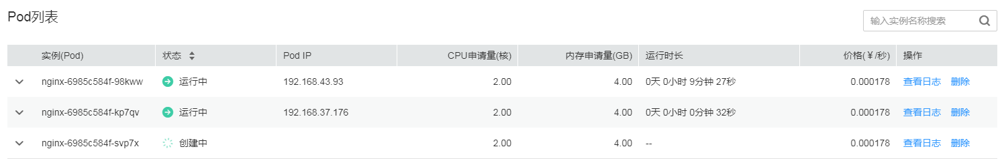

# 伸缩负载

本节主要讲解工作负载弹性伸缩和手动伸缩的配置方式。请根据实际业务选择。

-   弹性伸缩：支持告警、定时、周期三种策略。配置完成后可基于资源变化、固定时间、固定周期自动触发实例的增减。
-   手动伸缩：配置完成后立即触发实例的增减。

> **注意：**   
>对于挂载了云硬盘卷的Pod，实例缩容时不会同步删除云硬盘。且再次创建相同名称的Pod时，无法挂载云硬盘。  

## 弹性伸缩

> **说明：**   
>当前仅支持无状态负载弹性伸缩。  

您可以根据业务需求自行定义伸缩策略，降低人为反复调整资源以应对业务变化和高峰压力的工作量，帮助您节约资源和人力成本。当前支持三种弹性伸缩策略：

[告警策略](#li16804196913)：支持根据CPU/内存的使用率，进行工作负载的自动伸缩。工作负载创建完成后即可设置，在CPU/内存超过或少于一定值时，自动增减实例。

[定时策略](#li1595211281895)：支持在特定时间点进行工作负载的自动伸缩。适用于秒杀周年庆等活动，例如在秒杀这个时间点增加一定数量的实例个数。

[周期策略](#li35861531491)：支持以天、周、月为周期的伸缩策略。适用于周期性的流量变化。

-   **告警策略**：支持根据CPU/内存的使用率，进行工作负载的自动伸缩。
    1.  登录云容器实例控制台，在左侧导航栏中选择[工作负载 \> 无状态负载](https://console.huaweicloud.com/cci/#/app/workload/deployment/list)，单击工作负载名称进入负载详情。
    2.  在左侧选择“伸缩”，单击弹性伸缩，单击“添加伸缩策略“。

        **图 1**  添加告警策略  
        

        **表 1**  添加告警策略

        
        <table><thead align="left"><tr id="row152117205715"><th class="cellrowborder" valign="top" width="23%" id="mcps1.2.3.1.1">
参数

        </th>
        <th class="cellrowborder" valign="top" width="77%" id="mcps1.2.3.1.2">
参数说明

        </th>
        </tr>
        </thead>
        <tbody><tr id="row18981795718"><td class="cellrowborder" valign="top" width="23%" headers="mcps1.2.3.1.1 ">
策略名称

        </td>
        <td class="cellrowborder" valign="top" width="77%" headers="mcps1.2.3.1.2 ">
请输入伸缩策略的名称。

        </td>
        </tr>
        <tr id="row315181717574"><td class="cellrowborder" valign="top" width="23%" headers="mcps1.2.3.1.1 ">
策略类型

        </td>
        <td class="cellrowborder" valign="top" width="77%" headers="mcps1.2.3.1.2 ">
选择“告警策略”。

        </td>
        </tr>
        <tr id="row122211765714"><td class="cellrowborder" valign="top" width="23%" headers="mcps1.2.3.1.1 ">
触发条件

        </td>
        <td class="cellrowborder" valign="top" width="77%" headers="mcps1.2.3.1.2 ">
支持“CPU使用率”和“内存使用率”。

        
若输入“内存使用率”的“平均值&gt;70%”，表示在该条件下触发伸缩策略。

        </td>
        </tr>
        <tr id="row15301217115716"><td class="cellrowborder" valign="top" width="23%" headers="mcps1.2.3.1.1 ">
周期时长

        </td>
        <td class="cellrowborder" valign="top" width="77%" headers="mcps1.2.3.1.2 ">
指标统计周期。单击下拉选项进行选择。

        
若设置为60秒，表示每60秒统计一次。

        </td>
        </tr>
        <tr id="row1735111705710"><td class="cellrowborder" valign="top" width="23%" headers="mcps1.2.3.1.1 ">
连续出现次数

        </td>
        <td class="cellrowborder" valign="top" width="77%" headers="mcps1.2.3.1.2 ">
若设置为3，则表示指标数据连续三个统计周期达到了设定的阈值，则触发策略动作。

        </td>
        </tr>
        <tr id="row139111716578"><td class="cellrowborder" valign="top" width="23%" headers="mcps1.2.3.1.1 ">
执行动作

        </td>
        <td class="cellrowborder" valign="top" width="77%" headers="mcps1.2.3.1.2 ">
策略触发后执行的动作。增加或减少实例数。

        </td>
        </tr>
        </tbody>
        </table>

    3.  单击“确定“。

        在弹性伸缩下，可看到策略已启动。

        **图 2**  策略已启动  
        

        待到触发条件发生时，弹性伸缩策略会自动启动。

-   **定时策略**：支持在特定时间点进行工作负载的自动伸缩。
    1.  单击弹性伸缩，单击“添加伸缩策略“，选择“定时策略“。

        **图 3**  定时策略  
        

        **表 2**  添加定时策略

        
        <table><thead align="left"><tr id="row1428011412512"><th class="cellrowborder" valign="top" width="26%" id="mcps1.2.3.1.1">
参数

        </th>
        <th class="cellrowborder" valign="top" width="74%" id="mcps1.2.3.1.2">
参数说明

        </th>
        </tr>
        </thead>
        <tbody><tr id="row1728054182516"><td class="cellrowborder" valign="top" width="26%" headers="mcps1.2.3.1.1 ">
策略名称

        </td>
        <td class="cellrowborder" valign="top" width="74%" headers="mcps1.2.3.1.2 ">
请输入伸缩策略的名称。

        </td>
        </tr>
        <tr id="row5280154182518"><td class="cellrowborder" valign="top" width="26%" headers="mcps1.2.3.1.1 ">
策略类型

        </td>
        <td class="cellrowborder" valign="top" width="74%" headers="mcps1.2.3.1.2 ">
选择定时策略。

        </td>
        </tr>
        <tr id="row1728113415258"><td class="cellrowborder" valign="top" width="26%" headers="mcps1.2.3.1.1 ">
触发时间

        </td>
        <td class="cellrowborder" valign="top" width="74%" headers="mcps1.2.3.1.2 ">
策略触发时间。

        </td>
        </tr>
        <tr id="row112811346259"><td class="cellrowborder" valign="top" width="26%" headers="mcps1.2.3.1.1 ">
执行操作

        </td>
        <td class="cellrowborder" valign="top" width="74%" headers="mcps1.2.3.1.2 ">
策略触发后执行的动作。增加或减少实例数。

        </td>
        </tr>
        </tbody>
        </table>

    2.  单击“确定“。

        在弹性伸缩下，可看到策略已启动。

-   **周期策略**：支持以天、周、月为周期的伸缩策略。
    1.  单击弹性伸缩，单击“添加伸缩策略“，选择“周期策略“

        **图 4**  周期策略  
        

        **表 3**  添加周期策略

        
        <table><thead align="left"><tr id="row13407141620275"><th class="cellrowborder" valign="top" width="26%" id="mcps1.2.3.1.1">
参数

        </th>
        <th class="cellrowborder" valign="top" width="74%" id="mcps1.2.3.1.2">
参数说明

        </th>
        </tr>
        </thead>
        <tbody><tr id="row10407101652718"><td class="cellrowborder" valign="top" width="26%" headers="mcps1.2.3.1.1 ">
策略名称

        </td>
        <td class="cellrowborder" valign="top" width="74%" headers="mcps1.2.3.1.2 ">
请输入伸缩策略的名称。

        </td>
        </tr>
        <tr id="row3409316102719"><td class="cellrowborder" valign="top" width="26%" headers="mcps1.2.3.1.1 ">
策略类型

        </td>
        <td class="cellrowborder" valign="top" width="74%" headers="mcps1.2.3.1.2 ">
选择周期策略。

        </td>
        </tr>
        <tr id="row1940915163272"><td class="cellrowborder" valign="top" width="26%" headers="mcps1.2.3.1.1 ">
选择时间

        </td>
        <td class="cellrowborder" valign="top" width="74%" headers="mcps1.2.3.1.2 ">
选择策略触发的时间。

        </td>
        </tr>
        <tr id="row154091616182715"><td class="cellrowborder" valign="top" width="26%" headers="mcps1.2.3.1.1 ">
执行操作

        </td>
        <td class="cellrowborder" valign="top" width="74%" headers="mcps1.2.3.1.2 ">
策略触发后执行的动作。

        </td>
        </tr>
        </tbody>
        </table>

    2.  单击“确定“。

        在弹性伸缩下，可看到策略已启动。

## 手动伸缩

1.  登录云容器实例控制台，在左侧导航栏中选择[工作负载 \> 无状态负载](https://console.huaweicloud.com/cci/#/app/workload/deployment/list)，单击工作负载名称。
2.  在“手动伸缩“策略下，单击修改实例数量，例如修改为“3“，单击“保存“后实例伸缩操作即可生效。

    云容器实例为应用删除提供一个时间窗，预留给生命周期中停止前处理阶段执行命令。若超过此时间窗，进程仍未停止，该应用将被强制删除。

    **图 5**  修改实例数  
    

3.  在“Pod列表“处，可查看到新的实例在创建中，待状态为运行中时，表示已成功完成实例伸缩操作。

    **图 6**  手动伸缩  
    

