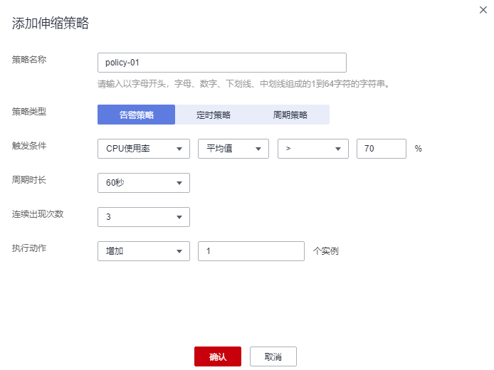
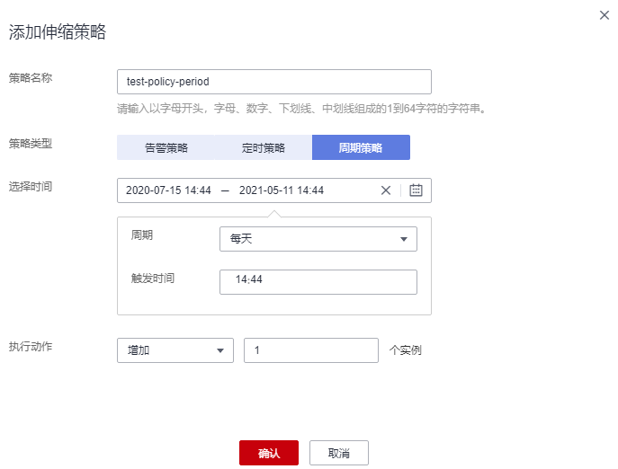
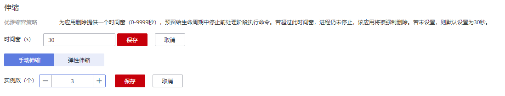
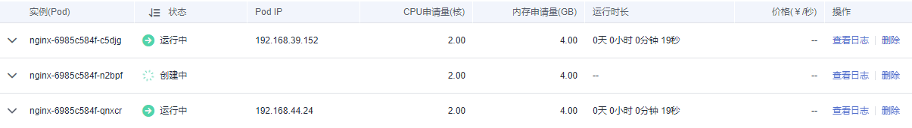

# 伸缩负载

本节主要讲解工作负载弹性伸缩和手动伸缩的配置方式。请根据实际业务选择。

-   弹性伸缩：支持告警、定时、周期三种策略。配置完成后可基于资源变化、固定时间、固定周期自动触发实例的增减。
-   手动伸缩：配置完成后立即触发实例的增减。

> **须知：** 
>对于挂载了云硬盘存储卷的Pod，实例缩容时不会同步删除云硬盘。且再次创建相同名称的Pod时，无法挂载云硬盘。

## 弹性伸缩

> **说明：** 
>当前仅支持无状态负载弹性伸缩。

您可以根据业务需求自行定义伸缩策略，降低人为反复调整资源以应对业务变化和高峰压力的工作量，帮助您节约资源和人力成本。当前支持三种弹性伸缩策略：

[告警策略](#li16804196913)：支持根据CPU/内存的使用率，进行工作负载的自动伸缩。工作负载创建完成后即可设置，在CPU/内存超过或少于一定值时，自动增减实例。

[定时策略](#li1595211281895)：支持在特定时间点进行工作负载的自动伸缩。适用于秒杀周年庆等活动，例如在秒杀这个时间点增加一定数量的实例个数。

[周期策略](#li35861531491)：支持以天、周、月为周期的伸缩策略。适用于周期性的流量变化。

-   **告警策略**：支持根据CPU/内存的使用率，进行工作负载的自动伸缩。
    1.  登录云容器实例控制台，在左侧导航栏中选择“工作负载 \> 无状态（Deployment）”，单击工作负载名称进入负载详情。
    2.  在“伸缩”中，单击“弹性伸缩”，单击“添加伸缩策略“。

        **图 1**  添加告警策略  
        

        **表 1**  添加告警策略

|参数|参数说明|
|--|--|
|策略名称|请输入伸缩策略的名称。|
|策略类型|选择告警策略。|
|触发条件|支持CPU使用率和内存使用率。若输入内存使用率的平均值>70%，表示在该条件下触发伸缩策略。|
|周期时长|指标统计周期。单击下拉选项进行选择。若设置为60秒，表示每60秒统计一次。|
|连续出现次数|若设置为3，则表示指标数据连续三个统计周期达到了设定的阈值，则触发策略动作。|
|执行动作|策略触发后执行的动作。增加或减少实例数。|

    3.  单击“确定“。

        在弹性伸缩下，可看到策略已启动。

        **图 2**  策略已启动  
        

        待到触发条件发生时，弹性伸缩策略会自动启动。

-   **定时策略**：支持在特定时间点进行工作负载的自动伸缩。
    1.  单击“弹性伸缩”，单击“添加伸缩策略“，选择“定时策略“。

        **图 3**  定时策略  
        

        **表 2**  添加定时策略

|参数|参数说明|
|--|--|
|策略名称|请输入伸缩策略的名称。|
|策略类型|选择定时策略。|
|触发时间|策略触发时间。|
|执行操作|策略触发后执行的动作。增加或减少实例数。|

    2.  单击“确定“。

        在弹性伸缩下，可看到策略已启动。

-   **周期策略**：支持以天、周、月为周期的伸缩策略。
    1.  单击“弹性伸缩”，单击“添加伸缩策略“，选择“周期策略“

        **图 4**  周期策略  
        

        **表 3**  添加周期策略

|参数|参数说明|
|--|--|
|策略名称|请输入伸缩策略的名称。|
|策略类型|选择周期策略。|
|选择时间|选择策略触发的时间。|
|执行操作|策略触发后执行的动作。|

    2.  单击“确定“。

        在弹性伸缩下，可看到策略已启动。

## 手动伸缩

1.  登录云容器实例控制台，在左侧导航栏中选择“工作负载 \> 无状态负载（Deployment）”，单击工作负载名称。
2.  在“伸缩 \> 手动伸缩“策略下，单击修改实例数量，例如修改为“3“，单击“保存“后实例伸缩操作即可生效。

    云容器实例为应用删除提供一个时间窗，预留给生命周期中停止前处理阶段执行命令。若超过此时间窗，进程仍未停止，该应用将被强制删除。

    **图 5**  修改实例数  
    

3.  在“Pod列表“处，可查看到新的实例在创建中，待状态为运行中时，表示已成功完成实例伸缩操作。

    **图 6**  手动伸缩  
    

