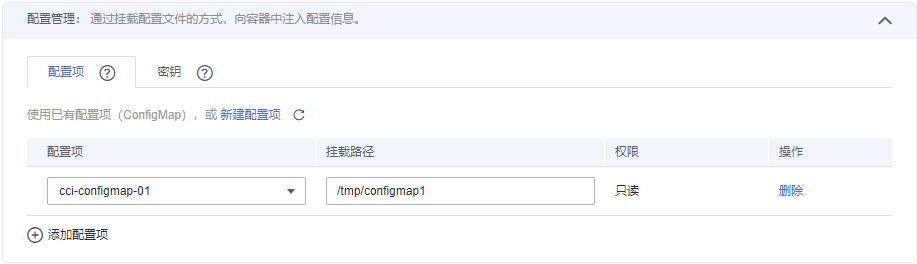

# 使用ConfigMap<a name="cci_01_0034"></a>

ConfigMap是一种用于存储应用所需配置信息的资源类型。资源创建完成后，可在容器应用中作为文件使用。

## 创建ConfigMap<a name="section18512531861"></a>

1.  登录云容器实例控制台，单击左侧导航栏的[配置中心 \> 配置项（ConfigMap）](https://console.huaweicloud.com/cci/#/app/config/configMap/list)，在右侧页面中选择命名空间，单击“创建配置项“。
2.  云容器实例支持“手工输入”和“文件上传”两种方式来创建ConfigMap。
    -   方式一：手工输入。参照[表1](#table16321825732)设置新增配置参数，其中带“\*”标志的参数为必填参数。

        **表 1**  新建配置参数说明

        <a name="table16321825732"></a>
        <table><thead align="left"><tr id="row173212251235"><th class="cellrowborder" valign="top" width="28.000000000000004%" id="mcps1.2.3.1.1"><p id="p43211725338"><a name="p43211725338"></a><a name="p43211725338"></a>参数</p>
        </th>
        <th class="cellrowborder" valign="top" width="72%" id="mcps1.2.3.1.2"><p id="p0322102516320"><a name="p0322102516320"></a><a name="p0322102516320"></a>参数说明</p>
        </th>
        </tr>
        </thead>
        <tbody><tr id="row424229832"><td class="cellrowborder" colspan="2" valign="top" headers="mcps1.2.3.1.1 mcps1.2.3.1.2 "><p id="p1598191212311"><a name="p1598191212311"></a><a name="p1598191212311"></a><strong id="b137387216312"><a name="b137387216312"></a><a name="b137387216312"></a>基本信息</strong></p>
        </td>
        </tr>
        <tr id="row163229255313"><td class="cellrowborder" valign="top" width="28.000000000000004%" headers="mcps1.2.3.1.1 "><p id="p1232219251339"><a name="p1232219251339"></a><a name="p1232219251339"></a>*配置项名称</p>
        </td>
        <td class="cellrowborder" valign="top" width="72%" headers="mcps1.2.3.1.2 "><p id="p173227259312"><a name="p173227259312"></a><a name="p173227259312"></a>新建的ConfigMap名称。</p>
        <p id="p94110474136"><a name="p94110474136"></a><a name="p94110474136"></a>请输入以小写字母或数字开头，小写字母、数字、中划线（-）、点（.）组成（其中两点不能相连，点不能与中划线相连），小写字母或数字结尾的1到253字符的字符串</p>
        </td>
        </tr>
        <tr id="row1535723154615"><td class="cellrowborder" valign="top" width="28.000000000000004%" headers="mcps1.2.3.1.1 "><p id="p83591731124620"><a name="p83591731124620"></a><a name="p83591731124620"></a>描述</p>
        </td>
        <td class="cellrowborder" valign="top" width="72%" headers="mcps1.2.3.1.2 "><p id="p1736012314462"><a name="p1736012314462"></a><a name="p1736012314462"></a>ConfigMap的描述信息。</p>
        </td>
        </tr>
        <tr id="row133224252315"><td class="cellrowborder" valign="top" width="28.000000000000004%" headers="mcps1.2.3.1.1 "><p id="p23228259314"><a name="p23228259314"></a><a name="p23228259314"></a><strong id="b16491619731"><a name="b16491619731"></a><a name="b16491619731"></a>配置项数据</strong></p>
        </td>
        <td class="cellrowborder" valign="top" width="72%" headers="mcps1.2.3.1.2 "><p id="p133223251335"><a name="p133223251335"></a><a name="p133223251335"></a>ConfigMap存储的配置数据。其中，“键”代表文件名；“值”代表文件中的内容。</p>
        <a name="ol10322425232"></a><a name="ol10322425232"></a><ol id="ol10322425232"><li>单击“添加数据” 。</li><li>输入键、值。</li></ol>
        </td>
        </tr>
        <tr id="row123142814330"><td class="cellrowborder" valign="top" width="28.000000000000004%" headers="mcps1.2.3.1.1 "><p id="p17322225134"><a name="p17322225134"></a><a name="p17322225134"></a><strong id="b1173817253317"><a name="b1173817253317"></a><a name="b1173817253317"></a>配置项标签</strong></p>
        </td>
        <td class="cellrowborder" valign="top" width="72%" headers="mcps1.2.3.1.2 "><p id="p1932211253312"><a name="p1932211253312"></a><a name="p1932211253312"></a>标签以Key/value键值对的形式附加到各种对象上（如负载、服务等）。</p>
        <p id="p1932220252316"><a name="p1932220252316"></a><a name="p1932220252316"></a>标签定义了这些对象的可识别属性，用来对它们进行管理和选择。</p>
        <a name="ol11394016509"></a><a name="ol11394016509"></a><ol id="ol11394016509"><li>单击“添加标签” 。</li><li>输入键、值。</li></ol>
        </td>
        </tr>
        </tbody>
        </table>

    -   方式二：文件上传。

        > **说明：**   
        >云容器实例支持json或yaml格式，且文件大小需要小于1MB，详细请参见[ConfigMap文件格式要求](#section18975165217385)。  

        单击“添加文件“，选择已创建的ConfigMap类型资源文件后，单击“打开”。

3.  配置完成后，单击“创建“。

## ConfigMap的使用<a name="section152761334151217"></a>

配置项创建完成后，可以在创建负载的过程中挂载到容器指定路径下，如下图所示，将名为cci-configmap01的配置项挂载到“/tmp/configmap1“路径下。

**图 1**  使用ConfigMap<a name="fig4539158113314"></a>  


负载创建后，在“/tmp/configmap1“路径下将创建配置文件，配置项的“键”代表文件名；“值”代表文件中的内容。

## ConfigMap文件格式要求<a name="section18975165217385"></a>

ConfigMap资源文件支持json和yaml两种格式，且数据值大小不得超过1MB。

-   json格式

    文件名称为configmap.json，配置示例如下：

    ```
    {
        "kind": "ConfigMap",
        "apiVersion": "v1",
        "metadata": {
            "name": "test-configmap",
            "labels": {
                "label-01": "value-01",
                "label-02": "value-02"
            },
            "annotations": {
                "description": "a test configmap"
            },
            "enable": true
        },
        "data": {
            "key-01": "value-01",
            "key-02": "value-02"
        }
    }
    ```

-   yaml格式

    文件名称为configmap.yaml，配置示例如下：

    ```
    apiVersion: v1
    kind: ConfigMap
    metadata:
      name: test-configmap
      labels:
        label-01: value-01
        label-02: value-02
      annotations:
        description: "a test configmap"
      enable: true
    data:  
      key-01: value-01
      key-02: value-02
    ```


## 使用kubectl创建ConfigMap<a name="section25041341338"></a>

使用kubectl创建ConfigMap请参见[ConfigMap](https://support.huaweicloud.com/devg-cci/cci_05_0019.html)。

