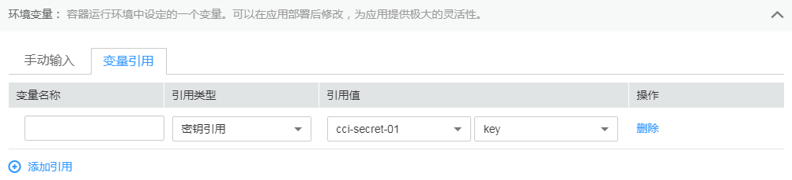
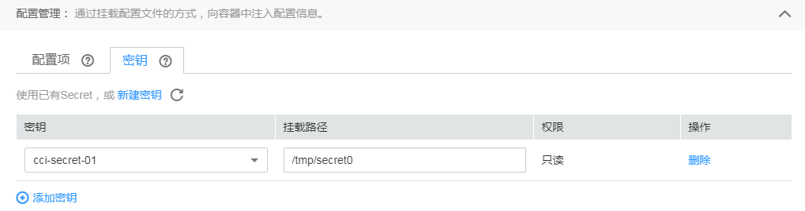

# 使用Secret<a name="cci_01_0035"></a>

Secret是Kubernetes中一种加密存储的资源对象，您可以将认证信息、证书、私钥等保存在密钥中，在容器启动时以环境变量加载到容器中，或以文件方式挂载到容器中。

> **说明：** 
>Secret与SSL证书共用同一个配额。

## 创建Secret<a name="section18512531861"></a>

1.  登录云容器实例控制台，单击左侧导航栏的“配置中心 \> 密钥（Secret）”，在右侧页面中选择命名空间，单击“创建密钥“。
2.  云容器实例支持“手工输入”和“文件上传”两种方式来创建Secret。
    -   方式一：手工输入。参照[表1](#table16321825732)设置基本信息，其中带“\*”标志的参数为必填参数。

        **表 1**  基本信息说明

|参数|参数说明|
|--|--|
|**基本信息**|
|*密钥名称|新建Secret的名称。以小写字母或数字开头，小写字母、数字、中划线（-）、点（.）组成（其中两点不能相连，点不能与中划线相连），小写字母或数字结尾的1到253字符的字符串。|
|描述|密钥的描述信息。|
|*密钥数据|Secret的数据可以在容器中使用。其中，“键”代表文件名；“值”代表文件中的内容。单击“添加数据” 。输入键、值（支持base64自动转码，如果您勾选自动转码，则可以输入未转码的Secret值）。|
|密钥标签|标签以Key/value键值对的形式附加到各种对象上（如应用、节点、服务等）。标签定义了这些对象的可识别属性，用来对它们进行管理和选择。单击“添加标签”。输入键、值。|


    -   方式二：文件上传。

        > **说明：** 
        >云容器实例支持json或yaml格式，且文件大小不得超过2MB，详细请参见[Secret文件格式说明](#section96481187193)。

        单击“添加文件“，选择已创建的Secret类型资源文件后，单击“打开“。

3.  配置完成后，单击“创建“。

    Secret列表中会出现新创建的Secret。


## Secret的使用<a name="section152761334151217"></a>

Secret创建完后，可以在创建负载的过程中作为环境变量引用，或以文件方式挂载到容器中。

**图 1**  使用环境变量挂载Secret<a name="fig1233982173411"></a>  


**图 2**  将Secret挂载到容器中<a name="fig81692045303"></a>  


## Secret文件格式说明<a name="section96481187193"></a>

-   secret.yaml资源描述文件

    例如现在有一个应用需要获取下面的key-value并加密，可以通过Secret来实现：

    key1: value1

    key2: value2

    定义的Secret文件secret.yaml内容如下。其中Value需要进行Base64编码，Base64编码方法请参见[如何进行Base64编码](#section175000605919)。

    ```
    apiVersion: v1
    kind: Secret
    metadata:
      name: mysecret           # secret的名称
      annotations:
        description: "test"
      labels:
        label-01: value-01
        label-02: value-02
    data:
      key1: dmFsdWUx    #需要用Base64编码
      key2: dmFsdWUy    #需要用Base64编码
    type: Opaque         # 必须为Opaque
    ```

-   secret.json资源描述文件

    定义的Secret文件secret.json内容如下。

    ```
    {
        "apiVersion": "v1",
        "kind": "Secret",
        "metadata": {
            "annotations": {
                "description": "test"
            },
            "labels": {
                "label-01": "value-01",
                "label-02": "value-02"
            },
            "name": "mysecret"
        },
        "data": {
            "key1": "dmFsdWUx",
            "key2": "dmFsdWUy"
        },
        "type": "Opaque"
    }
    ```


## 如何进行Base64编码<a name="section175000605919"></a>

对字符串进行Base64加密，可以直接使用“echo -n 要编码的内容 | base64“命令即可，示例如下：

```
root@ubuntu:~# echo -n "3306" | base64
MzMwNg==
```

## 使用kubectl创建Secret<a name="section25041341338"></a>

使用kubectl创建Secret请参见[Secret](https://support.huaweicloud.com/devg-cci/cci_05_0020.html)。

