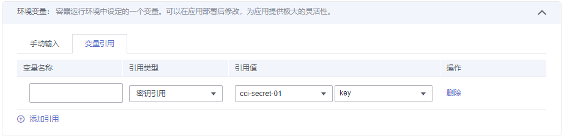
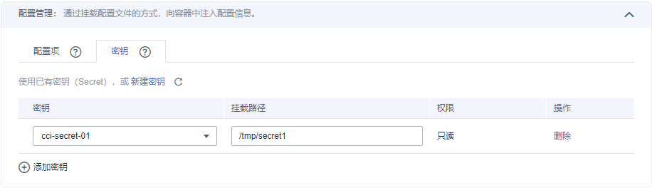

# 使用Secret<a name="cci_01_0035"></a>

Secret是Kubernetes中一种加密存储的资源对象，您可以将认证信息、证书、私钥等保存在密钥中，在容器启动时以环境变量加载到容器中，或以文件方式挂载到容器中。

> **说明：**   
>Secret与SSL证书共用同一个配额。  

## 创建Secret<a name="section18512531861"></a>

1.  登录云容器实例控制台，单击左侧导航栏的“配置管理 \> Secret“，在右侧页面中选择命名空间，单击“添加Secret“。
2.  云容器实例支持“手工输入”和“文件上传”两种方式来创建Secret。
    -   方式一：手工输入。参照[表1](#table16321825732)设置基本信息，其中带“\*”标志的参数为必填参数。输入完成后，单击“添加Secret“。

        **表 1**  基本信息说明

        <a name="table16321825732"></a>
        <table><thead align="left"><tr id="row173212251235"><th class="cellrowborder" valign="top" width="28.000000000000004%" id="mcps1.2.3.1.1"><p id="p43211725338"><a name="p43211725338"></a><a name="p43211725338"></a>参数</p>
        </th>
        <th class="cellrowborder" valign="top" width="72%" id="mcps1.2.3.1.2"><p id="p0322102516320"><a name="p0322102516320"></a><a name="p0322102516320"></a>参数说明</p>
        </th>
        </tr>
        </thead>
        <tbody><tr id="row424229832"><td class="cellrowborder" colspan="2" valign="top" headers="mcps1.2.3.1.1 mcps1.2.3.1.2 "><p id="p1598191212311"><a name="p1598191212311"></a><a name="p1598191212311"></a><strong id="b137387216312"><a name="b137387216312"></a><a name="b137387216312"></a>基本信息</strong></p>
        </td>
        </tr>
        <tr id="row111551253912"><td class="cellrowborder" valign="top" width="28.000000000000004%" headers="mcps1.2.3.1.1 "><p id="p1232219251339"><a name="p1232219251339"></a><a name="p1232219251339"></a>*Secret名称</p>
        </td>
        <td class="cellrowborder" valign="top" width="72%" headers="mcps1.2.3.1.2 "><p id="p173227259312"><a name="p173227259312"></a><a name="p173227259312"></a>新建Secret的名称。</p>
        <p id="p67019179159"><a name="p67019179159"></a><a name="p67019179159"></a>以小写字母或数字开头，小写字母、数字、中划线（-）、点（.）组成（其中两点不能相连，点不能与中划线相连），小写字母或数字结尾的1到253字符的字符串。</p>
        </td>
        </tr>
        <tr id="row1535723154615"><td class="cellrowborder" valign="top" width="28.000000000000004%" headers="mcps1.2.3.1.1 "><p id="p83591731124620"><a name="p83591731124620"></a><a name="p83591731124620"></a>描述</p>
        </td>
        <td class="cellrowborder" valign="top" width="72%" headers="mcps1.2.3.1.2 "><p id="p1736012314462"><a name="p1736012314462"></a><a name="p1736012314462"></a>密钥的描述信息。</p>
        </td>
        </tr>
        <tr id="row133224252315"><td class="cellrowborder" valign="top" width="28.000000000000004%" headers="mcps1.2.3.1.1 "><p id="p23228259314"><a name="p23228259314"></a><a name="p23228259314"></a>*Secret数据</p>
        </td>
        <td class="cellrowborder" valign="top" width="72%" headers="mcps1.2.3.1.2 "><p id="p133223251335"><a name="p133223251335"></a><a name="p133223251335"></a>Secret的数据可以在容器中使用。其中，“键”代表文件名；“值”代表文件中的内容。</p>
        <a name="ol10322425232"></a><a name="ol10322425232"></a><ol id="ol10322425232"><li>单击“添加Secret数据” 。</li><li>输入键、值（支持base64自动转码，如果您勾选<span class="uicontrol" id="uicontrol165220558496"><a name="uicontrol165220558496"></a><a name="uicontrol165220558496"></a>“自动转码”</span>，则可以输入未转码的Secret值）。</li></ol>
        </td>
        </tr>
        <tr id="row123142814330"><td class="cellrowborder" valign="top" width="28.000000000000004%" headers="mcps1.2.3.1.1 "><p id="p17322225134"><a name="p17322225134"></a><a name="p17322225134"></a>Secret标签</p>
        </td>
        <td class="cellrowborder" valign="top" width="72%" headers="mcps1.2.3.1.2 "><p id="p1932211253312"><a name="p1932211253312"></a><a name="p1932211253312"></a>标签以Key/value键值对的形式附加到各种对象上（如应用、节点、服务等）。</p>
        <p id="p1932220252316"><a name="p1932220252316"></a><a name="p1932220252316"></a>标签定义了这些对象的可识别属性，用来对它们进行管理和选择。</p>
        <a name="ol11394016509"></a><a name="ol11394016509"></a><ol id="ol11394016509"><li>单击“添加标签”。</li><li>输入键、值。</li></ol>
        </td>
        </tr>
        </tbody>
        </table>

    -   方式二：文件上传。

        > **说明：**   
        >云容器实例支持json或yaml格式，且文件大小不得超过2MB，详细请参见[Secret文件格式说明](#section96481187193)。  

        单击“添加文件“，选择已创建的Secret类型资源文件后，单击“打开“。


3.  配置完成后，单击添加“Secret“。

    Secret列表中会出现新创建的Secret。


## Secret的使用<a name="section152761334151217"></a>

Secret创建完后，可以在创建负载的过程中作为环境变量引用，或以文件方式挂载到容器中。

**图 1**  使用环境变量挂载Secret<a name="fig1233982173411"></a>  


**图 2**  将Secret挂载到容器中<a name="fig81692045303"></a>  


## Secret文件格式说明<a name="section96481187193"></a>

-   secret.yaml资源描述文件

    例如现在有一个应用需要获取下面的key-value并加密，可以通过Secret来实现：

    key1: value1

    key2: value2

    定义的Secret文件secret.yaml内容如下。其中Value需要进行Base64编码，Base64编码方法请参见[如何进行Base64编码](#section175000605919)。

    ```
    apiVersion: v1
    kind: Secret
    metadata:
      name: mysecret           # secret的名称
      annotations:
        description: "test"
      labels:
        label-01: value-01
        label-02: value-02
    data:
      key1: dmFsdWUx    #需要用Base64编码
      key2: dmFsdWUy    #需要用Base64编码
    type: Opaque         # 必须为Opaque
    ```

-   secret.json资源描述文件

    定义的Secret文件secret.json内容如下。

    ```
    {
        "apiVersion": "v1",
        "kind": "Secret",
        "metadata": {
            "annotations": {
                "description": "test"
            },
            "labels": {
                "label-01": "value-01",
                "label-02": "value-02"
            },
            "name": "mysecret"
        },
        "data": {
            "key1": "dmFsdWUx",
            "key2": "dmFsdWUy"
        },
        "type": "Opaque"
    }
    ```


## 如何进行Base64编码<a name="section175000605919"></a>

对字符串进行Base64加密，可以直接使用“echo -n 要编码的内容 | base64“命令即可，示例如下：

```
root@ubuntu:~# echo -n "3306" | base64
MzMwNg==
```

## 使用kubectl创建Secret<a name="section25041341338"></a>

使用kubectl创建Secret请参见[Secret](https://support.huaweicloud.com/devg-cci/cci_05_0020.html)。

