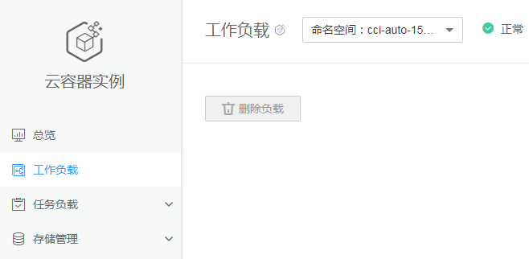
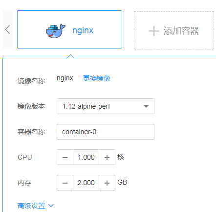
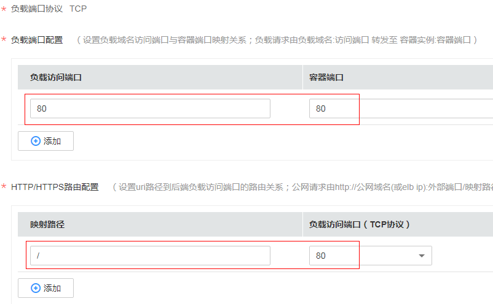
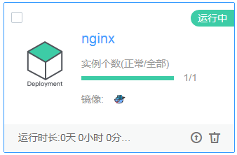

# 入门

本节以创建一个Nginx负载为例介绍如何使用云容器实例。

工作负载是对Pod的服务化封装，包括无状态负载（Deployment）。一个工作负载可以包含多个Pod，其中无状态负载中的所有Pod都相同，且您不需要保存负载的状态或持久化的数据。

1.  登录云容器实例管理控制台。
2.  创建命名空间。
    1.  在左侧导航栏中选择“命名空间“，单击右侧页面中“创建命名空间“。
    2.  在弹出的窗口中选择命名空间资源类型，当前提供“通用计算型“和“GPU型“两种类型的计算资源。命名空间的资源类型详情请参见[命名空间](命名空间.md)。

        您还可以选择单击“一键创建通用计算型“，一键式创建命名空间。命名空间名称随机生成，新建VPC并在每个AZ下分配子网。

    3.  填写命名空间名称。
    4.  设置VPC。

        选择使用已有VPC或新建VPC，新建VPC需要填写VPC网段，建议使用网段：10.0.0.0/8~24，172.16.0.0/12~24，192.168.0.0/16~24。

    5.  设置子网网段，每个可用区（AZ）下需要创建一个子网。
    6.  单击“创建“。

3.  在左侧导航栏中选择“工作负载“，在右侧选择上一个步骤创建的命名空间，单击“创建负载“。

    **图 1**  创建负载  
    

4.  配置容器。
    1.  选择需要的容器镜像，您可以选择Docker官方镜像，也可以上传私有镜像到容器镜像服务的镜像仓库中，然后在这里使用。

        在本例中因为要创建Nginx负载，请选择“Docker官方镜像“，在nginx镜像下单击“使用该镜像“。

    2.  根据需要配置容器规格及高级设置（日志采集、存储、环境变量、健康检查、生命周期、启动命令和ConfigMap）。

        本示例请保持默认值不变，然后单击“下一步“。

        **图 2**  配置容器  
        

5.  配置Pod的数量和域名。

    当配置多个Pod时，云容器实例会自动在Pod间做负载均衡。

    本例中，Pod数量请配置为“2“，然后单击“下一步“。

6.  配置负载信息。
    1.  填写负载名称、描述。
    2.  选择负载访问方式。有如下3种选项。

        -   不启用：负载不提供外部访问方式，适合一些计算类场景，只需计算完存储结果即可，无需与外部通信。
        -   内网访问：负载之间通过“负载域名:负载端口“互相访问。
        -   公网访问：通过弹性负载均衡，从外部访问访问负载。

        本例中，选择配置为“公网访问“，这样可以通过负载均衡的IP和端口访问Nginx负载。

        配置负载域名为“nginx“，选择ELB实例，如果没创建负载均衡，可以单击“新建增强型ELB实例“创建一个，具体步骤请参见[（可选）创建ELB](（可选）创建ELB.md)。

        配置ELB协议为“HTTP“、端口为“80“。

        **图 3**  配置公网访问参数  
        

        设置负载端口为“80“（也可以选择其他端口），容器端口为“80“（容器端口必须为80，因为Docker官方Nginx镜像配置的端口为80，具体请参见[https://hub.docker.com/\_/nginx/](https://hub.docker.com/_/nginx/)）。

        HTTP路由映射路径为“/“并关联到负载访问端口，这样就可以通过“ELB IP地址:端口“访问Nginx负载。

        **图 4**  配置负载端口参数  
        

7.  单击“下一步“，然后单击“启动负载“，单击“返回负载列表”。

    在负载列表中，待负载状态为“运行中“，负载创建成功。

    **图 5**  负载创建成功  
    

    单击负载名称，进入负载详情页面，选择“访问配置 \> 公网访问“Tab页，拷贝公网访问地址（即“ELB IP地址:端口“），即可在浏览器中访问Nginx负载。

    **图 6**  Nginx访问页面  
    

