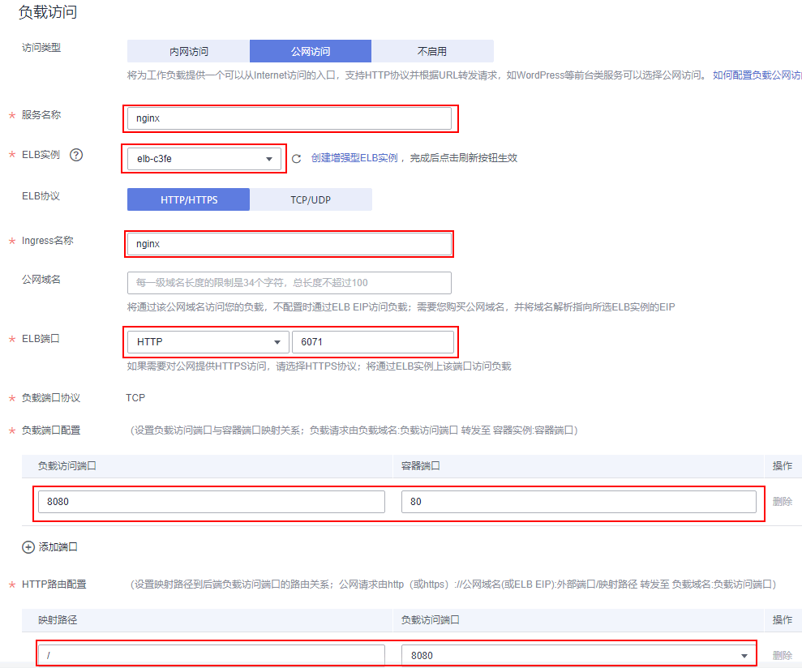
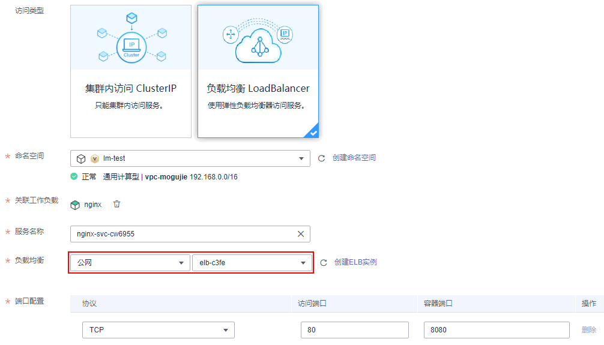

# 公网访问<a name="cci_01_0055"></a>

公网访问是指使用外部网络访问负载，您可以给负载绑定增强型ELB实例（ELB必须与负载在同一个VPC内），通过ELB实例访问负载，当前外部访问支持四层和七层负载公网访问。

-   四层公网访问支持TCP和UDP两种协议，设置完成后可以通过“elb公网ip:elb端口“访问负载。
-   七层公网访问支持HTTP和HTTPS两种协议访问，设置完成后，可以通过“http://公网域名\(或elb 公网ip\):elb端口/映射路径“访问负载。

Service是基于四层TCP和UDP协议转发的，Ingress可以基于七层的HTTP和HTTPS协议转发，可以通过域名和路径做到更细粒度的划分，如下图所示。

**图 1**  Ingress-Service<a name="fig1175625955017"></a>  


下图是一个通过HTTP协议访问负载的示例。

**图 2**  公网访问<a name="fig1395818597306"></a>  


## 配置公网访问-创建工作负载时设置<a name="section182891579481"></a>

在云容器实例中，您只需要在创建负载时选择“公网访问“，然后配置如下参数。

-   服务名称：服务名称即Service的名称，Service是用于管理Pod访问的对象。Service的详细信息请参见[https://support.huaweicloud.com/devg-cci/cci\_05\_0007.html](https://support.huaweicloud.com/devg-cci/cci_05_0007.html)。

-   安装coredns：coredns插件为您的其他负载提供内部域名解析服务，如果不安装coredns则无法通过“服务名称:负载访问端口“访问负载。
-   ELB实例：选择ELB实例，如没有ELB实例可以单击“创建共享型ELB实例“去创建。

    > **须知：** 
    >此处创建的ELB需要与负载所在命名空间在同一个VPC内。
    >CCI暂时不支持独享型负载均衡，建议您创建共享型ELB实例。

-   ELB协议：即公网访问使用的通信协议，支持HTTP、HTTPS、TCP和UDP协议。
-   Ingress名称：Ingress是用于管理七层协议访问的对象。此处如果不配置，云容器实例会默认负载名称作为Ingress名称。Ingress的详细信息请参见[https://support.huaweicloud.com/devg-cci/cci\_05\_0008.html](https://support.huaweicloud.com/devg-cci/cci_05_0008.html)。
-   公网域名（选择HTTP/HTTPS协议时可配置）：通过域名访问负载，公网域名需要您自行购买，并将域名解析指向所选的ELB实例弹性公网IP。
-   证书（选择HTTPS协议时必填）：SSL证书的导入方法请参见[SSL证书](SSL证书.md)。
-   ELB端口：选择使用的ELB访问的具体协议和端口。
-   负载端口协议：访问负载的通信协议，可选择TCP或UDP，如果ELB协议选择为HTTP/HTTPS，则负载端口协议为TCP。
-   负载端口配置：
    -   负载访问端口：负载提供的访问端口。
    -   容器端口：容器监听的端口，负载访问端口映射到容器端口。

-   HTTP路由配置
    -   映射路径：URL访问的路径，必须以“/“开头，如“/api/web“，也可以是根路径“/“。
    -   负载访问端口：前面设置的负载访问端口。


如下图所示，假如ELB实例的IP地址为“10.10.10.10“，则通过“http://10.10.10.10:6071/“就可以从公网访问到负载。

**图 3**  配置公网访问参数<a name="fig1905141443120"></a>  


## 配置公网访问-工作负载创建完成后设置<a name="section1589416183371"></a>

在工作负载创建完成后对Service进行配置，此配置对工作负载状态无影响，且实时生效。具体操作如下：

1.  登录云容器实例管理控制台，左侧导航栏中选择“网络管理 \> 服务（Service）”，在右侧页面单击“添加服务“。
2.  在“添加服务“页面，访问类型选择“负载均衡 LoadBalancer“。
3.  设置弹性负载均衡访问参数。

    -   服务名称：服务名称即Service的名称，Service是用于管理Pod访问的对象。
    -   命名空间：工作负载所在命名空间。
    -   关联工作负载：要添加Service的工作负载。
    -   负载均衡：选择公网ELB实例，如没有ELB实例可以单击“创建ELB实例“去创建。

        > **须知：** 
        >此处创建的ELB需要与负载所在命名空间在同一个VPC内。
        >CCI暂时不支持独享型负载均衡，建议您创建共享型ELB实例。

    -   负载端口配置
        -   协议：访问负载的通信协议，可选择TCP或UDP。
        -   访问端口：负载提供的访问端口。
        -   容器端口：容器监听的端口，负载访问端口映射到容器端口。

    **图 4**  配置公网访问-工作负载创建完成后<a name="fig1581364616"></a>  
    

4.  单击“提交”，工作负载已添加“负载均衡 LoadBalancer”的服务。

## 添加DNAT访问方式<a name="section582917215283"></a>

工作负载创建后，如果想要使用公网访问Pod，除了使用ELB，还可以添加DNAT访问方式。具体操作如下：

1.  创建一个NAT网关。
2.  使用kubectl创建DNAT类型的Service，具体创建方式请参考[Service](https://support.huaweicloud.com/devg-cci/cci_05_0007.html)，下面是一个DNAT类型的Service示例：

    ```
    apiVersion: v1
    kind: Service
    metadata:
      name: nginx
      namespace: default  # 用户命名空间，默认为default
      annotations:
        kubernetes.io/elb.class: dnat       # 类型DNAT
        kubernetes.io/natgateway.id: 4b8cda3d-3543-4ebd-a55e-ca610b3b3c43 # NAT网关ID
    spec:
      loadBalancerIP: 100.85.218.195      # DNAT使用的 EIP
      selector:
        app: nginx
      ports:
      - name: service0
        targetPort: 80     # Pod 暴露的端口
        port: 8080         # DNAT访问端口
        protocol: TCP
      type: LoadBalancer   # Service的类型
    ```


1.  创建成功后，使用kubectl describe <service\_name\> -n <service\_namespace\> 可以查看Service更新状态。

创建并更新成功后，就可以使用EIP+Port的方式访问Pod了。

**约束与限制**：

1.  由于一条DNAT规则只能转发一个后端，因此一条DNAT Service也只能关联一个后端Pod，超过一个时DNAT规则绑定失败。
2.  一个 NAT 网关只能添加 200 条 DNAT 规则，具体限制参考  [NAT](https://support.huaweicloud.com/productdesc-natgateway/zh-cn_topic_0086739763.html)  网关文档。
3.  DNAT Service 创建后前端可以查看到信息，但是请不要在前端进行修改设置。
4.  子网使用非默认路由需要在对应路由表中添加NAT网关的路由。
5.  如果在SNAT规则使用的网关下配置DNAT Service，请确保DNAT Service使用的EIP与SNAT规则绑定的EIP不同。
6.  NAT网关的使用，具体可参考[NAT](https://support.huaweicloud.com/productdesc-natgateway/zh-cn_topic_0086739750.html)网关文档。

## 添加Ingress访问方式<a name="section26891075374"></a>

您可以在工作负载创建完成后为其添加Ingress类型的访问，此配置对工作负载状态无影响，且实时生效。具体操作如下：

1.  登录云容器实例管理控制台，左侧导航栏中选择“网络管理 \> 路由（Ingress）”，在右侧页面单击“添加路由“。
2.  设置路由参数。
    -   路由名称：自定义Ingress名称。
    -   命名空间：选择需要添加Ingress的命名空间。
    -   负载均衡：可以将互联网访问流量自动分发到工作负载所在的多个节点上。
    -   对外端口：开放在负载均衡服务地址的端口，可任意指定。
    -   对外协议：支持HTTP和HTTPS。若选择HTTPS，请选择密钥证书，格式说明请参见[证书格式](https://support.huaweicloud.com/usermanual-elb/zh-cn_topic_0092382555.html)。

        > **说明：** 
        >-   选择HTTPS协议时，才需要创建密钥证书ingress-test-secret.yaml。创建密钥的方法请参见[使用Secret](使用Secret.md)。
        >-   同一个ELB实例的同一个端口配置HTTPS时，一个监听器只支持配置一个密钥证书。若使用两个不同的密钥证书将两个Ingress添加到同一个ELB下的同一个监听器，ELB侧实际只生效最初的证书。

    -   **域名：**可选填。实际访问的域名地址，该域名需用户购买并备案，并确保所填域名能解析到所选负载均衡实例的服务地址。一旦配置了域名规则，则必须使用域名访问。
    -   **路由配置：**
        -   路由匹配规则：当前仅支持前缀路由匹配。

            前缀路由匹配：例如映射URL为/healthz，只要符合此前缀的URL均可访问。例如/healthz/v1，/healthz/v2。

        -   映射URL：需要注册的访问路径。
        -   服务名称：选择需要添加Ingress的服务。
        -   服务端口：容器镜像中容器实际监听端口，需用户确定。

3.  配置完成后，单击“提交“。

    创建完成后，在Ingress列表可查看到已创建成功的Ingress。


## 如何处理公网无法访问<a name="section108763244818"></a>

1.  公网能正常访问的前提是负载已处于运行中状态，如果您的负载处于未就绪或异常状态，公网访问将无法正常使用。
2.  从负载开始创建到公网可以正常访问可需要1分钟到3分钟的时间，在此时间内网络路由尚未完成配置，请稍作等待。
3.  负载创建3分钟以后仍然无法访问。单击创建的负载进入详情页，在详情页单击访问配置下面的“事件”标签，查看访问事件，查看是否有告警事件。如下两种常见的事件。
    -   Listener port is repeated：ELB监听器端口重复，是由于之前发布公网访问的负载，删除之后立刻创建使用相同ELB端口的公网访问负载，ELB实际删除端口需要一定的时间，因此首次创建失败，可以选择删除负载重新创建，也可以等待5-10分钟，公网访问可正常使用。
    -   Create listener failed：创建ELB监听器失败，创建监听器失败的原因一般是超过配额限度，请选择其他配额充足的ELB实例。

4.  负载创建3分钟以后仍然无法访问，且无告警事件，可能原因是用户配置的容器端口实际上没有相应进程在监听，目前云容器实例服务无法检测出该类使用异常，需要您排查镜像是否有监听该容器端口。如果容器端口监听正确，此时无法访问的原因可能为ELB实例本身有问题，请排查ELB实例状态。

## 使用kubectl实现公网访问<a name="section1351018173017"></a>

公网访问需要配合Service和Ingress两个Kubernetes对象实现，具体请参见[Service](https://support.huaweicloud.com/devg-cci/cci_05_0007.html)和[Ingress](https://support.huaweicloud.com/devg-cci/cci_05_0008.html)。

## 更新Service<a name="section16507523191119"></a>

您可以在添加完Service后，更新此Service的端口配置。操作如下：

1.  登录云容器实例管理控制台，左侧导航栏中选择“网络管理 \> 服务（Service）”，在Service页面中，选择对应的命名空间，单击需要更新端口配置的Service后的“更新”。
2.  更新负载均衡参数：
    -   命名空间：工作负载所在命名空间，更新时此处不可修改。
    -   关联工作负载：要添加Service的工作负载，更新时此处不可修改。
    -   服务名称：服务名称即Service的名称，Service是用于管理Pod访问的对象，更新时此处不可修改。
    -   负载均衡：更新时此处不可修改。
    -   端口配置
        -   协议：访问负载的通信协议，可选择TCP或UDP。
        -   访问端口：负载提供的访问端口。
        -   容器端口：容器监听的端口，负载访问端口映射到容器端口。

3.  单击“提交”。工作负载已更新Service。

## 更新Ingress<a name="section1697274019216"></a>

您可以在添加完Ingress后，更新此Ingress的端口、域名和路由配置。操作如下：

1.  登录云容器实例管理控制台，左侧导航栏中选择“网络管理 \> 路由（Ingress）”，选择对应的命名空间，单击待更新Ingress后的“更新”。
2.  在“更新路由“页面，更新如下参数：
    -   **对外端口：**开放在负载均衡服务地址的端口，可任意指定。
    -   **域名：**可选填。实际访问的域名地址，该域名需用户购买并备案，并确保所填域名能解析到所选负载均衡实例的服务地址。一旦配置了域名规则，则必须使用域名访问。
    -   **路由配置：**可单击“添加映射”增加新的路由配置。
        -   路由匹配规则：当前仅支持前缀路由匹配。

            前缀路由匹配：例如映射URL为/healthz，只要符合此前缀的URL均可访问。例如/healthz/v1，/healthz/v2。

        -   映射URL：需要注册的访问路径，例如：/healthz。
        -   服务名称：选择需要添加Ingress的服务。
        -   服务端口：容器镜像中容器实际监听端口，需用户确定。

3.  单击“提交”，工作负载已更新Ingress。

