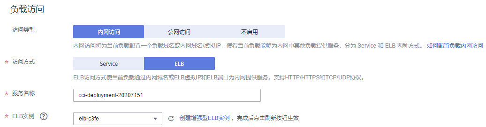
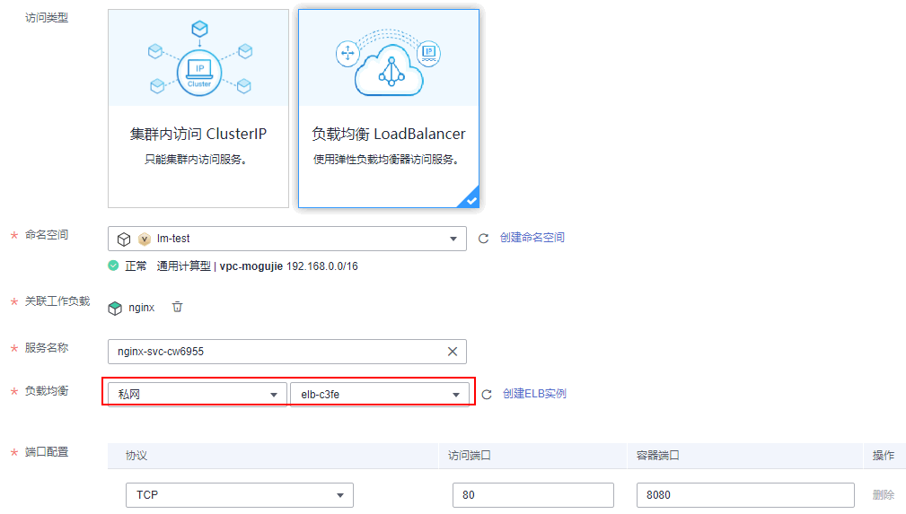

# 内网访问

内网访问有如下两种情况：

-   [使用Service方式访问](#section7148214124710)：该方式适合CCI中同一个命名空间中的负载相互访问。
-   [使用私网ELB访问](#section154315254491)：该方式适合华为云内部资源（云容器实例以外的资源，如ECS等）且与负载在同一个VPC内互相访问，另外在同一个VPC不同命名空间的负载也可以选择此种方式。通过内网域名或ELB的“IP:Port“为内网提供服务，支持HTTP/HTTPS和TCP/UDP协议。如果是华为云内部且与负载在不在同一个VPC内，也可以选择创建VPC[对等连接](https://support.huaweicloud.com/usermanual-vpc/zh-cn_topic_0046655036.html)，使得两个VPC之间网络互通。

## 使用Service方式访问-创建工作负载时设置

负载中最小的资源单位就是Pod，访问负载就是访问负载中的Pod。负载中的Pod能够动态地创建和销毁，例如，扩缩容或者执行滚动升级，这时Pod的地址会发生变化，这为访问Pod带来了不便。

为解决该问题，云容器实例提供了coredns（内部域名解析）插件，Pod的变化由负载管理，外部无需感知。

访问负载只需要通过“服务名称:负载访问端口“即可，其中负载访问端口映射到容器端口。如下图所示，前台中的Pod如果要访问后台中的Pod时，只需要访问“nginx:8080“即可。

**图 1**  使用Service方式访问  

在云容器实例中，您只需要在创建负载时，填写服务名称和负载的端口配置，即可通过“服务名称:负载访问端口“访问到该负载。

-   服务名称：服务名称即Service的名称，Service是用于管理Pod访问的对象。Service的详细信息请参见[https://support.huaweicloud.com/devg-cci/cci\_05\_0007.html](https://support.huaweicloud.com/devg-cci/cci_05_0007.html)。
-   安装coredns：coredns插件为您的其他负载提供内部域名解析服务，如果不安装coredns则无法通过“服务名称:负载访问端口“访问负载。
-   负载端口配置
    -   协议：访问负载的通信协议，可选择TCP或UDP。
    -   负载访问端口：负载提供的访问端口。
    -   容器端口：容器监听的端口，负载访问端口映射到容器端口。

**图 2**  配置Service访问参数  

## 使用Service方式访问-工作负载创建完成后设置

在工作负载创建完成后对Service进行配置，此配置对工作负载状态无影响，且实时生效。具体操作如下：

1.  登录云容器实例管理控制台，左侧导航栏中选择[网络管理 \> 服务（Service）](https://console.huaweicloud.com/cci/?#/network/service/list)，在右侧页面单击“添加服务“。
2.  在“添加服务“页面，访问类型选择“集群内访问 ClusterIP“。
3.  设置集群内访问参数。
    -   服务名称：服务名称即Service的名称，Service是用于管理Pod访问的对象。
    -   命名空间：工作负载所在命名空间。
    -   关联工作负载：要添加Service的工作负载。
    -   负载端口配置
        -   协议：访问负载的通信协议，可选择TCP或UDP。
        -   访问端口：负载提供的访问端口。
        -   容器端口：容器监听的端口，负载访问端口映射到容器端口。

4.  单击“提交”，工作负载已添加“集群内访问 \( ClusterIP \)”的服务。

## 使用kubectl创建Service

使用kubectl创建Service请参见[Service](https://support.huaweicloud.com/devg-cci/cci_05_0007.html)。

## 使用私网ELB访问

如果需要从负载所在命名空间之外（华为云其他资源、云容器实例其他命名空间的负载）访问负载，可以通过绑定私网类型的增强型ELB实例（即创建ELB时类型选择私网），通过私网ELB的VIP访问负载。

此时需要选择私网ELB实例，其余配置方法与[公网访问](公网访问.md)完全一致。

**图 3**  使用内网ELB访问-创建工作负载时  

**图 4**  使用内网ELB访问-工作负载创建完成后设置  

## 使用Ingress访问方式-工作负载创建完成后设置

您可以在工作负载创建完成后为其添加Ingress类型的访问方式，此配置对工作负载状态无影响，且实时生效。具体操作如下：

1.  登录云容器实例管理控制台，左侧导航栏中选择[网络管理 \> 路由（Ingress）](https://console.huaweicloud.com/cci/?#/network/ingress/list)，在右侧页面单击“添加路由“。
2.  设置路由参数。
    -   路由名称：自定义Ingress名称。
    -   命名空间：选择需要添加Ingress的命名空间。
    -   负载均衡：可以将互联网访问流量自动分发到工作负载所在的多个节点上。
    -   对外端口：开放在负载均衡服务地址的端口，可任意指定。
    -   对外协议：支持HTTP和HTTPS。若选择HTTPS，请选择密钥证书，格式说明请参见[证书格式](https://support.huaweicloud.com/usermanual-elb/zh-cn_topic_0092382555.html)。

        > **说明：**   
        >-   选择HTTPS协议时，才需要创建密钥证书ingress-test-secret.yaml。创建密钥的方法请参见[使用Secret](使用Secret.md)。  
        >-   同一个ELB实例的同一个端口配置HTTPS时，一个监听器只支持配置一个密钥证书。若使用两个不同的密钥证书将两个Ingress添加到同一个ELB下的同一个监听器，ELB侧实际只生效最初的证书。  

    -   **域名：**可选填。实际访问的域名地址，该域名需用户购买并备案，并确保所填域名能解析到所选负载均衡实例的服务地址。一旦配置了域名规则，则必须使用域名访问。
    -   **路由配置：**
        -   路由匹配规则：当前仅支持前缀路由匹配。

            前缀路由匹配：例如映射URL为/healthz，只要符合此前缀的URL均可访问。例如/healthz/v1，/healthz/v2。

        -   映射URL：需要注册的访问路径。
        -   服务名称：选择需要添加Ingress的服务。
        -   容器端口：容器镜像中容器实际监听端口，需用户确定。

3.  配置完成后，单击“提交“。

    创建完成后，在Ingress列表可查看到已创建成功的Ingress。

## 更新Service

您可以在添加完Service后，更新此Service的端口配置，操作步骤如下：

1.  登录云容器实例管理控制台，左侧导航栏中选择[网络管理 \> 服务（Service）](https://console.huaweicloud.com/cci/?#/network/service/list)，在Service页面中，选择对应的命名空间，单击需要更新端口配置的Service后的“更新”。
2.  在“更新服务“页面，访问类型选择“集群内访问 \( ClusterIP \)“。
3.  更新集群内访问参数。
    -   **集群名称：**工作负载所在集群的名称，此处不可修改。
    -   **命名空间：**工作负载所在命名空间，此处不可修改。
    -   **关联工作负载：**要添加Service的工作负载，此处不可修改。
    -   **端口配置：**
        -   协议：请根据业务的协议类型选择。
        -   容器端口：工作负载程序实际监听的端口，需用户确定。nginx程序实际监听的端口为80。
        -   访问端口：容器端口映射到集群虚拟IP上的端口，用虚拟IP访问工作负载时使用，端口范围为1-65535，可任意指定。

4.  单击“提交”，工作负载已更新Service。

## 更新Ingress

您可以在添加完Ingress后，更新此Ingress的端口、域名和路由配置。操作如下：

1.  登录云容器实例管理控制台，左侧导航栏中选择[网络管理 \> 路由（Ingress）](https://console.huaweicloud.com/cci/?#/network/ingress/list)，选择对应的命名空间，单击待更新Ingress后的“更新”。
2.  在“更新路由“页面，更新如下参数：
    -   **对外端口：**开放在负载均衡服务地址的端口，可任意指定。
    -   **域名：**可选填。实际访问的域名地址，该域名需用户购买并备案，并确保所填域名能解析到所选负载均衡实例的服务地址。一旦配置了域名规则，则必须使用域名访问。
    -   **路由配置：**可单击“添加映射”增加新的路由配置。
        -   路由匹配规则：当前仅支持前缀路由匹配。

            前缀路由匹配：例如映射URL为/healthz，只要符合此前缀的URL均可访问。例如/healthz/v1，/healthz/v2。

        -   映射URL：需要注册的访问路径，例如：/healthz。
        -   服务名称：选择需要添加Ingress的服务。
        -   容器端口：容器镜像中容器实际监听端口，需用户确定。

3.  单击“提交”，工作负载已更新Ingress。

