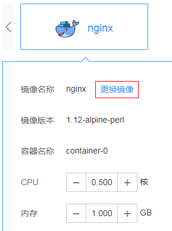

# 升级负载

负载创建成功后，可以对负载更新和升级。当前支持“滚动升级“和“替换升级“两种方式。

-   滚动升级：将逐步用新版本的实例替换旧版本的实例，升级的过程中，业务流量会同时负载均衡分布到新老的实例上，因此业务不会中断。
-   替换升级：将先把您工作负载的老版本实例删除，再安装指定的新版本，升级过程中业务会中断。

## 升级负载

1.  登录云容器实例管理控制台，左侧导航栏中选择“工作负载 \> 无状态（Deployment）”，进入实例详情页面，单击右上角“升级“。
2.  修改Pod规格。

    您可以选择使用GPU（只能在GPU型命名空间下）或不使用GPU。

    当前提供3种类型的Pod，包括通用计算型（通用计算型命名空间下使用）、[RDMA](https://zh.wikipedia.org/wiki/%E8%BF%9C%E7%A8%8B%E7%9B%B4%E6%8E%A5%E5%86%85%E5%AD%98%E8%AE%BF%E9%97%AE)加速型和GPU加速型（GPU型命名空间下使用）。具体的规格信息请参考[约束与限制](https://support.huaweicloud.com/productdesc-cci/cci_03_0007.html)中的“Pod规格”。

3.  修改容器配置。
    1.  单击“更换镜像“可以选择新的镜像，如下图所示。

        **图 1**  更换镜像  
        

        -   我的镜像：展示了您上传到容器镜像服务的镜像。
        -   开源镜像中心：展示了镜像中心的公共镜像。
        -   共享镜像：展示了容器镜像服务中他人共享的镜像。

    2.  镜像选择完成后，需要选择镜像的版本、设置容器名称、设置容器占用的CPU和内存规格（单个容器最小配置是0.25核、0.2GB），并选择是否开启采集标准输出文件（开启后，应用运维管理AOM将根据实际使用量进行计费）。

        > **说明：** 
        >每个租户一个月有500M的免费日志存储空间，超过500M时AOM将根据实际使用量进行收费，计费规则请参见[产品价格详情](https://www.huaweicloud.com/pricing.html?tab=detail#/aom)。

        对于Pod中只有一个容器能使用GPU，如果您的Pod中有个多个容器，您可以通过“开启GPU“这个开关选择哪个容器使用GPU。

        您还可以为容器做如下高级设置：

        -   存储：支持挂载持久化卷到容器中，以实现数据文件的持久化存储，当前支持云硬盘存储卷、文件存储卷和极速文件存储卷。单击“添加云硬盘存储卷“、“添加文件存储卷“或“添加极速文件存储卷“，输入名称、容量、容器内挂载路径，选择磁盘类型。负载创建完成后，可对存储卷进行管理，具体请参见[云硬盘存储卷](云硬盘存储卷.md)、[文件存储卷](文件存储卷.md)或[极速文件存储卷](极速文件存储卷.md)。
        -   日志采集：支持根据您配置的日志输出路径，采集应用日志，请自行防爆处理。单击添加日志存储，输入容器内日志路径，调整日志存储空间。负载创建完成后，可在AOM界面查看日志，具体请参见[日志管理](日志管理.md)。
        -   环境变量：在容器中设置环境变量，支持手动输入和引用变量。环境变量为应用提供极大的灵活性，您可以在应用程序中使用环境变量，在创建容器时为环境变量赋值，容器运行时读取环境变量的值，从而做到灵活的配置，而不是每次都重新编写应用程序制作镜像。

            手动输入只需要直接输入变量名称和变量值。

            变量引用支持引用PodIP（Pod的IP地址）、PodName（Pod的名称）以及Secret，输入变量名称，选择引用类型、引用值。其中Secret引用的创建请参见[使用Secret](使用Secret.md)。

        -   健康检查：健康检查是指容器运行过程中，根据您需要，定时检查容器健康状况。详细步骤请参见[健康检查](健康检查.md)。
        -   生命周期：生命周期脚本定义，在容器的生命周期的特定阶段执行调用。详细步骤请参见[容器生命周期](容器生命周期.md)。
        -   启动命令：输入容器启动命令，容器启动后会立即执行。启动命令对应于容器引擎的ENTRYPOINT启动命令，详细内容请参见[容器启动命令](容器启动命令.md)。
        -   配置管理：容器支持挂载ConfigMap和Secret。ConfigMap和Secret的创建请参见[使用ConfigMap](使用ConfigMap.md)和[使用Secret](使用Secret.md)。

4.  单击“下一步“，选择升级策略。

    您可以指定无状态工作负载的升级方式，包括逐步“滚动升级“和整体“替换升级“。

    -   滚动升级：将逐步用新版本的实例替换旧版本的实例，升级的过程中，业务流量会同时负载均衡分布到新老的实例上，因此业务不会中断。

        最大无效实例数：每次滚动升级允许的最大无效实例数，如果等于实例数有断服风险（最小存活实例数 = 实例数 - 最大无效实例数）。

    -   替换升级：将先把您工作负载的老版本实例删除，再安装指定的新版本，升级过程中业务会中断。

5.  单击“下一步”，单击“提交“，升级负载。

## 使用kubectl升级负载

使用kubectl升级负载请参见[Deployment](https://support.huaweicloud.com/devg-cci/cci_05_0005.html)章节的“升级“部分。

