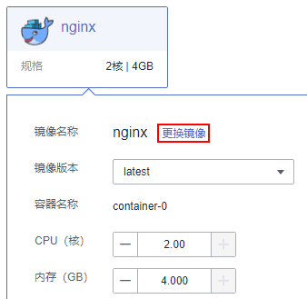

# 升级负载

负载创建成功后，可以对负载更新和升级。

目前支持滚动升级，滚动升级将逐步用新版本的负载替换旧版本的负载，升级的过程中，业务流量会同时负载均衡分布到新老的负载上，因此业务不会中断。

## 升级负载

1.  登录云容器实例管理控制台，单击要更新升级的负载，进入实例详情页面，单击右上角“升级“。
2.  单击“更换镜像“可以选择新的镜像，如下图所示，其余参数如[表1](#table775415515504)所示。

    **图 1**  更换镜像  
    

    **表 1**  镜像参数说明

    
    <table><thead align="left"><tr id="row675465517503"><th class="cellrowborder" valign="top" width="23%" id="mcps1.2.3.1.1">
参数

    </th>
    <th class="cellrowborder" valign="top" width="77%" id="mcps1.2.3.1.2">
说明

    </th>
    </tr>
    </thead>
    <tbody><tr id="row1775415517504"><td class="cellrowborder" valign="top" width="23%" headers="mcps1.2.3.1.1 ">
镜像版本

    </td>
    <td class="cellrowborder" valign="top" width="77%" headers="mcps1.2.3.1.2 ">
选择镜像的版本。

    </td>
    </tr>
    <tr id="row12754105565010"><td class="cellrowborder" valign="top" width="23%" headers="mcps1.2.3.1.1 ">
容器规格

    </td>
    <td class="cellrowborder" valign="top" width="77%" headers="mcps1.2.3.1.2 "><ul id="ul13282205619311"><li>Pod的CPU取值范围为0.25核-32核，且单个容器的CPU必须为0.25核的整数倍</li><li>Pod的内存取值范围为1GB-128GB，且内存必须为1GB的整数倍</li><li>Pod的CPU/内存配比值必须在1:2到1:4之间</li><li>一个Pod内最多支持5个容器，单个容器最小配置是0.25核、0.2GB，最大同容器实例的最大配置</li></ul>
    </td>
    </tr>
    </tbody>
    </table>

3.  （可选）高级设置。

    **表 2**  高级设置

    
    <table><thead align="left"><tr id="cci_01_0011_row167061935153213"><th class="cellrowborder" valign="top" width="23%" id="mcps1.2.3.1.1">
参数

    </th>
    <th class="cellrowborder" valign="top" width="77%" id="mcps1.2.3.1.2">
说明

    </th>
    </tr>
    </thead>
    <tbody><tr id="cci_01_0011_row135751322144113"><td class="cellrowborder" valign="top" width="23%" headers="mcps1.2.3.1.1 ">
存储

    </td>
    <td class="cellrowborder" valign="top" width="77%" headers="mcps1.2.3.1.2 ">
支持挂载持久化卷到容器中，以实现数据文件的持久化存储。当前支持云硬盘卷和文件存储卷。

    <ol id="cci_01_0011_ol7523142816416"><li>单击“添加云硬盘卷”或“添加文件存储卷”。</li><li>输入名称、容量、容器内挂载路径，选择磁盘类型。</li></ol>
    
负载创建完成后，可对存储卷进行管理，具体请参见<a href="云硬盘卷.md">云硬盘卷</a>或<a href="文件存储卷.md">文件存储卷</a>。

    </td>
    </tr>
    <tr id="cci_01_0011_row3669818141715"><td class="cellrowborder" valign="top" width="23%" headers="mcps1.2.3.1.1 ">
日志采集

    </td>
    <td class="cellrowborder" valign="top" width="77%" headers="mcps1.2.3.1.2 ">
支持根据您配置的日志输出路径，采集负载日志，并进行防爆处理。

    <ol id="cci_01_0011_ol1888210123245"><li>单击添加日志存储。</li><li>输入容器内日志路径，调整日志存储空间。</li></ol>
    
负载创建完成后，可在AOM界面查看日志，具体请参见<a href="日志管理.md">日志管理</a>。

    </td>
    </tr>
    <tr id="cci_01_0011_row10165174402214"><td class="cellrowborder" valign="top" width="23%" headers="mcps1.2.3.1.1 ">
环境变量

    </td>
    <td class="cellrowborder" valign="top" width="77%" headers="mcps1.2.3.1.2 ">
容器运行环境中设定的一个变量。可以在负载部署后修改，为负载提供极大的灵活性。

    <ul id="cci_01_0011_ul789917269235"><li>手动输入<ol id="cci_01_0011_ol132614379232"><li>单击“添加变量”。</li><li>输入变量名称、变量值。</li></ol>
    </li><li>变量引用<ol id="cci_01_0011_ol1160515682420"><li>单击添加引用。</li><li>输入变量名称，选择引用类型、引用值。其中Secret引用的创建请参见<a href="使用Secret.md">使用Secret</a>。</li></ol>
    </li></ul>
    </td>
    </tr>
    <tr id="cci_01_0011_row173162112241"><td class="cellrowborder" valign="top" width="23%" headers="mcps1.2.3.1.1 ">
健康检查

    </td>
    <td class="cellrowborder" valign="top" width="77%" headers="mcps1.2.3.1.2 ">
健康检查是指容器运行过程中，根据您需要，定时检查容器健康状况。详细步骤请参见<a href="容器健康检查.md">容器健康检查</a>。

    </td>
    </tr>
    <tr id="cci_01_0011_row17061435113218"><td class="cellrowborder" valign="top" width="23%" headers="mcps1.2.3.1.1 ">
生命周期

    </td>
    <td class="cellrowborder" valign="top" width="77%" headers="mcps1.2.3.1.2 ">
生命周期脚本定义，主要针对容器类负载的生命周期事件负载采取的动作。详细步骤请参见<a href="容器生命周期.md">容器生命周期</a>。<ul id="cci_01_0011_ul7468112919334"><li>启动后处理：负载启动后触发。</li><li>停止前处理：负载停止前触发。</li></ul>
    

    </td>
    </tr>
    <tr id="cci_01_0011_row725218519814"><td class="cellrowborder" valign="top" width="23%" headers="mcps1.2.3.1.1 ">
启动命令

    </td>
    <td class="cellrowborder" valign="top" width="77%" headers="mcps1.2.3.1.2 ">
输入容器启动命令，容器启动后会立即执行。

    
启动命令对应于docker的ENTRYPOINT启动命令，详细内容请参见<a href="容器启动命令.md">容器启动命令</a>。

    </td>
    </tr>
    <tr id="cci_01_0011_row12584143142315"><td class="cellrowborder" valign="top" width="23%" headers="mcps1.2.3.1.1 ">
配置管理

    </td>
    <td class="cellrowborder" valign="top" width="77%" headers="mcps1.2.3.1.2 ">
容器支持挂载ConfigMap和Secret。

    
ConfigMap和Secret的创建请参见<a href="使用ConfigMap.md">使用ConfigMap</a>和<a href="使用Secret.md">使用Secret</a>。

    </td>
    </tr>
    </tbody>
    </table>

4.  单击“下一步“。
5.  单击“提交“，升级负载。

