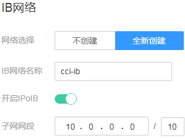

# 命名空间

命名空间（namespace）是一种在多个用户之间划分资源的方法。适用于用户中存在多个团队或项目的情况。

当前云容器实例提供“通用计算型“、“通用计算型-鲲鹏“和“GPU加速型“三种类型的资源，创建命名空间时需要选择资源类型，后续创建的负载中容器就运行在此类型的集群上。

-   通用计算型：支持创建含CPU资源的容器实例，适用于通用计算场景。
-   通用计算型-鲲鹏：具备多核、众核的并发处理优势，除了原生手机APP之外，对于后端的偏Scale-out、micro-server的业务，具有很好的应用场景。
-   GPU加速型：支持创建含GPU资源的容器实例，适用于深度学习、科学计算、视频处理等场景。

> **说明：**   
>-   目前“GPU加速型”资源仅“华北-北京一”和“华北-北京四”区域支持，“通用计算型-鲲鹏”资源仅“华北-北京四”区域支持。  
>-   “通用计算型-鲲鹏”当前属于公测阶段，若需使用该功能，请单击“通用计算型-鲲鹏”下的“申请公测”，并根据实际情况设置企业规模、研发人员比例、应用场景、业务当前阶段等信息。  

## 命名空间与网络的关系

从网络角度，命名空间对应一个虚拟私有云（VPC）中一个子网，如[图1](#fig119999112419)所示，在创建命名空间时会关联已有VPC或创建一个新的VPC，并在VPC下创建一个子网。后续在该命名空间下创建的容器及其他资源都会在对应的VPC及子网之内。

通常情况下，如果您在同一个VPC下还会使用其他服务的资源，您需要考虑您的网络规划，如子网网段划分、IP数量规划等，确保有可用的网络资源。

**图 1**  命名空间与VPC子网的关系  

## 哪些情况下适合使用多个命名空间

因为namespace可以实现部分的环境隔离。当你的项目和人员众多的时候可以考虑根据项目属性，例如生产、测试、开发划分不同的namespace。

## 创建命名空间

1.  登录云容器实例管理控制台，左侧导航栏中选择[命名空间](https://console.huaweicloud.com/cci/#/app/namespace/list)。
2.  在对应类型的命名空间下单击“创建“。
3.  填写命名空间名称。

    > **说明：**   
    >命名空间名称在云容器实例中需全局唯一。  

4.  设置RBAC权限。

    开启RBAC鉴权后，用户使用命名空间下的资源将受到RBAC权限控制，详情请参见[命名空间权限](CCI权限说明.md#section944114820217)。

5.  选择企业项目。CCI中每个命名空间对应一个企业项目，一个企业项目下可以有多个命名空间。

    > **说明：**   
    >-   未开通企业管理的用户页面无此参数，无需进行配置。如需开通企业管理，请参见[如何开通企业项目/企业多账号](https://support.huaweicloud.com/usermanual-em/em_am_0008.html)。使用IAM用户的注意事项请参见[（可选）上传镜像](环境设置.md#section1593133403517)。  
    >-   您开通了企业项目后，自动创建的网络、存储资源与命名空间在同一企业项目中。您在企业项目页面进行资源迁移时，建议一同迁移相关资源。 例如命名空间从项目1迁移至项目2，网络和存储资源也需要一同迁移，否则可能会导致该命名空间下的负载异常。  

6.  设置按需弹性继承。

    设置按需弹性继承后，当专属资源用尽时，可自动弹性创建CCI按需实例。

    > **说明：**   
    >目前仅“华北-北京四”区域支持“按需弹性继承”功能。  

7.  设置VPC。

    选择使用已有VPC或新建VPC，新建VPC需要填写VPC网段，建议使用网段：10.0.0.0/8\~24，172.16.0.0/12\~24，192.168.0.0/16\~24。

    > **须知：**   
    >此处VPC和子网的网段不能为10.247.0.0/16，10.247.0.0/16是云容器实例预留给负载访问的网段。如果您使用此网段，后续可能会造成IP冲突，导致负载无法创建或服务不可用；如果您不需要通过负载访问，而是直接访问Pod，则可以使用此网段。  
    >命名空间创建完成后，在“网络管理 \> 容器网络”中可查看到VPC和子网信息。  

8.  设置子网网段。

    您需要关注子网的可用IP数，确保有足够数量的可用IP，如果没有可用IP，则会导致负载创建失败。

    **图 2**  子网设置  
    

9.  设置IB（Infiniband，无限带宽）网络。

    InfiniBand是一种用于高性能计算的计算机网络通信标准，具有极高的吞吐量和极低的延迟，使用IB网络能有效提升容器间的访问速度。

    IB网络与VPC网络是完全独立的两个网络，IB网络作为容器间高速访问通道，VPC网络则用于其他用途，包括对外访问等等。

    创建IB网络时，您可以开启IPoIB（IP over IB），即支持设置IB网络的网段。

    > **说明：**   
    >-   仅GPU型命名空间支持设置IB网络。  
    >-   IB网络的网段不能与VPC子网网段冲突。  

    **图 3**  IB网络配置  
    

10. 高级设置。

    > **说明：**   
    >目前仅“华北-北京四”区域支持“高级设置”功能。  

    每个命名空间下都提供了一个IP池，申请IP需要一段时间，如果需要快速创建负载，减少IP的申请时间，可通过自定义资源池大小来实现。

    例如，某业务线日常的负载数为200，当达到流量高峰时，IP资源池会自动扩容，瞬间将IP资源池扩容到500（IP资源池大小），同时会在回收间隔23h（IP资源池回收间隔）之后，进行回收超过资源池大小的部分即（500-200）个。

    -   预热IP资源池大小\(个\)：为每个命名空间预热一个IP池，用来加速负载创建。
    -   预热IP资源池回收间隔（h）：IP资源池弹性扩容出来的空闲IP资源， 在一定时间内可进行回收。
    -   专属容器实例节点预热IP资源池大小（个）：为每台专属容器实例节点预热一个IP池，用来加速负载创建。

        > **说明：**   
        >VIP用户时才显示该配置项。  

    -   容器网络预准备：容器启动时，可能会没有网络连接。如果容器在启动时，需要立即连接网络， 可开启此处的“容器网络预准备”开关。

11. 单击“创建“。

    创建完成后，可以在命名空间详情中看到VPC、子网等信息。

## 删除命名空间

> **须知：**   
>删除命名空间将会删除该命名空间相关的所有数据资源（工作负载、ConfigMap、Secret、SSL证书等）。  

1.  登录云容器实例管理控制台，左侧导航栏中选择[命名空间](https://console.huaweicloud.com/cci/#/app/namespace/list)，单击要删除的命名空间，进入命名空间详情页面。
2.  单击右上角“删除“，并输入DELETE，然后单击“确认“。

    > **说明：**   
    >如需删除VPC、Subnet请前往[虚拟私有云](https://console.huaweicloud.com/vpc/?#/vpcs)。  

## 使用kubectl创建命名空间

使用kubectl创建命名空间请参见[Namespace和Network](https://support.huaweicloud.com/devg-cci/cci_05_0023.html)。

