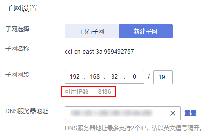

# 命名空间

命名空间（namespace）是一种在多个用户之间划分资源的方法。适用于用户中存在多个团队或项目的情况。

当前云容器实例提供“通用计算型“和“GPU型“两种类型的资源，创建命名空间时需要选择资源类型，后续创建的负载中容器就运行在此类型的集群上。

-   通用计算型：支持创建含CPU资源的容器实例及工作负载，适用于通用计算场景。
-   GPU型：支持创建含GPU资源的容器实例及工作负载，适用于深度学习、科学计算、视频处理等场景。

## 命名空间与网络的关系

从网络角度，命名空间对应一个虚拟私有云（VPC）中一个子网，如[图1](#fig119999112419)所示，在创建命名空间时会关联已有VPC或创建一个新的VPC，并在VPC下创建一个子网。后续在该命名空间下创建的容器及其他资源都会在对应的VPC及子网之内。

通常情况下，如果您在同一个VPC下还会使用其他服务的资源，您需要考虑您的网络规划，如子网网段划分、IP数量规划等，确保有可用的网络资源。

**图 1**  命名空间与VPC子网的关系  

## 哪些情况下适合使用多个命名空间

因为namespace可以实现部分的环境隔离。当你的项目和人员众多的时候可以考虑根据项目属性，例如生产、测试、开发划分不同的namespace。

## 创建命名空间

1.  登录云容器实例管理控制台，左侧导航栏中选择“命名空间“。
2.  在对应类型的命名空间下单击“创建“。

    > **说明：**   
    >“一键创建“会随机生成命名空间名称，随机选择已有VPC和子网，如果没有VPC会新建VPC并在每个AZ下分配子网。  

3.  填写命名空间名称。

    > **说明：**   
    >命名空间名称在云容器实例中需全局唯一。  

4.  设置VPC。

    选择使用已有VPC或新建VPC，新建VPC需要填写VPC网段，建议使用网段：10.0.0.0/8\~24，172.16.0.0/12\~24，192.168.0.0/16\~24。

    > **注意：**   
    >此处VPC和子网的网段不能为10.247.0.0/16，10.247.0.0/16是云容器实例预留给负载访问的网段。如果您使用此网段，后续可能会造成IP冲突，导致负载无法创建或服务不可用；如果您不需要通过负载访问，而是直接访问Pod，则可以使用此网段。  

5.  设置子网网段，每个可用区（AZ）下需要创建一个子网。

    您需要关注子网的可用IP数，确保有足够数量的可用IP，如果没有可用IP，则会导致负载创建失败。

    **图 2**  子网设置  
    

6.  单击“创建“。

    创建完成后，可以在命名空间详情中看到VPC与子网的信息。

## 删除命名空间

> **注意：**   
>删除命名空间将会删除该命名空间相关的所有数据资源（工作负载、任务负载、ConfigMap、Secret、SSL证书等）。  

1.  登录云容器实例管理控制台，左侧导航栏中选择“命名空间“，单击要删除的命名空间，进入命名空间详情页面。
2.  单击右上角“删除“，并输入DELETE，然后单击“确认“。

    > **说明：**   
    >如需删除VPC、Subnet请前往[虚拟私有云](https://console.huaweicloud.com/vpc/?region=cn-north-1#/vpc/vpcmanager/vpcs)。  

