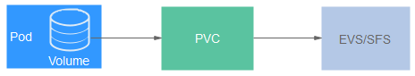

# 存储概述

云容器实例支持多种类型的持久化存储，满足您不同场景下的存储需求。创建工作负载时，可以使用以下类型的存储。

-   **云硬盘存储卷**（EVS）

    云容器实例支持将EVS创建的云硬盘存储卷挂载到容器的某一路径下。当容器迁移时，挂载的云硬盘存储卷将一同迁移。这种存储方式适用于需要永久化保存的数据。详情见[云硬盘存储卷](云硬盘存储卷.md)。

    > **说明：**   
    >使用EVS云硬盘存储卷时，请注意以下事项，否则会导致POD实例无法运行。  
    >-   不支持多个POD挂载相同的EVS磁盘。  
    >-   不支持挂载存在多分区的EVS磁盘。  

-   **文件存储卷**（SFS）

    云容器实例支持创建SFS存储卷并挂载到容器的某一路径下，也可以使用底层SFS服务创建的文件存储卷，SFS存储卷适用于多读多写的持久化存储，适用于多种工作负载场景，包括媒体处理、内容管理、大数据分析和分析工作负载程序等场景。详情见[文件存储卷](文件存储卷.md)。

-   **极速文件存储卷**（SFS Turbo）

    云容器实例支持创建SFS Turbo极速文件存储卷并挂载到容器的某一路径下，极速文件存储卷具有按需申请，快速供给，弹性扩展，方便灵活等特点，适用于DevOps、容器微服务、企业办公等应用场景。详情见[极速文件存储卷](极速文件存储卷.md)。

    > **说明：**   
    >目前“华东-上海一”区域不支持SFS Turbo。  

-   **对象存储卷**（OBS）

    云容器实例支持将OBS创建的对象存储卷挂载到容器的某一路径下。OBS是一个基于对象的海量存储服务，为客户提供海量、安全、高可靠、低成本的数据存储能力。详情见[对象存储卷](对象存储卷.md)。

## PersistentVolumeClaim（PVC）

云容器实例使用PVC申请并管理持久化存储，PVC可以让您无需关心底层存储资源如何创建、释放等动作，而只需要申明您需要何种类型的存储资源、多大的存储空间。

在实际使用中，您可以通过Pod中的Volume来关联PVC，通过PVC使用持久化存储，如[图1](#fig0228122142212)所示。

**图 1**  使用持久化存储  

在云容器实例控制台，您可以导入已经创建的EVS、SFS和SFS Turbo，导入这些存储资源的同时会创建一个PVC用于这些存储资源。

您还可以在云容器实例控制台直接购买EVS和SFS，购买动作不仅购买实际的存储资源，同时还会创建PVC，也就是在这里购买就会直接导入到云容器实例中。

