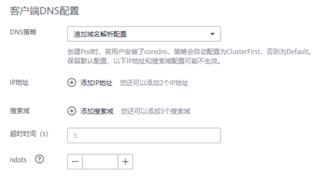

# 客户端DNS配置

CCI支持通过dnsPolicy标记每个Pod配置不同的DNS策略。

-   **None：**允许Pod忽略CCI预置的DNS设置。这种方式一般用于想要自定义DNS配置的场景，需要和dnsConfig配合一起使用，达到自定义DNS的目的。

-   **Default：**使用CCI提供的华为云内网DNS，能够完成华为云服务域名和代理其他公网域名解析，具体请参见[https://support.huaweicloud.com/dns\_faq/dns\_faq\_002.html](https://support.huaweicloud.com/dns_faq/dns_faq_002.html)。

    > **说明：** 
    >使用该策略的前提是用户Pod所在命名空间没有安装CoreDNS插件，否则会被覆盖为ClusterFirst策略。

-   **ClusterFirst：**使用命名空间安装的CoreDNS插件服务进行域名解析。任何与配置的集群域后缀（.cluster.local）不匹配的域名查询（例如，www.kubernetes.io）将转发到上游域名服务器（默认为华为云内网DNS）。

    配置存根域和上游域名服务器的解析逻辑请参考[https://support.huaweicloud.com/usermanual-cci/cci\_01\_0057.html](https://support.huaweicloud.com/usermanual-cci/cci_01_0057.html)。

    > **说明：** 
    >使用该策略的前提是用户Pod所在命名空间已经安装CoreDNS插件，否则会被覆盖为Default策略。

如果未明确指定dnsPolicy，则会根据是否安装CoreDNS插件设置默认值。即安装了CoreDNS，默认使用“ClusterFirst”，否则为“Default”。

**dnsConfig字段说明：**

dnsConfig为应用设置DNS参数，设置的参数将合并到基于dnsPolicy策略生成的域名解析文件中。当dnsPolicy为“None”，应用的域名解析文件完全由dnsConfig指定；当dnsPolicy不为“None”时，会在基于dnsPolicy生成的域名解析文件的基础上，追加dnsConfig中配置的dns参数。

-   **nameservers：**DNS的IP地址列表。当应用的dnsPolicy设置为“None”时，列表必须至少包含一个IP地址，否则此属性是可选的。列出的DNS的IP列表将合并到基于dnsPolicy生成的域名解析文件的nameserver字段中，并删除重复的地址。
-   **searches：**域名查询时的DNS搜索域列表，此属性是可选的。指定后，提供的搜索域列表将合并到基于dnsPolicy生成的域名解析文件的search字段中，并删除重复的域名。Kubernetes最多允许6个搜索域。
-   **options：**DNS的配置选项，其中每个对象可以具有name 属性（必需）和value属性（可选）。该字段中的内容将合并到基于dnsPolicy生成的域名解析文件的options字段中，dnsConfig的options的某些选项如果与基于dnsPolicy生成的域名解析文件的选项冲突，则会被dnsConfig所覆盖。常见的配置选项有超时时间、ndots等。

## **通过前端创建负载配置DNS策略**

**图 1**  客户端DNS配置  

-   替换域名解析配置：对应None策略，填写的IP地址、搜索域、超时时间、ndots等具体配置将作为dnsConfig生效。

-   追加域名解析配置：对应ClusterFirst或者Default策略，最终值取决于是否安装CoreDNS插件。填写的具体配置将作为dnsConfig生效，会在基于dnsPolicy生成的域名解析文件的基础上，追加dnsConfig中配置的dns参数。

