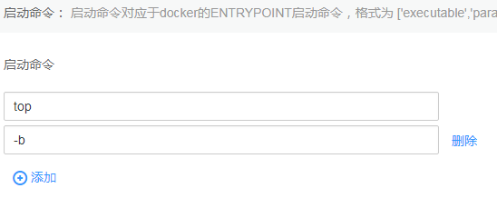

# 容器启动命令<a name="cci_01_0050"></a>

启动容器就是启动主进程，但有些时候，启动主进程前，需要一些准备工作。比如MySQL类的数据库，可能需要一些数据库配置、初始化的工作，这些工作要在最终的MySQL服务器运行之前解决。这些操作，可以在制作镜像时通过在Dockerfile文件中设置ENTRYPOINT或CMD来完成，如下所示的Dockerfile中设置了**ENTRYPOINT \["top", "-b"\]**命令，其将会在容器启动时执行。

```
FROM ubuntu
ENTRYPOINT ["top", "-b"]
```

> **须知：** 
>启动命令必须为容器镜像支持的命令，否则会导致容器启动失败。

在云容器实例中同样可以设置容器的启动命令，例如上面Dockerfile中的命令，只要在创建负载时配置容器的高级设置，先单击“添加“，输入“top“命令，再单击“添加“，输入参数“-b“，如下图所示。

**图 1**  启动命令<a name="fig1190899864"></a>  


由于容器引擎运行时只支持一条ENTRYPOINT命令，云容器实例中设置的启动命令会覆盖掉制作镜像时Dockerfile中设置的ENTRYPOINT和CMD命令，其规则如下表所示。

|镜像 Entrypoint|镜像CMD|容器运行命令|容器运行参数|最终执行|
|--|--|--|--|--|
|[touch]|[/root/test]|未设置|未设置|[touch /root/test]|
|[touch]|[/root/test]|[mkdir]|未设置|[mkdir]|
|[touch]|[/root/test]|未设置|[/opt/test]|[touch /opt/test]|
|[touch]|[/root/test]|[mkdir]|[/opt/test]|[mkdir /opt/test]|


