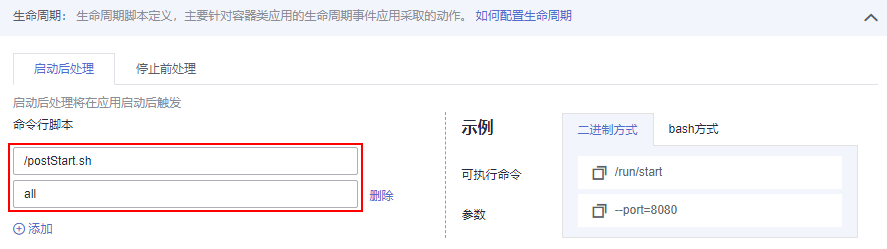

# 容器生命周期

## 设置容器生命周期

云容器实例基于Kubernetes，提供了[容器生命周期钩子](https://kubernetes.io/docs/concepts/containers/container-lifecycle-hooks/)，在容器的生命周期的特定阶段执行调用，比如容器在停止前希望执行某项操作，就可以注册相应的钩子函数。目前提供的生命周期钩子函数如下所示。

-   启动后处理（PostStart）：容器启动后触发。
-   停止前处理（PreStop）：容器停止前触发。

> **说明：**   
>当前云容器实例仅支持命令行类型（Exec）钩子函数。  

登录云容器实例控制台，在创建负载配置生命周期过程中，选择“启动后处理“或者“停止前处理“页签。

例如需要在容器中执行“/postStart.sh all“命令，则在界面上做如下配置即可，第一行是命令行脚本名称，第二行是参数。

**图 1**  命令行脚本  

## 使用kubectl设置容器生命周期

使用kubectl设置容器生命周期请参见[生命周期管理](https://support.huaweicloud.com/devg-cci/cci_05_0012.html)。

