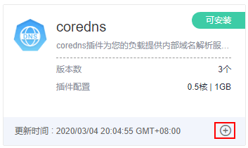
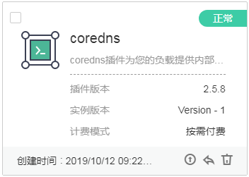
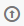

# 插件管理

kubernetes除了必要的支撑组件以外，其他的组件都是以插件的形式运行，如Kubernetes DNS，Kubernetes Dashboard等等。

插件是对现有功能的扩展，当前云容器实例提供了coredns插件供您使用，您可以在云容器实例界面上直接安装插件，从而方便的使用插件提供的功能。

## coredns插件介绍

coredns插件为您的其他负载提供内部域名解析服务。建议您不对本负载进行删除、升级操作，将导致内部域名解析服务无法正常使用。

## 安装插件

1.  登录云容器实例管理控制台，左侧导航栏中选择[插件管理 \> 插件市场](https://console.huaweicloud.com/cci/?#/app/addon/market/list)，单击右侧页面。

    **图 1**  coredns插件  
    

2.  选择“插件版本“，单击“提交“安装插件。

    安装完成后，您可以在“插件管理 \> 插件实例“中看到已安装的插件，如下图。

    **图 2**  coredns插件安装成功  
    

## 后续处理

插件安装成功后，您还可以对插件做如下操作。

**表 1**  其他操作

<table><thead align="left"><tr id="row10132164884311"><th class="cellrowborder" valign="top" width="17%" id="mcps1.2.3.1.1">
操作

</th>
<th class="cellrowborder" valign="top" width="83%" id="mcps1.2.3.1.2">
说明

</th>
</tr>
</thead>
<tbody><tr id="row01327483431"><td class="cellrowborder" valign="top" width="17%" headers="mcps1.2.3.1.1 ">
升级

</td>
<td class="cellrowborder" valign="top" width="83%" headers="mcps1.2.3.1.2 ">
单击，选择要升级的目标版本，然后单击“下一步”，确认新的配置信息，单击“提交”。

</td>
</tr>
<tr id="row107603475596"><td class="cellrowborder" valign="top" width="17%" headers="mcps1.2.3.1.1 ">
回退

</td>
<td class="cellrowborder" valign="top" width="83%" headers="mcps1.2.3.1.2 ">
单击，选择要回退的目标版本，单击“提交”。

</td>
</tr>
<tr id="row413274834318"><td class="cellrowborder" valign="top" width="17%" headers="mcps1.2.3.1.1 ">
删除

</td>
<td class="cellrowborder" valign="top" width="83%" headers="mcps1.2.3.1.2 ">
单击，然后单击“确认”。

 须知： 

删除操作无法恢复，请谨慎操作。

</td>
</tr>
</tbody>
</table>

