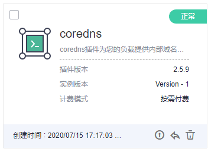

# 插件管理<a name="cci_01_0057"></a>

kubernetes除了必要的支撑组件以外，其他的组件都是以插件的形式运行，如Kubernetes DNS，Kubernetes Dashboard等等。

插件是对现有功能的扩展，当前云容器实例提供了coredns插件供您使用，您可以在云容器实例界面上直接安装插件，从而方便的使用插件提供的功能。

## coredns插件介绍<a name="section72801231388"></a>

coredns插件为您的其他负载提供内部域名解析服务。建议您不对本负载进行删除、升级操作，将导致内部域名解析服务无法正常使用。

## 安装插件<a name="section487917512211"></a>

1.  登录云容器实例管理控制台，左侧导航栏中选择[插件管理 \> 插件市场](https://console.huaweicloud.com/cci/?#/app/addon/market/list)，单击右侧页面。

    **图 1**  coredns插件<a name="fig1399310274353"></a>  
    

2.  选择“插件版本“，单击“提交“安装插件。

    安装2.5.9及以上版本的coredns插件时，还需配置如下参数：

    -   存根域：单击“添加“，您可对自定义的域名配置域名服务器，格式为一个键值对，键为DNS后缀域名，值为一个或一组DNS IP地址，如"acme.local -- 1.2.3.4,6.7.8.9"。
    -   上游域名服务器：解析除集群内服务域名及自定义域名之外的域名地址，格式为一个或一组DNS IP地址，例如"8.8.8.8","8.8.4.4"。

    安装完成后，您可以在“插件管理 \> 插件实例“中看到已安装的插件，如下图。

    **图 2**  coredns插件安装成功<a name="fig116718519387"></a>  
    


## 为CoreDNS配置存根域<a name="section5202157467"></a>

集群管理员可以修改CoreDNS Corefile的ConfigMap以更改服务发现的工作方式。使用插件proxy可对CoreDNS的存根域进行配置。

若集群管理员有一个位于10.150.0.1的Consul域名解析服务器，并且所有Consul的域名都带有.consul.local的后缀。在CoreDNS的ConfigMap中添加如下信息即可将该域名服务器配置在CoreDNS中：

```
consul.local:5353 {
        errors
        cache 30
        proxy . 10.150.0.1
    }
```

修改后最终的ConfigMap如下所示：

```
apiVersion: v1
data:
  Corefile: |-
    .:5353 {
        cache 30
        errors
        health
        kubernetes cluster.local in-addr.arpa ip6.arpa {
          pods insecure
          upstream /etc/resolv.conf
          fallthrough in-addr.arpa ip6.arpa
        }
        loadbalance round_robin
        prometheus 0.0.0.0:9153
        proxy . /etc/resolv.conf
        reload
    }

    consul.local:5353 {
        errors
        cache 30
        proxy . 10.150.0.1
    }
kind: ConfigMap
metadata:
  name: coredns
  namespace: kube-system
```

## kubernetes中的域名解析逻辑<a name="section1860523212152"></a>

DNS策略可以在每个pod基础上进行设置，目前，Kubernetes支持**Default、ClusterFirst、ClusterFirstWithHostNet和None**四种DNS策略，具体请参见[https://kubernetes.io/docs/concepts/services-networking/dns-pod-service/](https://kubernetes.io/docs/concepts/services-networking/dns-pod-service/)。这些策略在pod-specific的**dnsPolicy**  字段中指定。

-   **“Default”**：如果dnsPolicy被设置为“Default”，则名称解析配置将从pod运行的节点继承。 自定义上游域名服务器和存根域不能够与这个策略一起使用。
-   **“ClusterFirst”：**如果dnsPolicy被设置为“ClusterFirst”，任何与配置的集群域后缀不匹配的DNS查询（例如，www.kubernetes.io）将转发到从该节点继承的上游名称服务器。集群管理员可能配置了额外的存根域和上游DNS服务器。
-   **“ClusterFirstWithHostNet”：**对于使用hostNetwork运行的Pod，您应该明确设置其DNS策略“ClusterFirstWithHostNet”。
-   **“None”：**它允许Pod忽略Kubernetes环境中的DNS设置。应使用dnsConfigPod规范中的字段提供所有DNS设置 。

> **说明：**   
>-   Kubernetes 1.10及以上版本，支持Default、ClusterFirst、ClusterFirstWithHostNet和None四种策略；低于Kubernetes 1.10版本，仅支持default、ClusterFirst和ClusterFirstWithHostNet三种。  
>-   “Default”不是默认的DNS策略。如果dnsPolicy的Flag没有特别指明，则默认使用“**ClusterFirst**”。  

**路由请求流程：**

-   未配置存根域：没有匹配上配置的集群域名后缀的任何请求，例如 “www.kubernetes.io”，将会被转发到继承自节点的上游域名服务器。
-   已配置存根域：如果配置了存根域和上游 DNS 服务器，DNS 查询将基于下面的流程对请求进行路由：

    1.  查询首先被发送到 coredns 中的 DNS 缓存层。
    2.  从缓存层，检查请求的后缀，并根据下面的情况转发到对应的 DNS 上：
        -   具有集群后缀的名字（例如“.cluster.local”）：请求被发送到 coredns。

        -   具有存根域后缀的名字（例如“.acme.local”）：请求被发送到配置的自定义 DNS 解析器（例如：监听在 1.2.3.4）。
        -   未能匹配上后缀的名字（例如“widget.com”）：请求被转发到上游 DNS。

    **图 3**  路由请求流程<a name="fig7582181514118"></a>  
    


## 后续处理<a name="section116865813412"></a>

插件安装成功后，您还可以对插件做如下操作。

**表 1**  其他操作

<a name="table71324487437"></a>
<table><thead align="left"><tr id="row10132164884311"><th class="cellrowborder" valign="top" width="17%" id="mcps1.2.3.1.1"><p id="p1413284813434"><a name="p1413284813434"></a><a name="p1413284813434"></a>操作</p>
</th>
<th class="cellrowborder" valign="top" width="83%" id="mcps1.2.3.1.2"><p id="p2132748184317"><a name="p2132748184317"></a><a name="p2132748184317"></a>说明</p>
</th>
</tr>
</thead>
<tbody><tr id="row01327483431"><td class="cellrowborder" valign="top" width="17%" headers="mcps1.2.3.1.1 "><p id="p12132348174319"><a name="p12132348174319"></a><a name="p12132348174319"></a>升级</p>
</td>
<td class="cellrowborder" valign="top" width="83%" headers="mcps1.2.3.1.2 "><p id="p14251183613450"><a name="p14251183613450"></a><a name="p14251183613450"></a>单击<a name="image9794527591"></a><a name="image9794527591"></a><span></span>，选择要升级的目标版本，然后单击<span class="uicontrol" id="uicontrol19811586499"><a name="uicontrol19811586499"></a><a name="uicontrol19811586499"></a>“下一步”</span>，确认新的配置信息，单击<span class="uicontrol" id="uicontrol16227515506"><a name="uicontrol16227515506"></a><a name="uicontrol16227515506"></a>“提交”</span>。</p>
</td>
</tr>
<tr id="row107603475596"><td class="cellrowborder" valign="top" width="17%" headers="mcps1.2.3.1.1 "><p id="p1176217470592"><a name="p1176217470592"></a><a name="p1176217470592"></a>回退</p>
</td>
<td class="cellrowborder" valign="top" width="83%" headers="mcps1.2.3.1.2 "><p id="p197631347205918"><a name="p197631347205918"></a><a name="p197631347205918"></a>单击<a name="image168724304120"></a><a name="image168724304120"></a><span></span>，选择要回退的目标版本，单击<span class="uicontrol" id="uicontrol15751438501"><a name="uicontrol15751438501"></a><a name="uicontrol15751438501"></a>“提交”</span>。</p>
</td>
</tr>
<tr id="row413274834318"><td class="cellrowborder" valign="top" width="17%" headers="mcps1.2.3.1.1 "><p id="p0132104884313"><a name="p0132104884313"></a><a name="p0132104884313"></a>删除</p>
</td>
<td class="cellrowborder" valign="top" width="83%" headers="mcps1.2.3.1.2 "><p id="p15200144605018"><a name="p15200144605018"></a><a name="p15200144605018"></a>单击<a name="image5265644219"></a><a name="image5265644219"></a><span></span>，然后单击<span class="uicontrol" id="uicontrol88201318195114"><a name="uicontrol88201318195114"></a><a name="uicontrol88201318195114"></a>“确认”</span>。</p>
<div class="notice" id="note170814272474"><a name="note170814272474"></a><a name="note170814272474"></a><span class="noticetitle"> 须知： </span><div class="noticebody"><p id="p13732128154718"><a name="p13732128154718"></a><a name="p13732128154718"></a>删除操作无法恢复，请谨慎操作。</p>
</div></div>
</td>
</tr>
</tbody>
</table>

