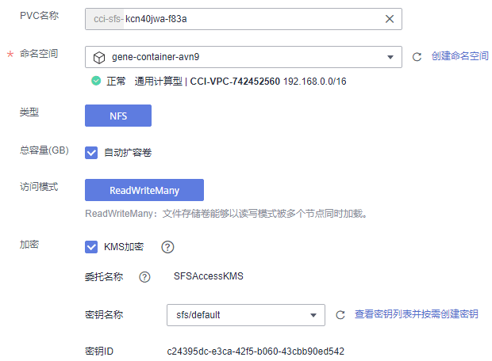

# 文件存储卷

云容器实例支持创建[弹性文件存储](https://www.huaweicloud.com/product/sfs.html)（SFS）挂载到容器中，当前仅支持NFS协议类型的文件系统。SFS存储卷适用于多种工作负载场景，包括媒体处理、内容管理、大数据分析和分析工作负载程序等场景。

## 使用限制

-   使用文件存储期间，不能修改文件存储关联的VPC配置信息，否则CCI中容器无法访问文件存储。
-   请谨慎执行文件存储的删除操作，以避免造成CCI中容器不可用。

## 导入文件存储

云容器实例支持导入已有的文件存储。

1.  登录云容器实例控制台，单击左侧导航栏的[存储管理 \> 文件存储卷](https://console.huaweicloud.com/cci/#/app/storage/sfs/list)。
    -   如果您在[弹性文件存储](https://www.huaweicloud.com/product/sfs.html)中创建了文件存储，可以这里导入后使用，请执行[2](#li181745101913)。
    -   如果您还没创建文件存储，可以直接在这里创建，请执行[3](#li171816301567)。

2.  单击“导入”，进入“导入文件存储“页面，选择需要导入的文件存储，然后单击“导入“。
3.  单击“创建文件存储卷“，填写相关参数，然后单击“立即创建“。

    

    -   **PVC名称**：PVC名称。
    -   **命名空间**：PVC所在命名空间。
    -   **类型**：文件存储类型，当前支持NFS类型。
    -   **总容量**：选择需要的容量，设置为“自动扩容卷”时 ，创建的文件存储卷容量不受限制。
    -   **访问模式**：文件存储的访问模式，当前支持ReadWriteMany，即文件存储卷能够以读写模式被多个节点同时加载。
    -   **加密**：“KMS加密“默认不勾选。勾选“KMS加密“后，若未创建委托请单击“创建委托“，并配置如下参数。

        > **说明：** 
        >目前“华东-上海一”区域暂不支持“加密”功能。

        -   委托名称：委托表示委托方通过创建信任关系，给被委托方授予访问其资源的权限。当“委托名称”为“EVSAccessKMS”时，表示已经成功授权访问EVS访问KMS，授权成功后，EVS可以获取KMS密钥用来加解密云硬盘系统。
        -   密钥名称：密钥是一种用于存储应用所需要认证信息、密钥的敏感信息等的资源类型，内容由用户决定。资源创建完成后，可在容器应用中加载使用。如何创建密钥请参见[创建密钥](https://support.huaweicloud.com/usermanual-dew/dew_01_0178.html)。
        -   密钥ID：默认生成。

4.  对于SFS多读场景，数据存在缓存的情况，会导致原数据读取延迟。若需要实时读取数据，可为已创建的文件系统指定挂载参数。

    挂载参数可设置mount命令指定文件系统挂载的选项，当前仅支持noac，即用于禁止本地的文件和目录缓存，支持客户端实时从远端SFS读取数据。

    > **说明：** 
    >-   此处设置的挂载参数仅对当前命名空间下创建的文件存储卷有效。
    >-   目前“华东-上海一”区域不支持“挂载参数”功能。

    **图 1**  设置SFS挂载参数  
    

## 使用文件存储卷

参照[无状态负载（Deployment）](无状态负载（Deployment）.md)、[创建任务](任务（Job）.md#section1754218181551)或[创建定时任务](定时任务（CronJob）.md#section145271625910)，在添加容器后，展开“高级设置 \> 存储“，选择“文件存储卷“，单击“添加文件存储卷“。

**图 2**  配置文件存储卷参数  

> **说明：** 
>挂载子路径为文件存储根路径下的子路径，如果不存在会自动在文件存储中创建。该路径必须为相对路径。

可以选自动创建或使用已有文件存储，使用已有存储需要提前导入存储，具体步骤请参见[导入文件存储](#section19847172452713)。

> **须知：** 
>-   请不要挂载在系统目录下，如“**/**”、“**/var/run”**等，会导致容器异常。建议挂载在空目录下，若目录不为空，请确保目录下无影响容器启动的文件，否则文件会被替换，导致容器启动异常，工作负载创建失败。
>-   挂载高危目录的情况下 ，建议使用低权限帐号启动，否则可能会造成宿主机高危文件被破坏。

## 使用kubectl创建文件存储卷

使用kubectl创建文件存储卷请参见[使用PersistentVolumeClaim申请持久化存储](https://support.huaweicloud.com/devg-cci/cci_05_0014.html)。

