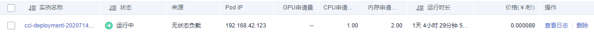

# 无状态工作负载

无状态负载与Kubernetes中Deployment Workloads的定义方式相同，是对Pod的服务化封装。一个无状态负载可以包含一个或多个Pod副本，每个Pod副本的角色相同，所以系统会自动为无状态负载的多个Pod副本分发请求。同一无状态负载的所有Pod副本共享存储卷。

## 创建负载

1.  登录云容器实例管理控制台，左侧导航栏中选择“工作负载 \> 无状态负载“，在右侧页面单击“创建负载“。
2.  添加基本信息。
    -   **负载名称**

        请输入以小写字母或数字开头，小写字母、数字、中划线（-）、点（.）组成（其中两点不能相连，点不能与中划线相连），小写字母或数字结尾的1到63字符的字符串。

    -   **命名空间**

        选择命名空间，如果还未创建命名空间，请参考[命名空间](命名空间.md)创建。

    -   **负载描述**

        描述信息，少于等于250个字符。

    -   **Pod数量**

        负载可以有一个或多个Pod，您可以设置具体Pod个数。每个负载Pod都由相同的容器部署而成。设置多个Pod主要用于实现高可靠性，当某个Pod故障时，负载还能正常运行。

    -   **Pod规格**

        您可以选择使用GPU（只能在GPU型命名空间下）或不使用GPU。

        当前提供Nvidia Telsla V100 16G显卡（显卡驱动版本: 396.26 | CUDA驱动版本: 9.2），使用GPU时容器规格有如下几种：

        -   Nvidia Telsla V100 16G x 1，CPU 4核，内存32GB
        -   Nvidia Telsla V100 16G x 2，CPU 8核，内存64GB
        -   Nvidia Telsla V100 16G x 4，CPU 16核，内存128GB
        -   Nvidia Telsla V100 16G x 8，CPU 32核，内存256GB

        不使用GPU时容器规格有如下几种：

        -   Pod的CPU取值范围为0.25核-32核，且单个容器的CPU必须为0.25核的整数倍
        -   Pod的内存取值范围为1GB-128GB，且内存必须为1GB的整数倍
        -   Pod的CPU/内存配比值必须在1:2到1:4之间
        -   一个Pod内最多支持5个容器，单个容器最小配置是0.25核、0.2GB，最大同容器实例的最大配置

    -   **容器配置**

        一个Pod可以包含一个或多个运行不同镜像的容器，通常情况下一个Pod中只有一个容器，若您的应用程序需要多个容器，请单击“添加容器“，然后选择镜像。

        > **注意：**   
        >同一个Pod实例中的不同容器如果监听了相同的端口，则会导致端口冲突，Pod可能会启动失败。例如在Pod中添加了一个nginx镜像容器，启动了80端口，如果该Pod中另一个http服务的镜像也启动80端口，那么这个Pod就会出现端口冲突。  

        -   我的镜像：展示了您上传到容器镜像服务的镜像。
        -   Docker官方镜像：展示了Dockerhub上的公共镜像。
        -   共享镜像：展示了容器镜像服务中他人共享的镜像。

        镜像选择完成后，需要选择镜像的版本、设置容器名称、设置容器占用的CPU和内存规格（单个容器最小配置是0.25核、0.2GB）。

        对于Pod中只有一个容器能使用GPU，如果您的Pod中有个多个容器，您可以通过“开启GPU“这个开关选择哪个容器使用GPU。

        您还可以为容器做如下高级设置：

        -   存储：支持挂载持久化卷到容器中，以实现数据文件的持久化存储，当前支持云硬盘卷和文件存储卷。单击“添加云硬盘卷“、“添加文件存储卷“或“添加极速文件存储卷“，输入名称、容量、容器内挂载路径，选择磁盘类型。负载创建完成后，可对存储卷进行管理，具体请参见[云硬盘卷](云硬盘卷.md)、[文件存储卷](文件存储卷.md)或[极速文件存储卷](极速文件存储卷.md)。
        -   日志采集：支持根据您配置的日志输出路径，采集负载日志，并进行防爆处理。单击添加日志存储，输入容器内日志路径，调整日志存储空间。负载创建完成后，可在AOM界面查看日志，具体请参见[日志管理](日志管理.md)。
        -   环境变量：在容器中设置环境变量，支持手动输入和引用变量。环境变量为应用提供极大的灵活性，您可以在应用程序中使用环境变量，在创建容器时为环境变量赋值，容器运行时读取环境变量的值，从而做到灵活的配置，而不是每次都重新编写应用程序制作镜像。

            手动输入只需要直接输入变量名称和变量值。

            变量引用支持引用PodIP（Pod的IP地址）、PodName（Pod的名称）以及Secret，输入变量名称，选择引用类型、引用值。其中Secret引用的创建请参见[使用Secret](使用Secret.md)。

        -   健康检查：健康检查是指容器运行过程中，根据您需要，定时检查容器健康状况。详细步骤请参见[容器健康检查](容器健康检查.md)。
        -   生命周期：生命周期脚本定义，主要针对容器类负载的生命周期事件负载采取的动作。详细步骤请参见[容器生命周期](容器生命周期.md)。
        -   启动命令：输入容器启动命令，容器启动后会立即执行。启动命令对应于docker的ENTRYPOINT启动命令，详细内容请参见[容器启动命令](容器启动命令.md)。
        -   配置管理：容器支持挂载ConfigMap和Secret。ConfigMap和Secret的创建请参见[使用ConfigMap](使用ConfigMap.md)和[使用Secret](使用Secret.md)。

3.  单击“下一步“，配置负载访问信息。

    负载访问有如下三个选项

    -   不启用：将不提供任何从其他负载访问到当前负载的入口，可用于使用自定义的服务发现或简单启用多个Pod的场景。
    -   内网访问：内网访问将为当前负载配置一个负载域名或内网域名/虚拟IP，使得当前负载能够为内网中其他负载提供服务，分为Service和ELB两种方式。内网访问的详细内容请参见[内网访问](内网访问.md)。
    -   公网访问：将提供一个可以从Internet访问的入口，支持HTTP/HTTPS/TCP/UDP协议。公网方法的详细内容请参见[公网访问](公网访问.md)。

4.  配置完成后，单击“提交”，单击“返回工作负载列表”。

    在负载列表中，待负载状态为“运行中“，负载创建成功。您可以单击负载名进入负载详情界面，按F5查看负载实时状态。

    若需要访问负载，选择“访问配置“Tab页，查看访问地址。

## 删除Pod

负载创建完后，可以对Pod进行手动删除操作，由于Pod是有控制器在控制，单击删除按钮后会立即重新创建一个新的Pod。手动删除Pod在某些场景下非常有用，比如升级到一半出现失败时、想重启业务进程时。

删除Pod如[图1](#fig18810183164014)所示。

**图 1**  删除Pod  

删除后立即重新创建Pod，如[图2](#fig8211132114467)所示。

**图 2**  删除Pod的效果  

