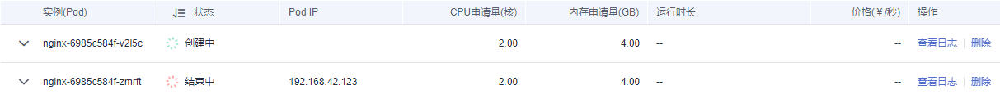

# 无状态工作负载

无状态负载与Kubernetes中Deployment Workloads的定义方式相同，是对Pod的服务化封装。一个无状态负载可以包含一个或多个Pod副本，每个Pod副本的角色相同，所以系统会自动为无状态负载的多个Pod副本分发请求。同一无状态负载的所有Pod副本共享存储卷。

## 创建负载

1.  登录云容器实例管理控制台，左侧导航栏中选择“工作负载 \> 无状态负载“，在右侧页面单击“创建负载“。
2.  添加基本信息。

    **表 1**  工作负载参数说明

    
    <table><thead align="left"><tr id="row939410581127"><th class="cellrowborder" valign="top" width="23%" id="mcps1.2.3.1.1">
参数

    </th>
    <th class="cellrowborder" valign="top" width="77%" id="mcps1.2.3.1.2">
说明

    </th>
    </tr>
    </thead>
    <tbody><tr id="row114036586128"><td class="cellrowborder" valign="top" width="23%" headers="mcps1.2.3.1.1 ">
负载名称

    </td>
    <td class="cellrowborder" valign="top" width="77%" headers="mcps1.2.3.1.2 ">
负载名称。

    </td>
    </tr>
    <tr id="row11409135861216"><td class="cellrowborder" valign="top" width="23%" headers="mcps1.2.3.1.1 ">
命名空间

    </td>
    <td class="cellrowborder" valign="top" width="77%" headers="mcps1.2.3.1.2 ">
选择命名空间，如果还未创建命名空间，请参考<a href="命名空间.md">命名空间</a>创建。

    </td>
    </tr>
    <tr id="row3416258191217"><td class="cellrowborder" valign="top" width="23%" headers="mcps1.2.3.1.1 ">
Pod数量

    </td>
    <td class="cellrowborder" valign="top" width="77%" headers="mcps1.2.3.1.2 ">
负载可以有一个或多个Pod，您可以设置具体Pod个数。每个负载Pod都由相同的容器部署而成。设置多个Pod主要用于实现高可靠性，当某个Pod故障时，负载还能正常运行。

    </td>
    </tr>
    <tr id="row06555120226"><td class="cellrowborder" valign="top" width="23%" headers="mcps1.2.3.1.1 ">
负载描述

    </td>
    <td class="cellrowborder" valign="top" width="77%" headers="mcps1.2.3.1.2 ">
描述信息，少于等于250个字符。

    </td>
    </tr>
    </tbody>
    </table>

3.  添加Pod中的容器。
    1.  选择需要部署的镜像。
        -   我的镜像：展示了您上传到容器镜像服务的镜像。
        -   Docker官方镜像：展示了Dockerhub上的公共镜像。
        -   共享镜像：展示了容器镜像服务中他人共享的镜像。

    2.  配置镜像参数。

        **表 2**  镜像参数说明

        
        <table><thead align="left"><tr id="row0282348486"><th class="cellrowborder" valign="top" width="23%" id="mcps1.2.3.1.1">
参数

        </th>
        <th class="cellrowborder" valign="top" width="77%" id="mcps1.2.3.1.2">
说明

        </th>
        </tr>
        </thead>
        <tbody><tr id="row48048642214"><td class="cellrowborder" valign="top" width="23%" headers="mcps1.2.3.1.1 ">
镜像版本

        </td>
        <td class="cellrowborder" valign="top" width="77%" headers="mcps1.2.3.1.2 ">
选择镜像的版本。

        </td>
        </tr>
        <tr id="row32839494813"><td class="cellrowborder" valign="top" width="23%" headers="mcps1.2.3.1.1 ">
容器名称

        </td>
        <td class="cellrowborder" valign="top" width="77%" headers="mcps1.2.3.1.2 ">
容器的名称，可修改。

        </td>
        </tr>
        <tr id="row152831345485"><td class="cellrowborder" valign="top" width="23%" headers="mcps1.2.3.1.1 ">
容器规格

        </td>
        <td class="cellrowborder" valign="top" width="77%" headers="mcps1.2.3.1.2 "><ul id="ul13282205619311"><li>Pod的CPU取值范围为0.25核-32核，且单个容器的CPU必须为0.25核的整数倍</li><li>Pod的内存取值范围为1GB-128GB，且内存必须为1GB的整数倍</li><li>Pod的CPU/内存配比值必须在1:2到1:4之间</li><li>一个Pod内最多支持5个容器，单个容器最小配置是0.25核、0.2GB，最大同容器实例的最大配置</li></ul>
        </td>
        </tr>
        </tbody>
        </table>

    3.  （可选）高级设置。

        **表 3**  高级设置

        
        <table><thead align="left"><tr id="row167061935153213"><th class="cellrowborder" valign="top" width="23%" id="mcps1.2.3.1.1">
参数

        </th>
        <th class="cellrowborder" valign="top" width="77%" id="mcps1.2.3.1.2">
说明

        </th>
        </tr>
        </thead>
        <tbody><tr id="row135751322144113"><td class="cellrowborder" valign="top" width="23%" headers="mcps1.2.3.1.1 ">
存储

        </td>
        <td class="cellrowborder" valign="top" width="77%" headers="mcps1.2.3.1.2 ">
支持挂载持久化卷到容器中，以实现数据文件的持久化存储。当前支持云硬盘卷和文件存储卷。

        <ol id="ol7523142816416"><li>单击“添加云硬盘卷”或“添加文件存储卷”。</li><li>输入名称、容量、容器内挂载路径，选择磁盘类型。</li></ol>
        
负载创建完成后，可对存储卷进行管理，具体请参见<a href="云硬盘卷.md">云硬盘卷</a>或<a href="文件存储卷.md">文件存储卷</a>。

        </td>
        </tr>
        <tr id="row3669818141715"><td class="cellrowborder" valign="top" width="23%" headers="mcps1.2.3.1.1 ">
日志采集

        </td>
        <td class="cellrowborder" valign="top" width="77%" headers="mcps1.2.3.1.2 ">
支持根据您配置的日志输出路径，采集负载日志，并进行防爆处理。

        <ol id="ol1888210123245"><li>单击添加日志存储。</li><li>输入容器内日志路径，调整日志存储空间。</li></ol>
        
负载创建完成后，可在AOM界面查看日志，具体请参见<a href="日志管理.md">日志管理</a>。

        </td>
        </tr>
        <tr id="row10165174402214"><td class="cellrowborder" valign="top" width="23%" headers="mcps1.2.3.1.1 ">
环境变量

        </td>
        <td class="cellrowborder" valign="top" width="77%" headers="mcps1.2.3.1.2 ">
容器运行环境中设定的一个变量。可以在负载部署后修改，为负载提供极大的灵活性。

        <ul id="ul789917269235"><li>手动输入<ol id="ol132614379232"><li>单击“添加变量”。</li><li>输入变量名称、变量值。</li></ol>
        </li><li>变量引用<ol id="ol1160515682420"><li>单击添加引用。</li><li>输入变量名称，选择引用类型、引用值。其中Secret引用的创建请参见<a href="使用Secret.md">使用Secret</a>。</li></ol>
        </li></ul>
        </td>
        </tr>
        <tr id="row173162112241"><td class="cellrowborder" valign="top" width="23%" headers="mcps1.2.3.1.1 ">
健康检查

        </td>
        <td class="cellrowborder" valign="top" width="77%" headers="mcps1.2.3.1.2 ">
健康检查是指容器运行过程中，根据您需要，定时检查容器健康状况。详细步骤请参见<a href="容器健康检查.md">容器健康检查</a>。

        </td>
        </tr>
        <tr id="row17061435113218"><td class="cellrowborder" valign="top" width="23%" headers="mcps1.2.3.1.1 ">
生命周期

        </td>
        <td class="cellrowborder" valign="top" width="77%" headers="mcps1.2.3.1.2 ">
生命周期脚本定义，主要针对容器类负载的生命周期事件负载采取的动作。详细步骤请参见<a href="容器生命周期.md">容器生命周期</a>。<ul id="ul7468112919334"><li>启动后处理：负载启动后触发。</li><li>停止前处理：负载停止前触发。</li></ul>
        

        </td>
        </tr>
        <tr id="row725218519814"><td class="cellrowborder" valign="top" width="23%" headers="mcps1.2.3.1.1 ">
启动命令

        </td>
        <td class="cellrowborder" valign="top" width="77%" headers="mcps1.2.3.1.2 ">
输入容器启动命令，容器启动后会立即执行。

        
启动命令对应于docker的ENTRYPOINT启动命令，详细内容请参见<a href="容器启动命令.md">容器启动命令</a>。

        </td>
        </tr>
        <tr id="row12584143142315"><td class="cellrowborder" valign="top" width="23%" headers="mcps1.2.3.1.1 ">
配置管理

        </td>
        <td class="cellrowborder" valign="top" width="77%" headers="mcps1.2.3.1.2 ">
容器支持挂载ConfigMap和Secret。

        
ConfigMap和Secret的创建请参见<a href="使用ConfigMap.md">使用ConfigMap</a>和<a href="使用Secret.md">使用Secret</a>。

        </td>
        </tr>
        </tbody>
        </table>

    4.  （可选）一个负载实例包含1个或多个相关容器。若您的负载包含多个容器，请单击“添加容器“，再执行添加容器的操作。

        > **注意：**   
        >同一个Pod实例中的不同容器如果监听了相同的端口，则会导致端口冲突，Pod可能会启动失败。例如在Pod中添加了一个nginx镜像容器，启动了80端口，如果该Pod中另一个http服务的镜像也启动80端口，那么这个Pod就会出现端口冲突。  

4.  单击“下一步“，配置负载访问信息。

    负载访问有如下三个选项

    -   不启用：将不提供任何从其他负载访问到当前负载的入口，可用于使用自定义的服务发现或简单启用多个Pod的场景。
    -   内网访问：内网访问将为当前负载配置一个负载域名或内网域名/虚拟IP，使得当前负载能够为内网中其他负载提供服务，分为 Service 和 ELB 两种方式。内网访问的详细内容请参见[内网访问](内网访问.md)。
    -   公网访问：将提供一个可以从Internet访问的入口，支持HTTP/HTTPS/TCP/UDP协议。公网方法的详细内容请参见[公网访问](公网访问.md)。

    **表 4**  负载访问信息

    
    <table><thead align="left"><tr id="row718117012516"><th class="cellrowborder" valign="top" width="23%" id="mcps1.2.3.1.1">
参数

    </th>
    <th class="cellrowborder" valign="top" width="77%" id="mcps1.2.3.1.2">
说明

    </th>
    </tr>
    </thead>
    <tbody><tr id="row201835062520"><td class="cellrowborder" valign="top" width="23%" headers="mcps1.2.3.1.1 ">
负载域名

    </td>
    <td class="cellrowborder" valign="top" width="77%" headers="mcps1.2.3.1.2 ">
您在云容器实例上运行的其他负载，可以通过该域名访问本负载。负载域名依赖内部域名解析功能，将为您安装功能扩展插件coredns。

    
小写英文字母开头，1-63位，可使用小写英文，数字，中划线（-）。

    </td>
    </tr>
    <tr id="row131846092510"><td class="cellrowborder" valign="top" width="23%" headers="mcps1.2.3.1.1 ">
负载端口配置

    </td>
    <td class="cellrowborder" valign="top" width="77%" headers="mcps1.2.3.1.2 ">
设置负载域名访问端口与容器端口映射关系；负载请求由“负载域名:访问端口”转发至“容器实例:容器端口”。

    <ul id="ul111844072518"><li>协议：支持TCP/UDP协议。</li><li>负载访问端口：访问负载的端口。</li><li>容器端口：访问容器的端口。</li></ul>
    </td>
    </tr>
    <tr id="row318412052510"><td class="cellrowborder" valign="top" width="23%" headers="mcps1.2.3.1.1 ">
ELB实例

    </td>
    <td class="cellrowborder" valign="top" width="77%" headers="mcps1.2.3.1.2 ">
选择ELB实例，如没有ELB实例请参见<a href="（可选）创建ELB.md">（可选）创建ELB</a>创建。

    </td>
    </tr>
    <tr id="row71849018255"><td class="cellrowborder" valign="top" width="23%" headers="mcps1.2.3.1.1 ">
ELB协议

    </td>
    <td class="cellrowborder" valign="top" width="77%" headers="mcps1.2.3.1.2 ">
支持HTTP/HTTPS/TCP/UDP。

    </td>
    </tr>
    <tr id="row101841042517"><td class="cellrowborder" valign="top" width="23%" headers="mcps1.2.3.1.1 ">
公网域名

    </td>
    <td class="cellrowborder" valign="top" width="77%" headers="mcps1.2.3.1.2 ">
将通过该公网域名访问您的负载，不配置时通过ELB IP访问负载；需要您购买公网域名，并将域名解析指向所选ELB实例的IP。

    </td>
    </tr>
    <tr id="row1318420102510"><td class="cellrowborder" valign="top" width="23%" headers="mcps1.2.3.1.1 ">
ELB端口

    </td>
    <td class="cellrowborder" valign="top" width="77%" headers="mcps1.2.3.1.2 ">
设置ELB访问的端口。

    </td>
    </tr>
    <tr id="row15184120112510"><td class="cellrowborder" valign="top" width="23%" headers="mcps1.2.3.1.1 ">
证书

    </td>
    <td class="cellrowborder" valign="top" width="77%" headers="mcps1.2.3.1.2 ">
使用HTTPS协议时需要选择。云容器实例将证书自动安装到弹性负载均衡器上，实现数据传输加密。

    
SSL证书的导入方法请参见<a href="SSL证书.md">SSL证书</a>。

    </td>
    </tr>
    <tr id="row13184150172517"><td class="cellrowborder" valign="top" width="23%" headers="mcps1.2.3.1.1 ">
HTTP路由配置

    </td>
    <td class="cellrowborder" valign="top" width="77%" headers="mcps1.2.3.1.2 ">
设置uri路径到后端负载访问端口的路由关系；公网请求由“http://公网域名(或elb ip)/映射路径:外部端口”转发至“负载域名:访问端口”。

    <ul id="ul1518440132510"><li>映射路径：映射到负载的路径。</li><li>负载访问端口：选择负载访问的端口。</li></ul>
    </td>
    </tr>
    </tbody>
    </table>

5.  配置完成后，单击“提交”，单击“返回工作负载列表”。

    在负载列表中，待负载状态为“运行中“，负载创建成功。您可以单击负载名进入负载详情界面，按F5查看负载实时状态。

    若需要访问负载，选择“访问配置“Tab页，查看访问地址。

## 删除Pod

负载创建完后，可以对Pod进行手动删除操作，由于Pod是有控制器在控制，单击删除按钮后会立即重新创建一个新的Pod。由于这个特性，手动删除Pod在某些场景下非常有用，比如升级到一半出现失败时、想重启业务进程时。

删除Pod如[图1](#fig18810183164014)所示。

**图 1**  删除Pod  

删除后立即重新创建Pod，如[图2](#fig8211132114467)所示。

**图 2**  删除Pod的效果  

