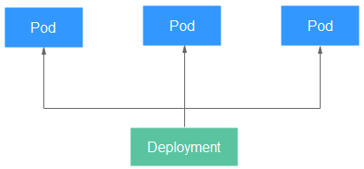
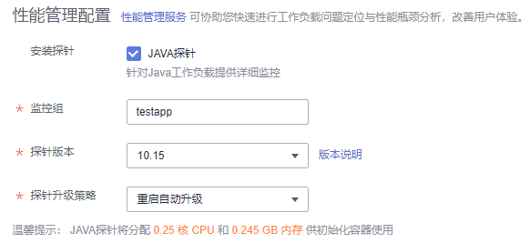
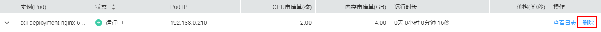
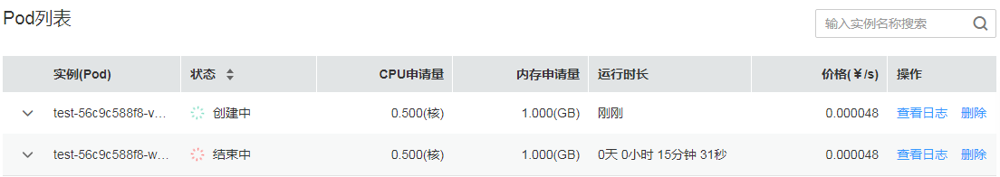

# 无状态负载（Deployment）

无状态负载与Kubernetes中Deployment Workloads的定义方式相同，是对Pod的服务化封装。一个无状态负载可以包含一个或多个Pod，每个Pod的角色相同，所以系统会自动为无状态负载的多个Pod分发请求。同一无状态负载的所有Pod共享存储卷。

在[Pod](Pod.md)这个章节介绍了Pod，Pod是Kubernetes创建或部署的最小单位，但是Pod是被设计为相对短暂的一次性实体，Pod可以被驱逐（当节点资源不足时）、随着集群的节点fail而消失。同时kubernetes提供了Controller（控制器）来管理Pod，Controller可以创建和管理多个Pod，提供副本管理、滚动升级和自愈能力，其中最为常用的就是Deployment。

一个Deployment可以包含一个或多个Pod副本，每个Pod副本的角色相同，所以系统会自动为Deployment的多个Pod副本分发请求。

Deployment集成了上线部署、滚动升级、创建副本，恢复上线任务，在某种程度上，Deployment可以帮我们实现无人值守的上线，大大降低我们的上线过程的复杂沟通、操作风险。

**图 1**  无状态负载  

## 创建无状态负载

1.  登录云容器实例管理控制台，左侧导航栏中选择[工作负载 \> 无状态（Deployment）](https://console.huaweicloud.com/cci/#/app/workload/deployment/list)，在右侧页面单击“创建无状态负载“。
2.  添加基本信息。
    -   **负载名称**

        请输入以小写字母或数字开头，小写字母、数字、中划线（-）、点（.）组成（其中两点不能相连，点不能与中划线相连），小写字母或数字结尾的1到63字符的字符串。

    -   **命名空间**

        选择命名空间，如果还未创建命名空间，请参考[命名空间](命名空间.md)创建。

    -   **负载描述**

        描述信息，少于等于250个字符。

    -   **Pod数量**

        负载可以有一个或多个Pod，您可以设置具体Pod个数。每个负载Pod都由相同的容器部署而成。设置多个Pod主要用于实现高可靠性，当某个Pod故障时，负载还能正常运行。

    -   **Pod规格**

        您可以选择使用GPU（只能在GPU型命名空间下）或不使用GPU。

        当前提供3种类型的Pod，包括通用计算型（通用计算型命名空间下使用）、[RDMA](https://zh.wikipedia.org/wiki/%E8%BF%9C%E7%A8%8B%E7%9B%B4%E6%8E%A5%E5%86%85%E5%AD%98%E8%AE%BF%E9%97%AE)加速型和GPU加速型（GPU型命名空间下使用）。

        GPU加速型Pod提供NVIDIA Tesla V100 32G显卡和NVIDIA Tesla V100 16G显卡，具体的规格有如下所示。

        -   NVIDIA Tesla V100 32G显卡：
            -   NVIDIA Tesla V100 32G x 1，CPU 4核，内存32GB
            -   NVIDIA Tesla V100 32G x 2，CPU 8核，内存64GB
            -   NVIDIA Tesla V100 32G x 4，CPU 16核，内存128GB
            -   NVIDIA Tesla V100 32G x 8，CPU 32核，内存256GB

        -   NVIDIA Tesla V100 16G显卡：
            -   NVIDIA Tesla V100 16G x 1，CPU 4核，内存32GB
            -   NVIDIA Tesla V100 16G x 2，CPU 8核，内存64GB
            -   NVIDIA Tesla V100 16G x 4，CPU 16核，内存128GB
            -   NVIDIA Tesla V100 16G x 8，CPU 32核，内存256GB

        云容器实例支持使用NVIDIA GPU的驱动版本为**410.104**和**418.126**，您应用程序中使用的CUDA需满足如[表1](#table16459192015518)所示的配套关系。CUDA与驱动的配套关系来源于NVIDIA官网，详细信息请参见[CUDA Compatibility](https://docs.nvidia.com/deploy/cuda-compatibility/index.html)。

        > **说明：** 
        >-   nvidia-smi是一个命令行工具，详细信息请参考[NVIDIA System Management Interface](https://developer.nvidia.com/nvidia-system-management-interface)。
        >-   CCI不提供nvidia-smi，您可以将nvidia-smi打包到镜像中，通过nvidia-smi监控GPU使用情况。使用nvidia-smi前需要设置LD\_LIBRARY\_PATH值，方法请参考[为什么exec进入容器后执行GPU相关的操作报错](https://support.huaweicloud.com/cci_faq/cci_faq_0040.html)。
        >-   “华北-北京四”区域，仅支持NVIDIA Tesla V100 32G显卡。

        **表 1**  NVIDIA GPU驱动与CUDA配套关系

        
        <table><thead align="left"><tr id="row194598204515"><th class="cellrowborder" valign="top" width="30.620000000000005%" id="mcps1.2.3.1.1">
NVIDIA GPU驱动版本

        </th>
        <th class="cellrowborder" valign="top" width="69.38%" id="mcps1.2.3.1.2">
CUDA Toolkit版本

        </th>
        </tr>
        </thead>
        <tbody><tr id="row9786192115398"><td class="cellrowborder" valign="top" width="30.620000000000005%" headers="mcps1.2.3.1.1 ">
410.104

        </td>
        <td class="cellrowborder" valign="top" width="69.38%" headers="mcps1.2.3.1.2 ">
CUDA 10.0 (10.0.130)及以下

        </td>
        </tr>
        <tr id="row626275911711"><td class="cellrowborder" valign="top" width="30.620000000000005%" headers="mcps1.2.3.1.1 ">
418.126

        </td>
        <td class="cellrowborder" valign="top" width="69.38%" headers="mcps1.2.3.1.2 ">
CUDA 10.1 (10.1.105)及以下

        </td>
        </tr>
        </tbody>
        </table>

        当不使用GPU时，容器规格需满足如下要求：

        -   Pod的CPU取值范围为0.25核-32核，另外还可选48核和64核，且单个容器的CPU必须为0.25核的整数倍
        -   Pod的内存取值范围为1GB-512GB，且内存必须为1GB的整数倍
        -   Pod的CPU/内存配比值必须在1:2到1:8之间
        -   一个Pod内最多支持5个容器，单个容器最小配置是0.25核、0.2GB，最大同容器实例的最大配置

    -   **容器配置**

        一个Pod可以包含一个或多个运行不同镜像的容器，通常情况下一个Pod中只有一个容器，若您的应用程序需要多个容器，请单击“添加容器“，然后选择镜像。

        > **须知：** 
        >同一个Pod实例中的不同容器如果监听了相同的端口，则会导致端口冲突，Pod可能会启动失败。例如在Pod中添加了一个nginx镜像容器，启动了80端口，如果该Pod中另一个http服务的镜像也启动80端口，那么这个Pod就会出现端口冲突。

        -   我的镜像：展示了您上传到容器镜像服务的镜像。

            > **说明：** 
            >如您是IAM用户，您需要参考[（可选）上传镜像](环境设置.md#section1593133403517)进行权限设置后才可使用账号的私有镜像。
            >CCI当前暂不支持对接第三方镜像仓库。

        -   开源镜像中心：展示了镜像中心的公共镜像。
        -   共享镜像：展示了容器镜像服务中他人共享的镜像。

        镜像选择完成后，需要选择镜像的版本、设置容器名称、设置容器占用的CPU和内存规格（**单个容器最小配置是0.25核、0.2GB**），并选择是否开启采集标准输出文件（开启后，应用运维管理AOM将根据实际使用量进行计费）。

        > **说明：** 
        >每个租户一个月有500M的免费日志存储空间，超过500M时AOM将根据实际使用量进行收费，计费规则请参见[产品价格详情](https://www.huaweicloud.com/pricing.html?tab=detail#/aom)。

        对于GPU加速型Pod（仅GPU型命名空间下才可以选择），Pod中只有一个容器能使用GPU，如果您的Pod中有多个容器，您可以通过**开启GPU**这个开关选择哪个容器使用GPU。

        您还可以为容器做如下高级设置：

        -   存储：支持挂载持久化卷到容器中，以实现数据文件的持久化存储，当前支持云硬盘存储卷、文件存储卷和极速文件存储卷。单击“添加云硬盘存储卷“、“添加文件存储卷“或“添加极速文件存储卷“，输入名称、容量、容器内挂载路径，选择磁盘类型。负载创建完成后，可对存储卷进行管理，具体请参见[云硬盘存储卷](云硬盘存储卷.md)、[文件存储卷](文件存储卷.md)或[极速文件存储卷](极速文件存储卷.md)。
        -   日志采集：支持根据您配置的日志输出路径，采集应用日志请自行防爆处理。单击添加日志存储，输入容器内日志路径，调整日志存储空间。负载创建完成后，可在AOM界面查看日志，具体请参见[日志管理](日志管理.md)。
        -   环境变量：在容器中设置环境变量，支持手动输入和引用变量。环境变量为应用提供极大的灵活性，您可以在应用程序中使用环境变量，在创建容器时为环境变量赋值，容器运行时读取环境变量的值，从而做到灵活的配置，而不是每次都重新编写应用程序制作镜像。

            手动输入只需要直接输入变量名称和变量值。

            变量引用支持引用PodIP（Pod的IP地址）、PodName（Pod的名称）以及Secret，输入变量名称，选择引用类型、引用值。其中Secret引用的创建请参见[使用Secret](使用Secret.md)。

        -   健康检查：健康检查是指容器运行过程中，根据您需要，定时检查容器健康状况。详细步骤请参见[健康检查](健康检查.md)。
        -   生命周期：生命周期脚本定义，在容器的生命周期的特定阶段执行调用。详细步骤请参见[容器生命周期](容器生命周期.md)。
        -   启动命令：输入容器启动命令，容器启动后会立即执行。启动命令对应于容器引擎的ENTRYPOINT启动命令，详细内容请参见[容器启动命令](容器启动命令.md)。
        -   配置管理：容器支持挂载ConfigMap和Secret。ConfigMap和Secret的创建请参见[使用ConfigMap](使用ConfigMap.md)和[使用Secret](使用Secret.md)。

3.  单击“下一步：访问配置“，配置负载访问信息。

    负载访问有如下三个选项：

    -   不启用：将不提供任何从其他负载访问到当前负载的入口，可用于使用自定义的服务发现或简单启用多个Pod的场景。
    -   内网访问：内网访问将为当前负载配置一个负载域名或内网域名/虚拟IP，使得当前负载能够为内网中其他负载提供服务，分为Service和ELB两种方式。内网访问的详细内容请参见[内网访问](内网访问.md)。
    -   公网访问：将提供一个可以从Internet访问的入口，支持HTTP/HTTPS/TCP/UDP协议。公网访问的详细内容请参见[公网访问](公网访问.md)。

4.  单击“下一步：高级设置”，进行高级设置。
    -   **升级策略：**升级方式支持“滚动升级“和“替换升级“。
        -   滚动升级：滚动升级将逐步用新版本的实例替换旧版本的实例，升级的过程中，业务流量会同时负载均衡分布到新老的实例上，因此业务不会中断。

            最大无效实例数：每次滚动升级允许的最大无效实例数，如果等于实例数有断服风险（最小存活实例数 = 实例数 - 最大无效实例数）。

        -   替换升级：先删除旧实例，再创建新实例。升级过程中业务会中断。

    -   **性能管理配置**：华为云的性能管理服务（APM）可协助您快速进行工作负载的问题定位与性能瓶颈分析。

        当前仅支持给Java类工作负载提供调用链、拓扑等监控能力，若您为Java类工作负载，并且需要监控状态，请勾选“Java探针”选项，并输入监控组名称。

        > **说明：** 
        >安装探针会产生少量资源消耗，主要作用是可对java工作负载提供应用调用链、拓扑、SQL分析、堆栈追踪等监控能力。

        1.  输入监控组名称，如testapp。若已有监控组，可下拉选择。
        2.  选择“探针版本“，探针版本默认为latest，具体可查看下拉框后的“版本说明“。

            **图 2**  设置性能管理配置  
            

        3.  选择“探针升级策略“，默认为“重启自动升级“。

            “探针升级策略“为获取探针镜像的策略，可选值有“重启自动升级“和“手动升级“。

            -   重启自动升级：每次都尝试重新下载镜像。
            -   手动升级：如果本地有该镜像，则使用本地镜像，本地不存在时下载镜像。

5.  配置完成后，单击“下一步：规格确认”，单击“提交”，单击“返回无状态负载列表”。

    在负载列表中，待负载状态为“运行中“，负载创建成功。您可以单击负载名进入负载详情界面，按F5查看负载实时状态。

    若需要访问负载，选择“访问配置“Tab页，查看访问地址。

## 删除Pod

负载创建完后，可以对Pod进行手动删除操作，由于Pod是有控制器在控制，单击删除按钮后会立即重新创建一个新的Pod。手动删除Pod在某些场景下非常有用，比如升级到一半出现失败时、想重启业务进程时。

删除Pod如[图3](#fig18810183164014)所示。

**图 3**  删除Pod  

删除后立即重新创建Pod，如[图4](#fig8211132114467)所示。

**图 4**  删除Pod的效果  

## 使用kubectl创建无状态负载

使用kubectl创建无状态负载请参见[Deployment](https://support.huaweicloud.com/devg-cci/cci_05_0005.html)。

## 重新拉取镜像失败问题排查

工作负载详情中，若事件中提示“重新拉取镜像失败”，请参见[事件一：重新拉取镜像失败](https://support.huaweicloud.com/cci_faq/cci_faq_0033.html)来排查原因。

## 重新启动容器失败问题排查

工作负载详情中，若事件中提示“重新启动容器失败”，请参见[事件二：重新启动容器失败](https://support.huaweicloud.com/cci_faq/cci_faq_0010.html)来排查原因。

