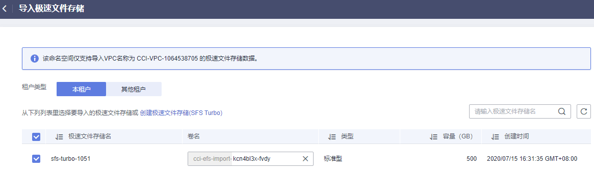

# 极速文件存储卷

云容器实例支持创建[弹性文件存储](https://www.huaweicloud.com/product/sfs.html)  SFS Turbo（极速文件存储）并挂载到容器的某一路径下，极速文件存储具有按需申请，快速供给，弹性扩展，方便灵活等特点，适用于DevOps、容器微服务、企业办公等应用场景。

> **说明：**   
>目前“华东-上海一”区域不支持SFS Turbo。  

## 导入极速文件存储

云容器实例支持导入已有的极速文件存储。

1.  登录云容器实例控制台，单击左侧导航栏的[存储管理 \> 极速文件存储卷](https://console.huaweicloud.com/cci/#/app/storage/efs/list)，在右侧页面中选择命名空间，单击“导入“。
2.  从列表里选择要导入的极速文件存储，单击“导入”。

    若无可用的极速文件存储，请单击“[创建极速文件存储\(SFS Turbo\)](https://storage.huaweicloud.com/sfs/?region=cn-north-1#/sfsnew/manager/list)”去创建。

    创建完成后，进入“导入极速文件存储”页面，选择新创建的极速文件存储，然后单击“导入“。

    **图 1**  导入极速文件存储卷  
    

3.  对于SFS Turbo多读场景，数据存在缓存的情况，会导致原数据读取延迟。若需要实时读取数据，可为导入的SFS Turbo指定挂载参数。

    挂载参数可设置mount命令指定文件系统挂载的选项，当前仅支持noac，即用于禁止本地的文件和目录缓存，支持客户端实时从远端SFS Turbo读取数据。

    > **说明：**   
    >此处设置的挂载参数仅对当前命名空间下创建的极速文件存储卷有效。  

    **图 2**  设置SFS Turbo挂载参数  
    

## 使用极速文件存储卷

参照[无状态负载（Deployment）](无状态负载（Deployment）.md)或[创建任务](任务（Job）.md#section1754218181551)，在添加容器后，展开“高级设置 \> 存储“，选择“极速文件存储卷“，单击“添加极速文件存储卷“。

**图 3**  添加极速文件存储卷  

> **说明：**   
>-   创建极速文件存储过程中需要创建单独的虚拟机，耗时较长。因此当前仅支持使用已有的极速文件存储卷。  
>-   挂载子路径为极速文件存储根路径下的子路径，如果不存在会自动在文件存储中创建。该路径必须为相对路径。  

## 解关联极速文件存储卷

导入极速文件存储卷成功后，如果不需要使用极速文件存储，您可以解关联极速文件存储卷。解关联之后，创建工作负载时无法使用该极速文件存储。

> **说明：**   
>若极速文件存储卷已被工作负载挂载，则无法解关联。  

1.  登录云容器实例控制台，单击左侧导航栏的[存储管理 \> 极速文件存储卷](https://console.huaweicloud.com/cci/#/app/storage/efs/list)，在极速文件存储卷列表中，单击极速文件存储卷后的“解关联“。
2.  查看系统提示，单击“确定“。

