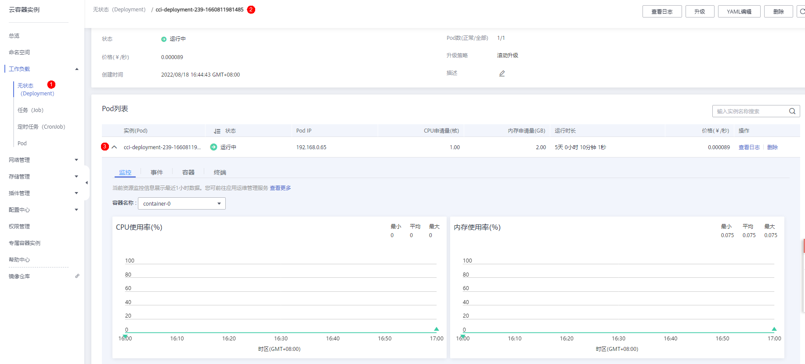
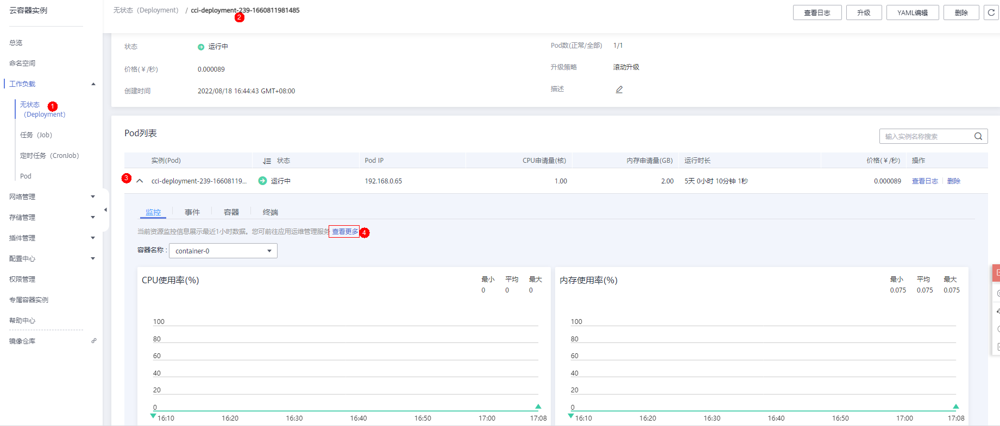
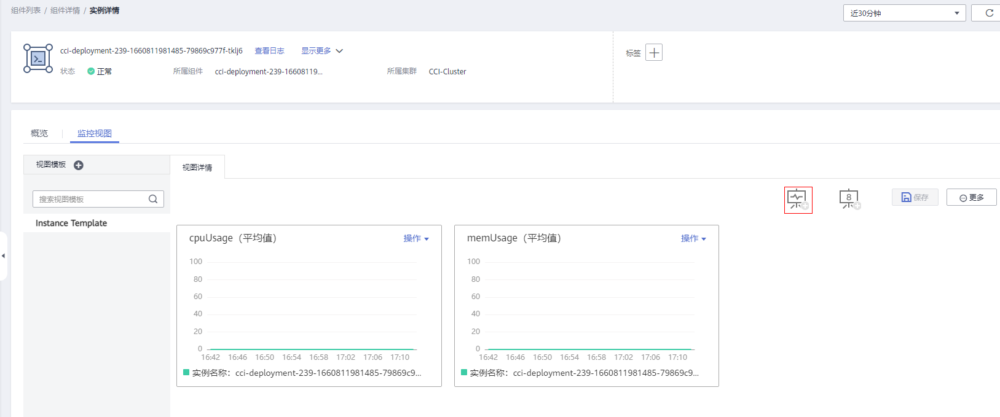
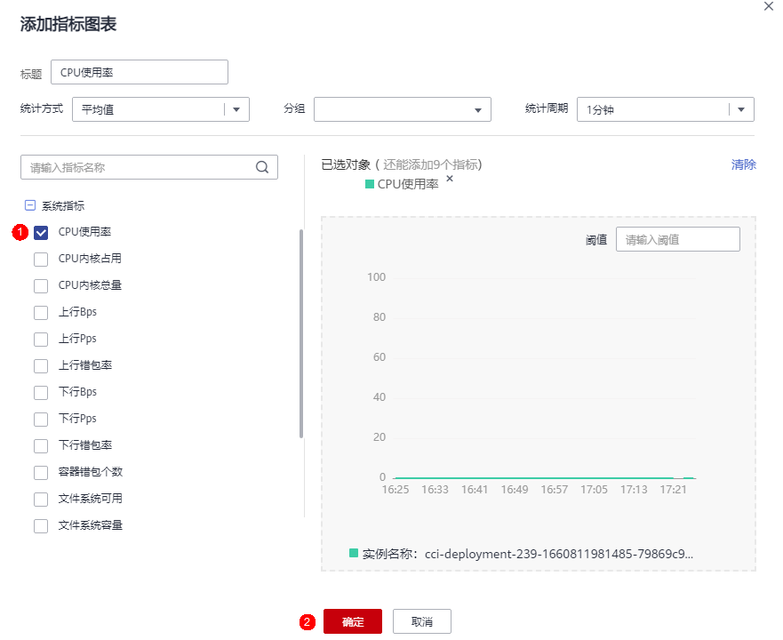
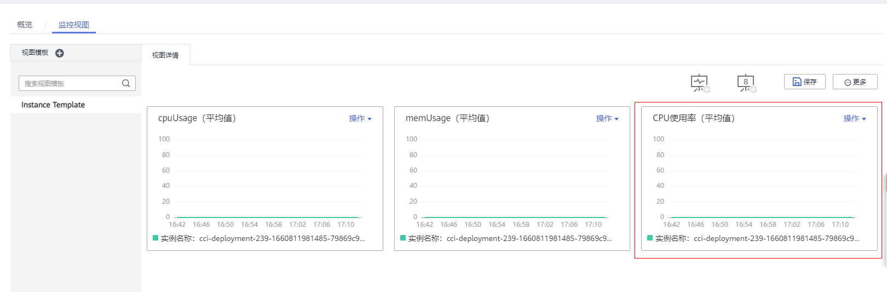

# 监控管理

CCI配合AOM对Pod资源进行基础监控，资源基础监控包含CPU/内存/磁盘等。您可以在CCI控制台查看Pod的监控指标数据，也可以在AOM中查看。

## 监控指标

在AOM控制台，可以查看容器实例的指标，指标内容请参见[监控指标](#section198672213527)。

**表 1**  监控指标

|指标ID|指标名称|指标含义|取值范围|单位|
|--|--|--|--|--|
|cpuUsage|CPU使用率|该指标用于统计测量对象的CPU使用率。服务实际使用的与限制的CPU核数量比率。|0～100%|百分比（Percent）|
|cpuCoreLimit|CPU内核总量|该指标用于统计测量对象限制的CPU核总量。|≥1|核（Core）|
|cpuCoreUsed|CPU内核占用|该指标用于统计测量对象已经使用的CPU核个数。|≥0|核（Core）|
|memCapacity|物理内存总量|该指标用于统计测量对象限制的物理内存总量。|≥0|兆字节（Megabytes）|
|memUsage|物理内存使用率|该指标用于统计测量对象已使用内存占限制物理内存总量的百分比。|0～100%|百分比（Percent）|
|memUsed|物理内存使用量|该指标用于统计测量对象实际已经使用的物理内存（Resident Set Size）。|≥0|兆字节（Megabytes）|

## 查看容器实例Pod的监控数据

在CCI控制台上，查看Pod监控数据。

进入CCI，左侧导航栏中选择“工作负载 \> 无状态（Deployment）”，在右侧页面单击要访问的工作负载。查看Pod实例下面的“监控“页签，该页签显示Pod近一小时的CPU使用率和内存使用率。

**图 1**  Pod列表  

CCI控制台上的资源监控信息仅展示CPU使用率和内存使用率。您可前往应用运维管理服务AOM查看更多监控指标。

1.  单击监控页签下方的“查看更多”，进入AOM控制台。

    **图 2**  Pod监控  
    

2.  单击，在视图模板中添加曲线图。

    **图 3**  视图模板  
    

3.  选择页面左侧系统指标，例如：选择“CPU使用率”，点击确认。

    **图 4**  系统指标  
    

4.  视图详情中即可查看Pod监控数据。

    **图 5**  监控视图  
    

