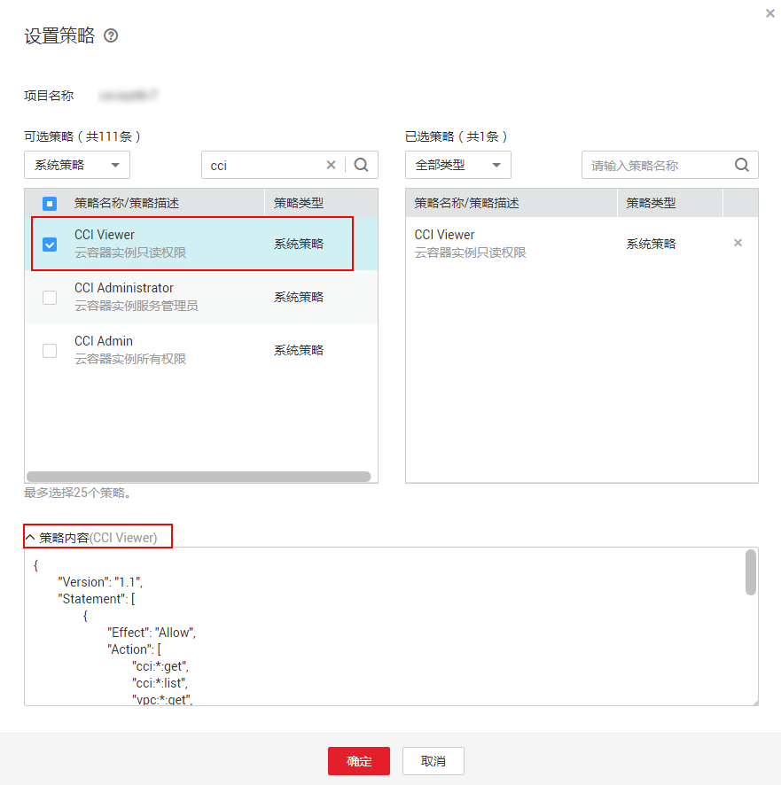

# 策略语法：细粒度策略<a name="cci_01_0073"></a>

## 策略结构<a name="section186971812173318"></a>

策略结构包括：Version（策略版本号）和Statement（策略权限语句），其中Statement可以有多个，表示不同的授权项。

**图 1**  策略结构<a name="fig8199242142918"></a>  


## 策略语法<a name="section20110818341"></a>

如下以“CCI Viewer”策略为例，说明策略语法组成。



```
{
    "Version": "1.1",
    "Statement": [
        {
            "Effect": "Allow",
            "Action": [
                "cci:*:get",
                "cci:*:list",
                "vpc:*:get",
                "vpc:*:list",
                "elb:*:get",
                "elb:*:list",
                "sfs:*:get",
                "sfs:*:list",
                "obs:*:get",
                "obs:*:list",
                "evs:*:get",
                "evs:*:list",
                "aom:*:get",
                "aom:*:list",
                "apm:*:get",
                "apm:*:list",
                "swr:*:get*",
                "swr:*:list",
                "nat:*:get",
                "nat:*:list"
            ]
        }
    ]
}
```

-   Version：标识策略的版本号，主要用于区分Role-Based Access Control（RBAC）策略和细粒度策略。
    -   1.0：RBAC策略。RBAC策略是将服务作为一个整体进行授权，授权后，用户可以拥有这个服务的所有权限。
    -   1.1：细粒度策略。相比RBAC策略，细粒度策略基于服务的API接口进行权限拆分，授权更加精细。授权后，用户可以对这个服务执行特定的操作。细粒度策略包括系统预置和用户自定义两种：

-   Statement：策略授权语句，描述策略的详细信息，包含Effect（作用）和Action（授权项）。
    -   Effect（作用）

        作用包含两种：Allow（允许）和Deny（Deny），系统预置策略仅包含允许的授权语句，自定义策略中可以同时包含允许和拒绝的授权语句，当策略中既有允许又有拒绝的授权语句时，遵循Deny优先的原则。

    -   Action（授权项）

        对资源的具体操作权限，格式为：服务名:资源类型:操作，支持单个或多个操作权限，支持通配符号\*，通配符号表示所有。

        示例：

        -   "evs:\*:get"，其中evs为服务名，\*为资源类型，get为操作，该授权项表示evs所有的资源类型的查询权限。


## 多个授权项策略<a name="section18912358134413"></a>

一个自定义策略中可以包含多个授权项，且除了可以包含本服务的授权项外，还可以包含其他服务的授权项，可以包含的其他服务必须跟本服务同属性，即都是项目级服务或都是全局级服务。多个授权语句策略描述如下：

```
{
    "Version": "1.1",
    "Statement": [
        {
            "Action": [
                "ecs:cloudServers:resize",
                "ecs:cloudServers:delete",
                "ecs:cloudServers:delete",
                "ims:images:list",
                "ims:serverImages:create"
            ],
            "Effect": "Allow"
        }
    ]
}
```

## 拒绝策略<a name="section4736536134610"></a>

拒绝策略需要同时配合其他策略使用，否则没有实际作用。用户被授予的策略中，一个授权项的作用如果同时存在Allow和Deny，则遵循Deny优先。

如果您给用户授予CCI Admin的系统策略，但不希望用户拥有CCI admin中定义的删除命名空间权限（cci:namespace:delete），您可以创建一条相同Action的自定义策略，并将自定义策略的Effect设置为Deny，然后同时将CCI Admin和拒绝策略授予用户，根据Deny优先原则，则用户可以对CCI执行除了删除命名空间外的所有操作。以下策略样例表示：拒绝用户删除命名空间。

```
{
    "Version": "1.1",
    "Statement": [
        {
            "Effect": "Deny",
            "Action": [
                "cci:namespace:delete"
            ]
        }
    ]
}
```

## 检查规则<a name="section22257755117"></a>

当用户被授予多个策略，或者一个策略中包含多个授权语句，这些策略中既有Allow又有Deny的授权语句时，遵循Deny优先的原则。在用户访问资源时，权限检查逻辑如下：

**图 2**  系统鉴权逻辑图<a name="fig299125317515"></a>  


> **说明：**   
>每条策略做评估时， Action之间是或\(or\)的关系。  

1.  用户访问系统，发起操作请求。
2.  系统评估用户被授予的访问策略，鉴权开始。
3.  在用户被授予的访问策略中，系统将优先寻找显式拒绝指令。如找到一个适用的显式拒绝，系统将返回Deny决定。
4.  如果没有找到显式拒绝指令，系统将寻找适用于请求的任何Allow指令。如果找到一个显式允许指令，系统将返回Allow决定。
5.  如果找不到显式允许，最终决定为Deny，鉴权结束。

