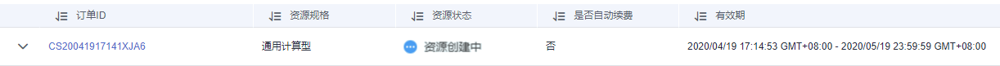
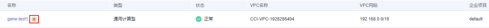

# 购买专属容器实例

购买专属容器实例前，您需要先申请开通专属容器实例。

## 开通专属容器实例

1.  登录云容器实例控制台，单击左侧导航栏的“专属容器实例”，在右侧页面中单击“开通申请“。
2.  在CCI专属容器实例开通申请页面，填写如下信息。
    -   **姓名**

        申请人姓名。

    -   **工作邮箱**

        申请人工作邮箱地址。

    -   **联系电话**

        申请人联系方式。

    -   **资源使用量预估**

        当前支持GPU加速型和通用计算型两种。

    -   **业务场景描述**

        描述信息，少于等于200个字。

3.  设置完成后，单击“提交”。

    提交申请后，界面提示“专属容器实例申请开通提交成功”，且开通申请状态变为“审核中”。待管理员审批后，刷新页面，系统自动进入专属容器实例列表页面。

    **图 1**  申请审核中  
    

## 购买专属容器实例

1.  登录云容器实例控制台，单击左侧导航栏的“专属容器实例”，在右侧页面中单击“购买专属容器实例“。
2.  设置购买资源规格和时长。
    -   **资源规格**
        -   GPU加速型：GPU加速型物理服务器能够提供优秀的浮点计算能力，从容应对人工智能、基因测序等科学计算场景。
        -   通用计算型：包括通用计算型物理服务器和高性能计算物理服务器。

            通用计算型物理服务器：具有性能稳定且资源独享的特点，满足企业级应用诉求。

            高性能计算型物理服务器：具有更强劲的CPU，并且提供大规格本地盘，满足计算性能高且稳定的企业级应用诉求。

    -   **购买时长**

        请设置专属容器实例购买时长。

3.  设置完成后，单击“去支付”。

    支付完成后，在专属容器实例列表页面，订单状态为“资源创建中”。

    **图 2**  资源创建中  
    

    待管理员开通资源后，即可使用专属容器实例。

    **图 3**  资源购买成功  
    

4.  左侧导航栏中选择“命名空间”，参照[命名空间](命名空间.md)中操作创建命名空间。

    命名空间创建完成后，若命名空间存在VIP标识，说明该命名空间为专属的。在该命名空间下创建的负载会调度到专属节点上。

    

