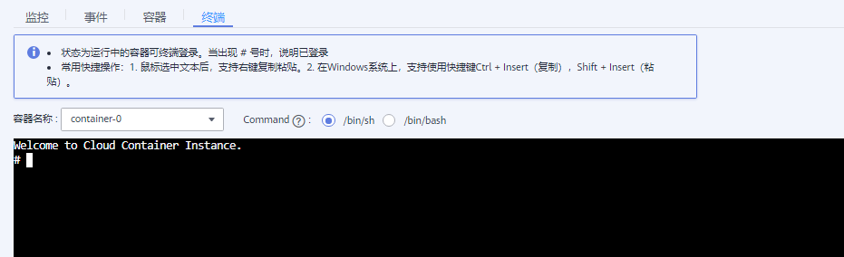

# 远程终端

远程终端（web-terminal）提供连接容器功能，帮助您快速调试容器。

## 约束与限制

-   web-terminal 默认是以 sh shell 登录容器，要求容器支持 sh shell。
-   只有状态为“运行中“的容器可终端登录。
-   退出时，请在web-terminal中输入“exit“，否则会导致sh进程残留。

## 通过远程终端连接容器

1.  登录云容器实例管理控制台，左侧导航栏中选择“工作负载“，单击要访问的工作负载。
2.  在Pod实例下面选择“终端“页签。

    当出现“\#” 号时，说明已登录。

    **图 1**  容器终端  
    

